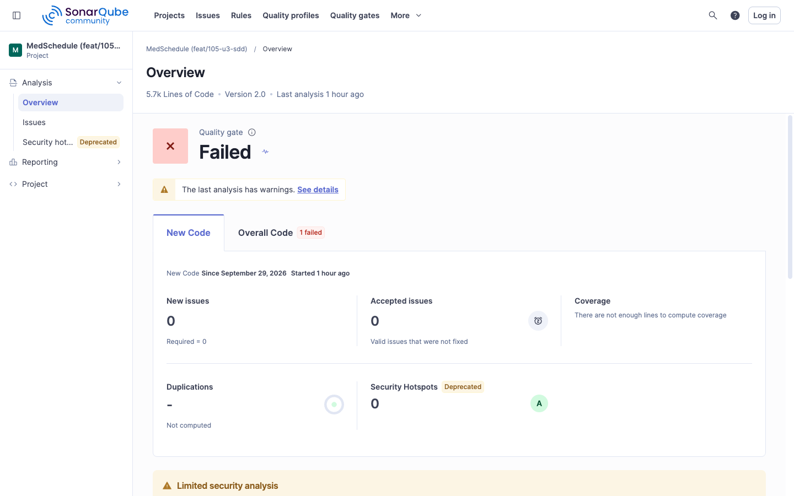
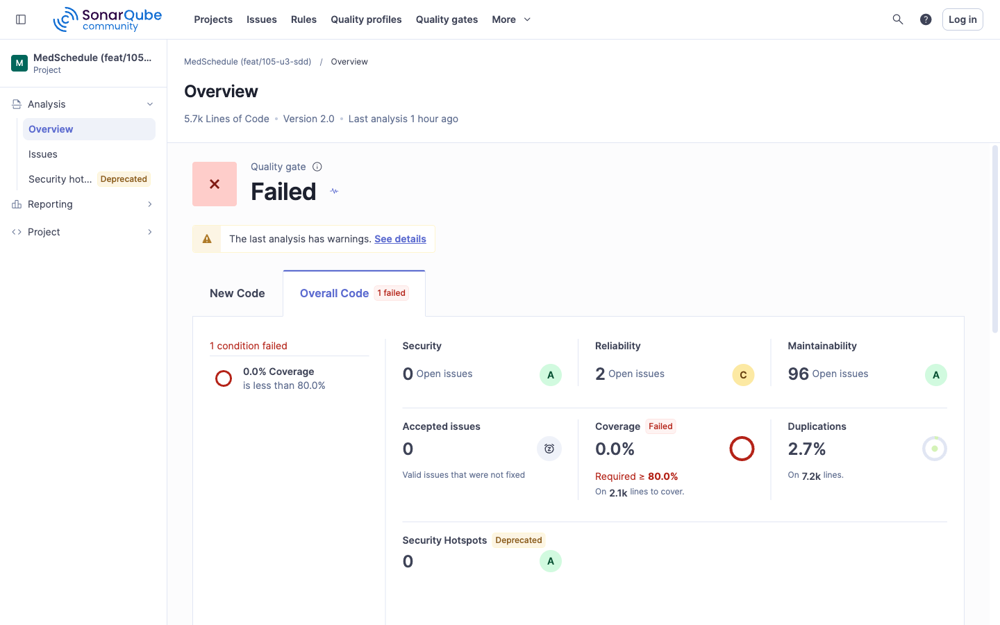
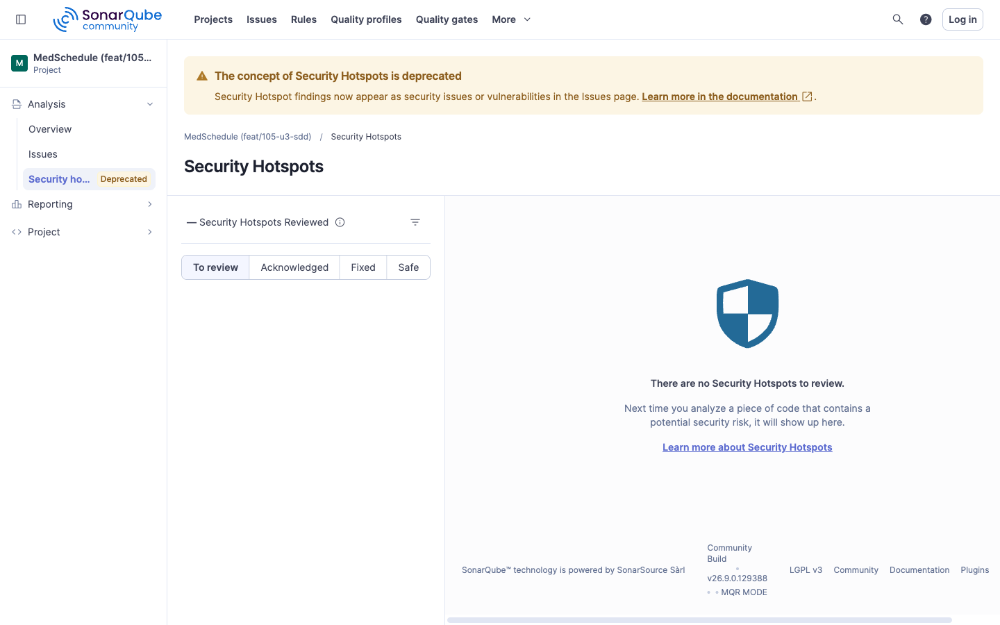
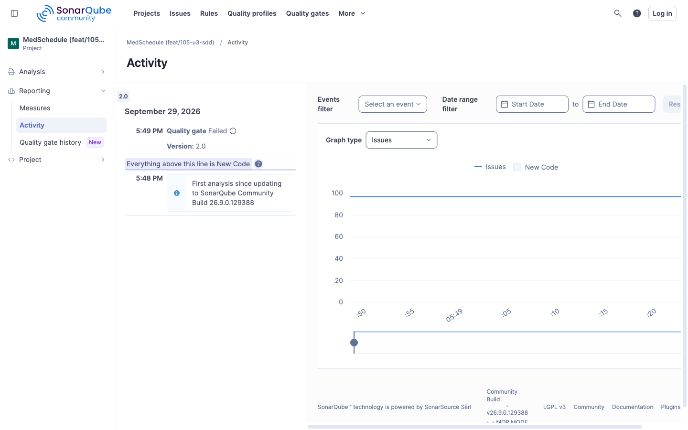
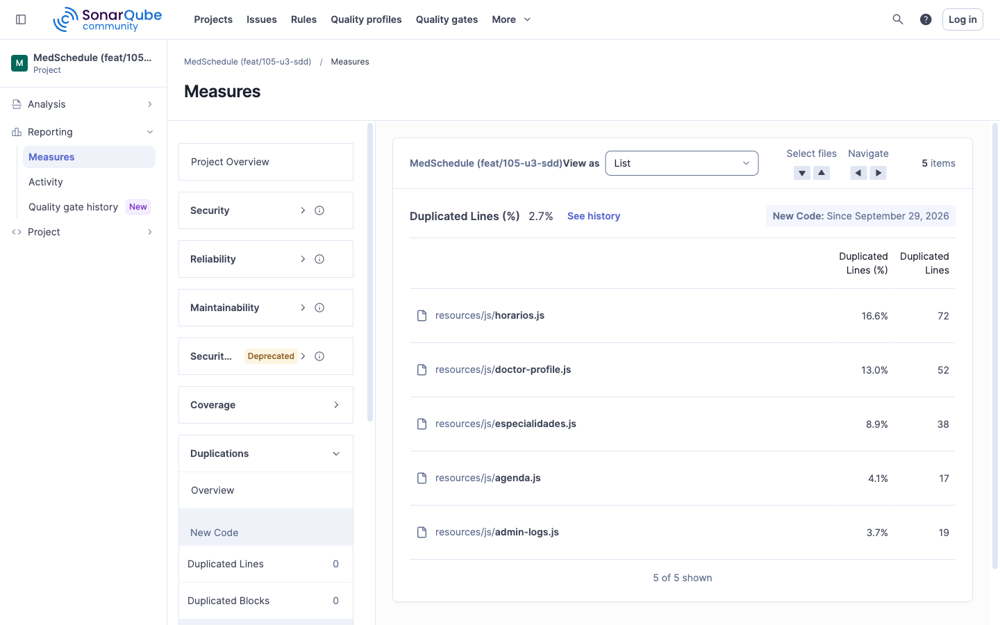
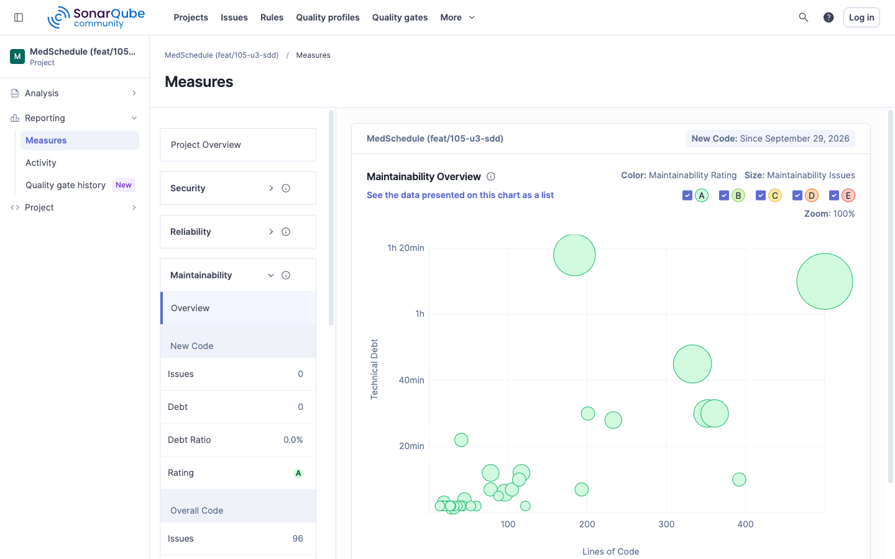

# MedSchedule — Unidad 3: liberación continua, observabilidad y auditoría

**Proyecto:** MedSchedule, sistema web de gestión de citas médicas (Laravel 12.53.0).
**Autor de esta entrega:** [`ramonibr`](https://github.com/ramonibr) (Ibarra Fontes José Ramón). **Entrega individual.**
**Repositorio:** [`github.com/JoseOrtega8/MedSchedule-`](https://github.com/JoseOrtega8/MedSchedule-) (público).
**Materia:** Desarrollo Web Profesional — Grupo IDGS 8-2, Universidad Tecnológica de Hermosillo.
**Profesor:** Iván Rogelio Chenoweth.
**Fecha:** septiembre de 2026.

## 0.1 Observación de la Unidad 2: dashboards de SonarQube

La revisión de la Unidad 2 señaló que los dashboards de SonarQube no se localizaban en la
entrega: aparecían como rutas de archivo al final del documento. En esta unidad se muestran
aquí, al inicio y como imágenes, tomadas sobre el análisis de la rama de la Unidad 3 con el
SonarQube que corre dentro del Codespace del proyecto (apartado 3).

Las capturas corresponden al proyecto `medschedule-feat-105-u3-sdd` justo después de la corrida
con la puerta estricta descrita en el apartado 0.1.1; por eso el panel muestra la puerta en
estado fallido.

**Panel general (código nuevo).** Estado de la puerta de calidad y métricas del código nuevo de la rama: 0 incidencias nuevas y 0 puntos sensibles de seguridad.

**Puerta de calidad (código completo).** La condición que la hizo fallar (cobertura de 0.0 %, se exige al menos 80 %) junto con las métricas globales: 0 incidencias de seguridad, 2 de fiabilidad, 96 de mantenibilidad y 2.7 % de duplicación.

**Puntos sensibles de seguridad.** No hay puntos pendientes de revisión. SonarQube 26.9 marca este concepto como obsoleto y muestra esos hallazgos como incidencias de seguridad.

**Actividad.** Historial de análisis de la rama, con el veredicto de cada uno.

**Duplicación.** 2.7 % de líneas duplicadas en total; todas están en `resources/js` (5.6 %, 198 líneas), y `app`, `database` y `routes` tienen 0 %.

**Medidas.** Mantenibilidad por archivo: deuda técnica frente a líneas de código, con calificación A en el código nuevo.

### 0.1.1 La puerta de calidad ahora detiene la liberación

En la Unidad 2 el análisis estático era un reporte: el escáner terminaba en éxito sin importar
el veredicto. En esta unidad `scripts/sonarqube-escanear.sh` ejecuta el escáner con
`-Dsonar.qualitygate.wait=true` y `-Dsonar.qualitygate.timeout=300`, de modo que espera el
veredicto de la puerta y termina con código 1 si no se supera. El mismo parámetro se agregó al
job `analisis-estatico` de `ci.yml` y al job nuevo `calidad` de `release.yml` (apartado 11).

Para demostrarlo se hicieron dos corridas del mismo script sobre el mismo código, dentro del
Codespace (commit `6c99cfb`):

| Corrida | Puerta de calidad | Resultado | Evidencia |
|---|---|---|---|
| Puerta por defecto de SonarQube ("Sonar way") | `QUALITY GATE STATUS: PASSED` | `codigo de salida: 0` | `evidencia/sonar-puerta-pasa.txt` |
| Puerta estricta "MedSchedule estricta" (cobertura mínima de 80 %) | `QUALITY GATE STATUS: FAILED` (cobertura real 0.0 % frente a 80 %) | `codigo de salida: 1` | `evidencia/sonar-puerta-falla.txt` |

La puerta estricta falla de forma honesta: la cobertura medida de la suite es 0 %, por la
razón explicada en el apartado 8.5 de la Unidad 2 (el informe de cobertura no se genera en el
análisis). La condición usa la métrica `coverage` (cobertura global menor que 80 %). Con
`new_coverage` la puerta pasó (código 0), porque en el primer análisis de la rama no hay "código
nuevo" que medir. Después de la corrida que falla, el proyecto se
regresa a la puerta por defecto.

## 0.2 Método de verificación

Las cifras de este documento provienen de ejecuciones reales o de los archivos del
repositorio, no de estimaciones. Cada una se puede rastrear a su origen:

| Dato | Origen |
|---|---|
| Dashboards y puerta de calidad de SonarQube | `evidencia/sonar-*.png`, `evidencia/sonar-puerta-*.txt` |
| Umbrales de alerta | `infra/monitoreo/prometheus/alertas.yml`, derivados de `docs/entrega-u2/03-niveles-de-servicio.md` |
| Comportamiento de las alertas | `infra/monitoreo/prometheus/alertas.test.yml`, ejecutado con `promtool test rules`; salida en `evidencia/promtool-alertas.txt` |
| Tiempo de notificación de una caída | `evidencia/monitoreo-alerta-tiempos.txt` |
| Tableros, trazas y visor de auditoría | Capturas `evidencia/monitoreo-*.png`, `evidencia/trazas-*.png`, `evidencia/auditoria-*.png` |
| Costo de la instrumentación | `evidencia/k6-sin-instrumentacion.txt`, `evidencia/k6-con-instrumentacion.txt` y `evidencia/k6-atribucion.txt` |
| Pruebas de PHPUnit de cada módulo | Ejecutadas en el Codespace: `evidencia/pruebas-metricas.txt`, `evidencia/pruebas-trazas.txt`, `evidencia/pruebas-auditoria.txt` |
| Integridad de la auditoría | `evidencia/auditoria-verificar-integra.txt` y `evidencia/auditoria-verificar-rota.txt` |
| Análisis de dependencias | `evidencia/snyk-00-antes.txt`, `evidencia/snyk-*.png`, `evidencia/snyk-puerta-*.txt` y `evidencia/snyk-pruebas-script.txt` |
| Versiones de herramientas | Imagen fijada en `infra/monitoreo/docker-compose.yml`, `composer.lock` y scripts |
| Diseño y cambios de diseño | `specs/003-observabilidad-auditoria/` (`spec.md`, `plan.md`, `tasks.md`) |

Donde un dato no se midió, el documento lo dice. Los valores que dependen de una corrida se
señalan con su archivo de evidencia.

## 0.3 Contenido

| # | Documento | Contenido |
|---|---|---|
| 00 | Introducción | Datos de la entrega, dashboards de SonarQube y método de verificación |
| 01 | Caso de estudio | El sistema, el equipo y el problema que resuelve esta unidad |
| 02 | Pipeline | Flujo de liberación y despliegue continuo, etapa por etapa |
| 03 | Entorno | Entorno requerido, stacks en contenedores, puertos y variables |
| 04 | Niveles de servicio | Acuerdos de la Unidad 2 ligados a alertas reales |
| 05 | Justificación de SDD | Por qué y cómo se especificó antes de codificar |
| 06 | Monitoreo | Módulo a: métricas, tableros y alertas |
| 07 | Trazabilidad | Módulo b: logs estructurados y trazas enlazados |
| 08 | Auditoría | Módulo c: visor de auditoría con detección de manipulación |
| 09 | Módulo adicional: Snyk | Compuerta de vulnerabilidades en dependencias |
| 10 | Parámetros de las herramientas | Cada parámetro, su valor, su archivo y su razón |
| 11 | Integración en CI/CD | Qué compuerta detiene qué y dónde corre |

## 0.4 Pull requests de esta entrega

| Pull request | Contenido | Base |
|---|---|---|
| [PR #110](https://github.com/JoseOrtega8/MedSchedule-/pull/110) | Especificación, plan, tareas, puerta de calidad de SonarQube y este documento | `feat/100-sonarqube` (Unidad 2) |
| [PR #111](https://github.com/JoseOrtega8/MedSchedule-/pull/111) | Módulo a: monitoreo con métricas y alertas | `feat/105-u3-sdd` |
| [PR #112](https://github.com/JoseOrtega8/MedSchedule-/pull/112) | Módulo b: visor de trazabilidad | `feat/106-monitoreo` |
| [PR #113](https://github.com/JoseOrtega8/MedSchedule-/pull/113) | Módulo c: visor de auditoría | `feat/105-u3-sdd` |
| [PR #114](https://github.com/JoseOrtega8/MedSchedule-/pull/114) | Módulo adicional: análisis de dependencias con Snyk | `feat/105-u3-sdd` |
