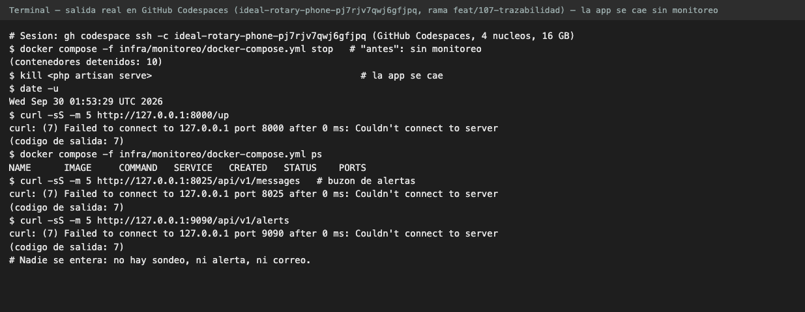
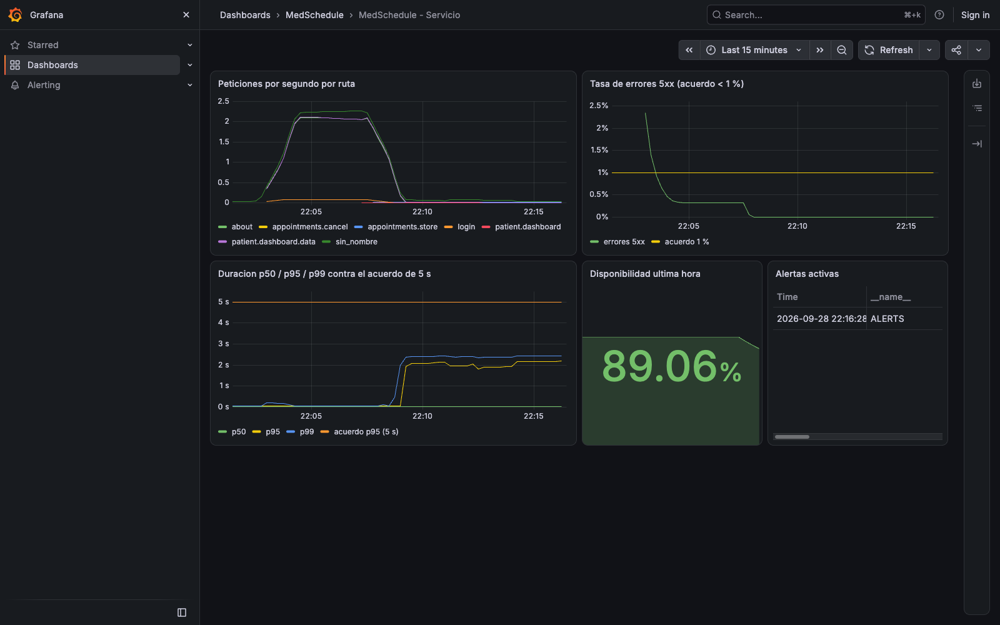
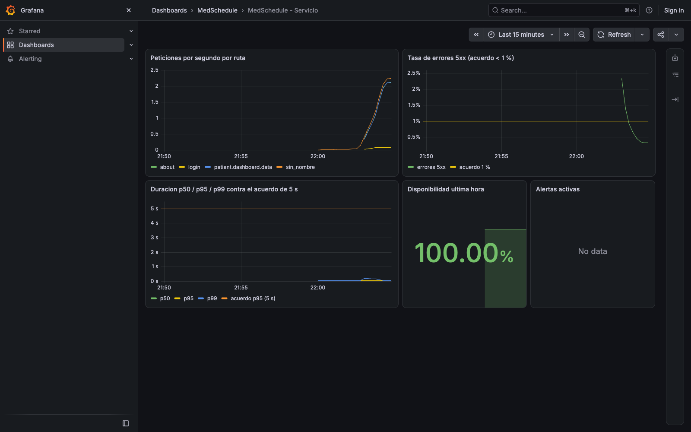
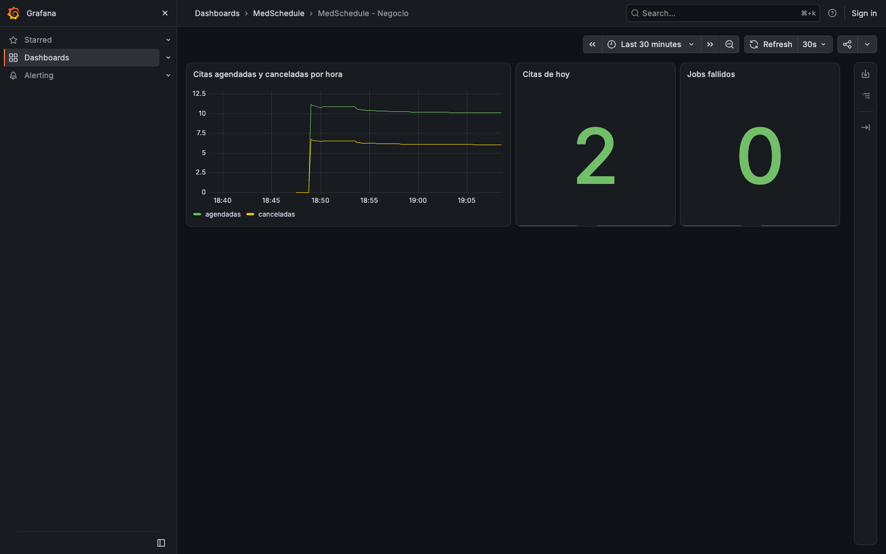
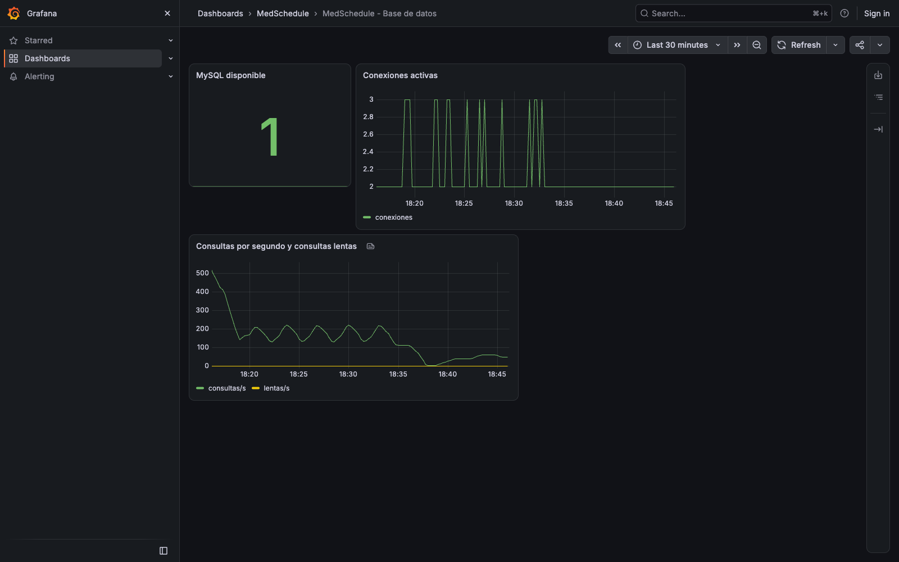

# 6. Módulo a: métricas para el monitoreo, con alarmas y alertas

**Pull request:** [[PR-106]]

## 6.1 Arquitectura

El stack vive en `infra/monitoreo/docker-compose.yml` y se levanta con
`scripts/monitoreo-local.sh`. La aplicación no empuja métricas: Prometheus las recoge cada 15 s.

| Componente | Imagen | Función |
|---|---|---|
| Prometheus | `prom/prometheus:v3.14.0` | Recoge métricas cada 15 s, evalúa las reglas de alerta y guarda 15 días de histórico |
| Alertmanager | `prom/alertmanager:v0.34.1` | Agrupa las alertas y las envía por correo |
| Mailpit | `axllent/mailpit:v1.31.2` | Buzón SMTP local donde llegan las alertas, sin correo real |
| Grafana | `grafana/grafana:13.2.2` | Tableros, aprovisionados como código desde `infra/monitoreo/grafana/` |
| blackbox-exporter | `prom/blackbox-exporter:v0.28.0` | Sonda externa contra `/up`, la ruta de salud de Laravel |
| mysqld-exporter | `prom/mysqld-exporter:v0.20.0` | Estado de MySQL con un usuario de solo lectura |
| Redis | `redis:8.8.3-alpine` | Almacén compartido de las métricas de la aplicación entre peticiones |

Prometheus tiene cuatro trabajos de recolección: `medschedule` (métricas de la aplicación en
`/metrics`), `disponibilidad` (la sonda de blackbox contra `/up`), `mysql` y el propio
`prometheus`.

La razón de Redis: PHP no conserva memoria entre peticiones, así que un contador en memoria
empezaría en cero cada vez. `promphp/prometheus_client_php` 2.15.1 guarda los contadores en
Redis mediante el adaptador `Predis`, que no requiere la extensión `phpredis`.

## 6.2 Métricas que expone la aplicación

| Métrica | Tipo | Etiquetas | Origen |
|---|---|---|---|
| `medschedule_http_requests_total` | Contador | `method`, `route`, `status` | Middleware `RegistrarMetricasHttp`, en cada petición |
| `medschedule_http_request_duration_seconds` | Histograma (buckets 0.05, 0.1, 0.25, 0.5, 1, 2.5, 5, 10 s) | `method`, `route` | El mismo middleware |
| `medschedule_citas_agendadas_total` | Contador | — | `ContadorCitasObserver`, al crear una cita |
| `medschedule_citas_canceladas_total` | Contador | — | El mismo observer, cuando `status` cambia a `cancelled` |
| `medschedule_citas_hoy` | Gauge | — | Se calcula al momento del scrape |
| `medschedule_jobs_fallidos` | Gauge | — | Filas de `failed_jobs`, calculado al momento del scrape |

Tres decisiones de diseño:

- **La etiqueta `route` es el nombre de la ruta, nunca la URL.** Una URL con identificadores
  (`/admin/auditoria/42`) crearía una serie temporal por cada id y haría crecer la cardinalidad
  sin límite. Las rutas sin nombre se agrupan como `sin_nombre`, y las peticiones que no
  coinciden con ninguna ruta (un 404) como `sin_ruta`.
- **Los buckets cubren el acuerdo y su doble.** El último bucket finito es 10 s, el doble del
  SLO de 5 s, para que el percentil 95 se pueda calcular aunque se incumpla el acuerdo.
- **El scrape no cuenta como tráfico.** Las peticiones a la ruta `metricas` no se registran.

## 6.3 Protección de `/metrics`

El endpoint vive en `routes/observabilidad.php`, fuera del grupo `web`: Prometheus no necesita
sesión, cookies ni CSRF. `MetricasController` exige la cabecera `Authorization: Bearer` con el
valor de `METRICS_TOKEN` y la compara con `hash_equals` (tiempo constante). Si no hay token
configurado, si falta o si es incorrecto, responde **404**, no 401: para quien no presenta la
credencial, el endpoint no existe.

Si el cálculo de las métricas falla, la respuesta es 503 y el error queda en el log; el
detalle nunca llega al cliente.

## 6.4 El monitoreo nunca tumba la aplicación

Todos los puntos donde la aplicación toca el monitoreo están dentro de `try/catch`:

| Punto | Si falla |
|---|---|
| Registrar la petición en el middleware | Se escribe una advertencia y la petición continúa |
| Contar una cita agendada o cancelada | Se escribe una advertencia y la cita se guarda igual |
| Exportar en `/metrics` | Responde 503 a Prometheus, que marca el objetivo como caído |

Los clientes de Redis tienen timeout de 0.2 s de conexión y de lectura. Una petición puede tocar
Redis hasta dos veces (el middleware y, si crea o cancela una cita, el observer), así que un
Redis caído agrega como máximo alrededor de 0.4 s a esa petición.

## 6.5 Tableros

Los cuatro tableros se aprovisionan desde `infra/monitoreo/grafana/dashboards/*.json`, en la
carpeta "MedSchedule", y no se pueden modificar desde la interfaz (`allowUiUpdates: false`): la
fuente de verdad es el repositorio. Tres corresponden a este módulo; el cuarto (Trazabilidad)
al módulo b.

| Tablero | Paneles |
|---|---|
| MedSchedule - Servicio | Peticiones por segundo por ruta; tasa de errores 5xx contra la línea del 1 %; duración p50, p95 y p99 contra la línea de 5 s; disponibilidad de la última hora; alertas activas |
| MedSchedule - Negocio | Citas agendadas y canceladas por hora; citas de hoy; jobs fallidos |
| MedSchedule - Base de datos | MySQL disponible; conexiones activas; consultas por segundo y consultas lentas |

## 6.6 Reglas de alerta

Las seis reglas de `infra/monitoreo/prometheus/alertas.yml`, su origen en los niveles de
servicio y sus pruebas con `promtool` se describen en el apartado 4. Resumen:

| Alerta | Condición | Severidad |
|---|---|---|
| `AplicacionCaida` | Sonda contra `/up` fallando por 1 min | crítica |
| `LatenciaP95FueraDeAcuerdo` | p95 > 5 s por 5 min | crítica |
| `LatenciaP95Degradada` | p95 > 500 ms por 10 min | advertencia |
| `TasaErrores5xxAlta` | Más de 1 % de 5xx en 5 min, sostenido 1 min | crítica |
| `BaseDeDatosCaida` | `mysql_up == 0` por 1 min | crítica |
| `JobsFallidos` | Jobs en `failed_jobs` por 10 min | advertencia |

Las pruebas de `promtool` incluyen casos negativos que discriminan umbrales y ventanas: por
ejemplo, un p95 entre 2.5 y 5 s dispara el aviso temprano pero no la alerta crítica, y un 0.5 %
de errores no dispara la alerta del 1 %. El resultado de la corrida está en el apartado 4.5
(`evidencia/promtool-alertas.txt`).

## 6.7 Pruebas de la aplicación

El módulo agrega seis métodos de prueba en `tests/Feature/Metricas/` (más dos en
`tests/Unit/Providers/MetricasServiceProviderTest.php` para la conexión persistente), que corren con el
almacén en memoria:

| Prueba | Qué verifica |
|---|---|
| `test_peticion_registra_contador_e_histograma` | Una petición incrementa el contador y observa el histograma con el nombre de ruta |
| `test_redis_caido_no_afecta_la_respuesta` | Con Redis inalcanzable la petición responde con normalidad |
| `test_sin_token_responde_404` | Sin credencial, `/metrics` no existe |
| `test_token_incorrecto_responde_404` | Con credencial incorrecta, tampoco |
| `test_token_correcto_devuelve_metricas` | Con la credencial correcta devuelve el formato de Prometheus |
| `test_cita_agendada_y_cancelada_incrementa_contadores` | Los contadores de negocio responden a los eventos de la cita |

Resultado registrado en `evidencia/pruebas-metricas.txt`: **9 pruebas aprobadas, 21 aserciones,
0 fallos**. Se corrió con `--filter=Metricas` sobre la rama `feat/107-trazabilidad` (commit
`22056c3`), que contiene la de monitoreo; por eso el filtro también toma una prueba de trazas cuyo
nombre incluye "metricas" (`test_scrape_de_metricas_no_produce_spans`) y las dos pruebas de
`tests/Unit/Providers/MetricasServiceProviderTest.php` sobre la conexión persistente de Redis. El
comando termina con código 1 por un aviso de PHPUnit anterior a esta unidad
(`No tests found in class Tests\Feature\Auth\RegistrationTest`), no por estas pruebas.

## 6.8 Antes y después

### Antes: la aplicación se cae y nadie se entera

Con el stack de monitoreo detenido se detuvo la aplicación. No hubo aviso de ningún tipo: la
única forma de saberlo era intentar abrirla.

### Después: la alerta dispara y llega el correo

Con el stack arriba se repitió la caída. La sonda de disponibilidad empezó a fallar,
`AplicacionCaida` pasó a `firing` y Alertmanager entregó el correo en Mailpit.

![Correo [FIRING:1] AplicacionCaida recibido en Mailpit con sus etiquetas y anotaciones](evidencia/monitoreo-06-correo-mailpit.png)

| Medición | Valor |
|---|---|
| Tiempo entre la caída y la llegada del correo | **1 min 40 s** (05:14:36 → 05:16:16 UTC, `evidencia/monitoreo-alerta-tiempos.txt`) |
| Objetivo de la especificación (SC-003) | Menos de 3 minutos |

### Después: los tableros muestran datos reales

Los tableros se capturaron con tráfico real generado por la prueba de carga de k6 de la
Unidad 2 contra la aplicación local. Las citas del tablero de negocio se agendaron y cancelaron
desde la aplicación con una cuenta de paciente de prueba. El pico inicial de errores 5xx del
tablero de servicio corresponde a `/about`, un defecto conocido desde la Unidad 2 (issue #97).

## 6.9 Límites

- El stack corre en local; su despliegue productivo y la persistencia más allá de los volúmenes
  de Docker quedan fuera de alcance.
- No se miden CPU ni memoria del anfitrión (node-exporter y cAdvisor quedaron fuera de alcance).
- Grafana permite lectura anónima con rol `Viewer`, solo porque escucha en `127.0.0.1`. En un
  entorno expuesto debe desactivarse.
