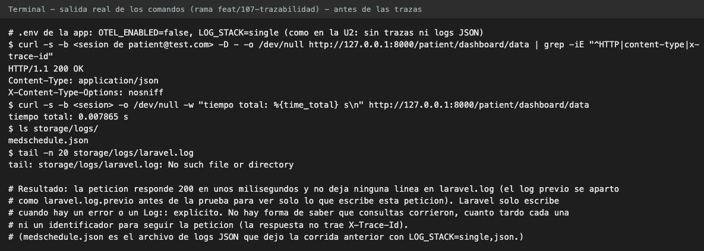
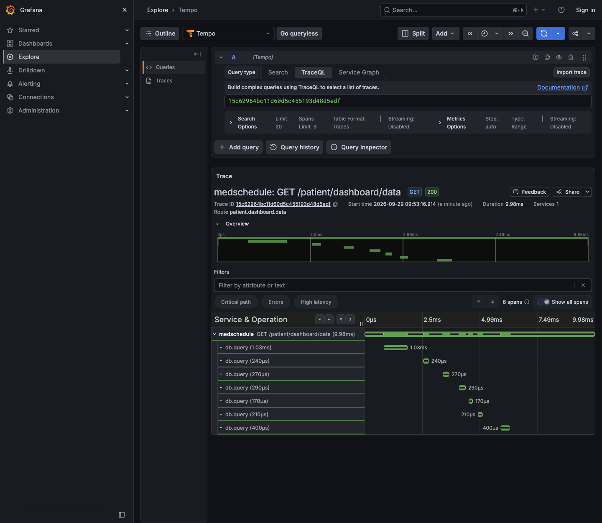
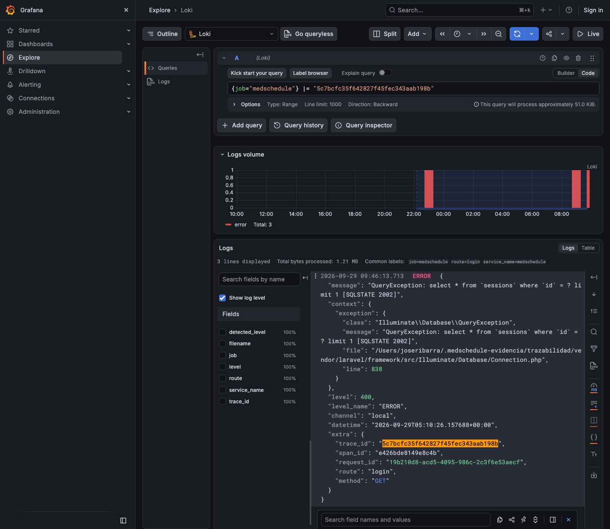
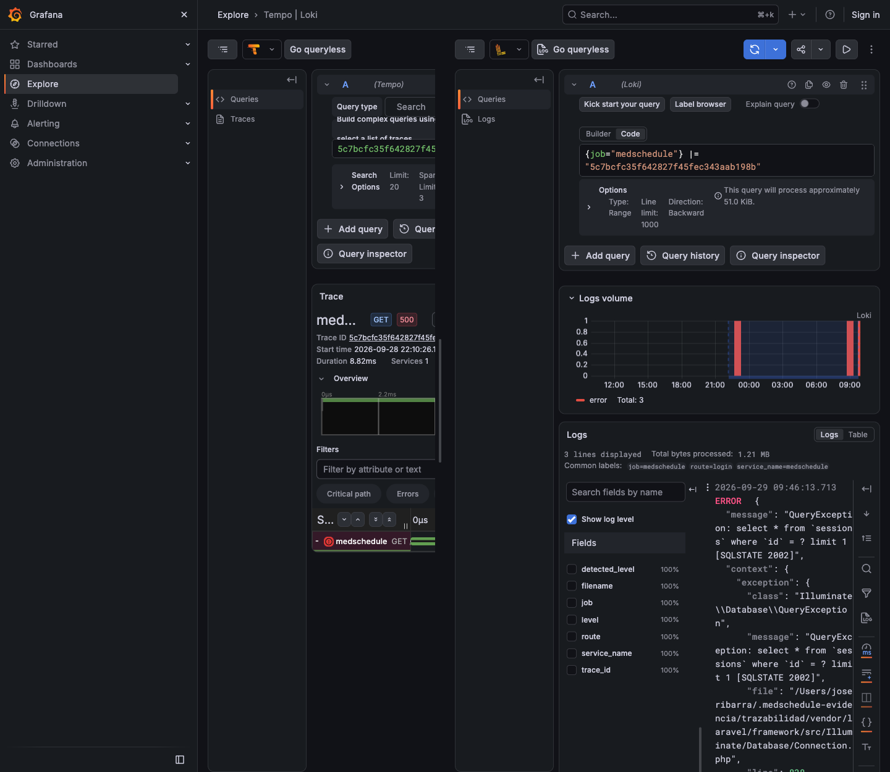
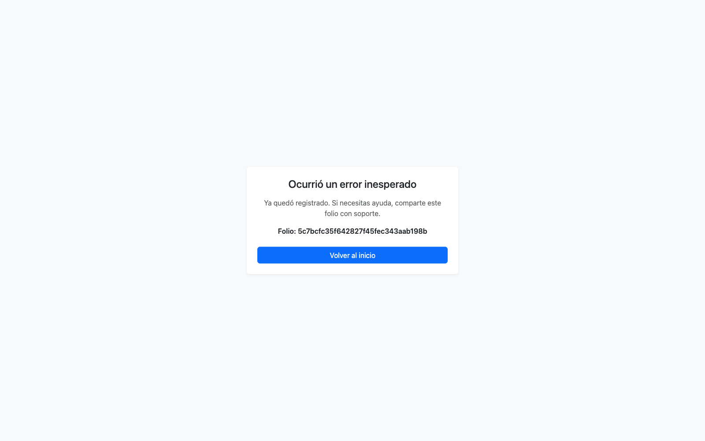
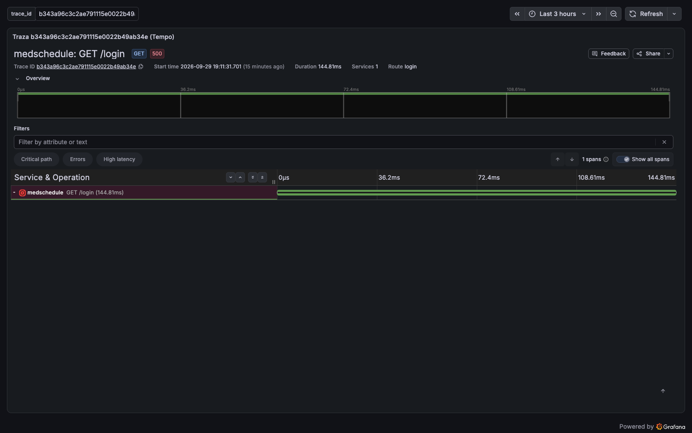

# 7. Módulo b: visor de trazabilidad con registros (logs) y trazas

**Pull request:** [PR #112](https://github.com/JoseOrtega8/MedSchedule-/pull/112)

## 7.1 Qué resuelve

Antes de esta unidad, investigar un incidente significaba abrir `storage/logs/laravel.log`: texto
plano, sin forma de saber a qué petición pertenecía cada línea ni en qué parte del código se fue
el tiempo. Este módulo agrega dos fuentes enlazadas entre sí dentro del mismo Grafana del
módulo a:

| Fuente | Qué responde | Dónde se guarda |
|---|---|---|
| Logs estructurados | Qué pasó, con qué usuario, en qué ruta | Loki, 7 días |
| Trazas | En qué se fue el tiempo de una petición | Tempo, 48 horas |

## 7.2 Logs estructurados con contexto de traza

`config/logging.php` agrega el canal `json`: una línea JSON por registro (Monolog
`JsonFormatter`) en `storage/logs/medschedule.json`. Se activa con `LOG_STACK=single,json`, que
conserva `laravel.log` y agrega el nuevo archivo.

El canal usa el driver `monolog` con `StreamHandler`. No es un detalle: el driver `single` de
Laravel 12.53 ignora la clave `processors`, y con él los logs salían sin redactar ni contexto
de traza. Por la misma razón, los canales `single` y `daily` reciben los mismos procesadores
mediante el tap `App\Logging\AplicarRedaccion`, de modo que `laravel.log` también queda
enmascarado.

Dos procesadores actúan sobre cada registro, en este orden:

| Procesador | Qué hace |
|---|---|
| `AgregarContextoTraza` | Agrega `trace_id`, `span_id`, `request_id`, `user_id`, `route` y `method`. Para el usuario usa `hasUser()`, que no dispara consultas y evita un ciclo con el log de SQL |
| `RedactarDatosSensibles` | Enmascara credenciales y PII médica en el mensaje, el contexto y los datos extra, a cualquier profundidad |

## 7.3 Enmascarado de PII

El enmascarado trabaja en cuatro frentes. Las claves y los patrones se sustituyen por
`[redactado]`; los literales que aparecen en una sentencia SQL se sustituyen por `'?'` o `?`, y
una `QueryException` se reescribe como `QueryException: <sentencia> [SQLSTATE …]`. (En la
auditoría, módulo c, el marcador es otro: `[protegido]`.)

| Frente | Regla |
|---|---|
| Claves del contexto | Una clave se enmascara si **contiene** alguna de estas subcadenas, sin distinguir mayúsculas: `token`, `password`, `secret`, `authorization`, `cookie`, `curp`, `email`, `allergies`, `chronic_conditions`, `blood_type`, `emergency_contact`, `api_key`, `apikey`, `credential`, `phone`, `telefono`, `signature`. Así `remember_token`, `access_token` o `password_confirmation` quedan cubiertas sin listarlas |
| Patrones en el texto | Dentro del mensaje y de cualquier valor de texto: correos electrónicos, credenciales `Bearer` o `Basic` (incluida la palabra del esquema) y CURP de 18 caracteres |
| Excepciones | Una excepción del contexto se reduce a clase, mensaje seguro, archivo y línea. Nunca se escribe el stacktrace, que lleva argumentos |
| Consultas | El mensaje de una `QueryException` trae los valores interpolados en el SQL. `App\Support\MensajeSeguro` lo sustituye por la sentencia parametrizada (`getSql()`) más el código SQLSTATE, y recorre **toda** la cadena de causas: una `QueryException` directa, envuelta por otra excepción o producida dentro de una vista Blade se enmascara igual, tanto en el mensaje de Laravel como en el mensaje crudo del driver |

Las subcadenas `key` y `hash` no se agregaron solas a propósito: enmascararían claves inocentes
como `cache_key`.

Cuatro piezas completan el enmascarado en la versión final:

| Pieza | Qué cubre |
|---|---|
| Excepciones encadenadas | `MensajeSeguro` recorre `getPrevious()` hasta el final de la cadena. Por cada `QueryException` que encuentra sustituye su mensaje completo y el mensaje crudo de su `PDOException` por el texto seguro, aunque la excepción visible sea otra (una `RuntimeException` que la envuelve o una `ViewException` de Blade) |
| Literales en `getSql()` | Si una sentencia trae valores escritos directamente (entre comillas, números tras `=` o dentro de `IN (...)`), se sustituyen por `'?'` o `?` antes de escribirla |
| Canales `single` y `daily` | El tap `App\Logging\AplicarRedaccion` les aplica los mismos procesadores que al canal `json`, así que `laravel.log` también sale enmascarado |
| Log interno de OpenTelemetry | Con las trazas activas, los avisos del propio SDK (un envío fallido a Tempo, por ejemplo) se dirigen al log de Laravel con `Psr3LogWriter`, en lugar de escribirse por su cuenta en la salida de errores de PHP; así pasan por los mismos procesadores |

Las expresiones regulares usan cuantificadores posesivos con límite superior para que su costo
sea lineal: un texto largo y malicioso no puede disparar un retroceso catastrófico.

Límites declarados en el propio código:

- Una contraseña escrita en texto libre, sin clave propia (por ejemplo, interpolada en el
  mensaje), no tiene un patrón detectable y **no se enmascara**. La regla del equipo es pasar
  cualquier secreto en el contexto con su clave (`password`, `token`), que sí se enmascara por
  nombre.
- La sustitución de excepciones encadenadas busca el mensaje original **tal cual**. Si la
  excepción que envuelve a la `QueryException` transforma ese mensaje (lo recorta, lo traduce o
  lo reformatea), ya no hay coincidencia y los valores de la consulta podrían quedar en el texto.
- El patrón de correo acepta hasta ocho etiquetas de dominio antes del dominio de primer nivel,
  para mantener el costo lineal. Un correo con nueve subdominios o más no se reconoce.
- El enmascarado de literales en SQL es una red de seguridad con expresiones acotadas, no un
  analizador de SQL. Una sentencia bien parametrizada no tiene nada que enmascarar.

## 7.4 Trazas OpenTelemetry

Las trazas usan `open-telemetry/sdk` 1.15.0 y el transporte de `open-telemetry/exporter-otlp`
1.4.0, en PHP puro (sin extensión C), y se envían a Tempo por OTLP/HTTP con JSON. La
serialización la hace un exportador propio, `App\Observability\Trazas\ExportadorOtlpJson`, en
lugar del `SpanExporter` oficial (apartado 7.8). Están apagadas por defecto
(`OTEL_ENABLED=false`): apagadas, el proveedor es nulo y no hay costo ni conexiones.

| Elemento | Cómo se genera | Qué guarda |
|---|---|---|
| Span raíz de la petición | Middleware `IniciarTraza`, el primero de la pila | Método, nombre de ruta, **plantilla** de la ruta (`url.template`), código de respuesta y, si hay sesión, el id del usuario. Estado de error en respuestas 5xx |
| Consultas SQL | `DB::listen` | La sentencia parametrizada, **sin bindings**; el inicio se calcula a partir de la duración que reporta Laravel. `db.statement` no pasa por el enmascarado de literales: un valor escrito directamente en SQL crudo, sin parámetro, llegaría al span (límite declarado) |
| Jobs de cola | Eventos de la cola | Un span por job, abierto en `JobProcessing` y cerrado en `JobProcessed`, `JobFailed` o `JobExceptionOccurred` |
| Google Calendar | `GoogleCalendarService` | Un span por llamada (`events.insert`, `events.delete`, `events.list`) con `peer.service=google-calendar` |

Detalles que salieron de las revisiones y quedaron en el diseño:

- **Plantilla en vez de ruta real.** El span guarda `reset-password/{token}`, nunca la ruta con
  el token real. Las rutas de restablecimiento y verificación de correo llevan secretos en sus
  parámetros.
- **Reintento de jobs.** Si al job le quedan reintentos, Laravel lo devuelve a la cola sin
  disparar `JobProcessed` ni `JobFailed`; sin escuchar `JobExceptionOccurred`, el span quedaba
  abierto.
- **Excepciones sin valores.** En lugar de `recordException()`, que guarda el stacktrace con
  argumentos, los spans registran un evento `exception` con la clase y el mensaje seguro de
  `MensajeSeguro`.
- **Tempo caído no frena la aplicación.** Los spans se acumulan en un `BatchSpanProcessor` y se
  envían en `terminate()`, después de responder. El transporte tiene timeout de 1 s y ningún
  reintento: con los valores por defecto, un Tempo inalcanzable bloqueaba cerca de 40 s. Así, un
  Tempo caído acota el costo a 1 s por petición, después de responder; con `php artisan serve`,
  que atiende una petición a la vez, ese segundo sí retrasa a la siguiente. Si el envío falla,
  se pierden esos spans y queda una advertencia en el log.
- **El scrape no se traza.** `/metrics` se consulta cada 15 s y solo generaría ruido.
- **Propagación.** Se respeta la cabecera `traceparent` entrante y la respuesta incluye
  `X-Trace-Id`. El `traceparent` se acepta tal cual: un cliente podría fijar el `trace_id`. Es
  aceptable en local; en producción debe validarse en el borde.

## 7.5 Folio en la página de error

`resources/views/errors/500.blade.php` muestra un mensaje genérico y un **folio**, sin ningún
detalle interno. Con las trazas activas el folio es el `trace_id`, que localiza la traza en
Tempo; con las trazas apagadas es el `request_id`, que localiza las líneas del log de esa
petición.

## 7.6 Loki, Tempo, Alloy y la correlación

| Componente | Imagen | Configuración |
|---|---|---|
| Loki | `grafana/loki:3.7.8` | `infra/monitoreo/loki/loki.yml`: almacenamiento local, esquema `v13`, retención de 168 h |
| Tempo | `grafana/tempo:2.9.5` | `infra/monitoreo/tempo/tempo.yml`: receptor OTLP/HTTP en 4318, retención de 48 h |
| Alloy | `grafana/alloy:v1.19.2` | `infra/monitoreo/alloy/config.alloy`: lee `medschedule.json` y lo envía a Loki |

Tempo se fija en la rama 2.9: la rama 3.x cambió el formato de configuración. Alloy extrae como
etiquetas solo el nivel y la ruta (baja cardinalidad); el `trace_id` se queda dentro de la línea.

La correlación está aprovisionada en `infra/monitoreo/grafana/provisioning/datasources/trazabilidad.yml`:

| Dirección | Mecanismo |
|---|---|
| Log → traza | Campo derivado de Loki: la expresión `"trace_id":"([0-9a-f]{32})"` convierte el identificador de cada línea en un enlace a Tempo |
| Traza → logs | `tracesToLogsV2` de Tempo: desde un span, busca en Loki las líneas que contienen su `trace_id`, en una ventana de 5 minutos antes y después |

El tablero "MedSchedule - Trazabilidad" reúne los logs filtrables por nivel, las trazas de más
de 100 ms y las peticiones con error, estas dos con consultas TraceQL.

## 7.7 Pruebas

El módulo agrega pruebas en `tests/Feature/Trazas/`, `tests/Unit/Logging/`,
`tests/Unit/Support/` y, con el exportador propio, `tests/Unit/Observability/`. Las pruebas de
trazas usan el `InMemoryExporter` de OpenTelemetry, sin Tempo. Entre ellas:

| Prueba | Qué verifica |
|---|---|
| `test_peticion_genera_span_raiz_y_cabecera_x_trace_id` | Hay span raíz y la respuesta devuelve su identificador |
| `test_ningun_span_guarda_la_ruta_real_con_tokens` | Ningún atributo contiene la ruta real |
| `test_consultas_de_la_peticion_son_spans_hijos_sin_bindings` | Las consultas son spans hijos y no llevan valores |
| `test_reintento_de_job_cierra_su_span_via_exception_occurred` | El span del job no queda abierto al reintentar |
| `test_query_exception_en_job_no_expone_bindings_en_su_span` | Una excepción de consulta en un job no expone valores |
| `test_scrape_de_metricas_no_produce_spans` | `/metrics` no se traza |
| `CodificadorOtlpJsonTest` | El JSON del exportador propio es idéntico al del exportador oficial para spans con padre remoto, enlaces, eventos, estados y atributos de todos los tipos |

Resultado registrado en `evidencia/pruebas-trazas.txt` (filtro
`Trazas|Redactar|MensajeSeguro|AplicarRedaccion`, commit `22056c3`): **44 pruebas aprobadas,
120 aserciones, 0 fallos**. El comando termina con código 1 por un aviso de PHPUnit anterior a
esta unidad (`No tests found in class Tests\Feature\Auth\RegistrationTest`), no por estas
pruebas; el archivo lo anota. Las pruebas del exportador propio se agregaron después de esa
corrida y no forman parte de ese archivo.

## 7.8 Costo de la instrumentación

El plan fijó como meta que la instrumentación completa (métricas en Redis, trazas y log JSON)
no suba el p95 más de un 10 %. **La meta no se cumplió.** Este apartado explica cuánto cuesta,
de dónde viene el costo y qué se corrigió. El detalle completo está en
`evidencia/k6-atribucion.txt`.

### Primera medición

Con la prueba de k6 de la Unidad 2 (`tests/carga/jri-prueba.js`, 10 usuarios virtuales,
2 minutos, `php artisan serve`) sobre la primera versión del módulo, el p95 pasó de 29.83 ms sin
instrumentación a 56.15 ms con ella: +88 %. En los dos casos hubo 0 % de errores.

### De dónde viene el costo

Para atribuirlo se usó una microprueba de bajo ruido (`ab -n 400 -c 1`, una petición a la vez),
encendiendo un componente cada vez. Tiempo medio por petición, en ms:

| Configuración | Portada, antes | Portada, después | Panel, antes | Panel, después |
|---|---|---|---|---|
| Sin instrumentación | 4.39 | 4.32 | 6.50 | 6.53 |
| Solo métricas en Redis | 5.60 (+1.2) | 5.35 (+1.0) | 8.01 (+1.5) | 8.07 (+1.5) |
| Solo trazas | 8.45 (+4.1) | 6.23 (+1.9) | 11.56 (+5.1) | 8.71 (+2.2) |
| Solo log JSON | 4.33 (+0.0) | 4.50 (+0.2) | 6.49 (+0.0) | 6.61 (+0.1) |
| Todo | 9.29 (+112 %) | 7.07 (+64 %) | 12.83 (+97 %) | 9.71 (+49 %) |

Las trazas dominaban, con cerca del 80 % del sobrecosto. Dentro de ellas, `forceFlush()` costaba
3.2 ms (p50): unos 0.6 ms eran el envío HTTP a Tempo y el resto era serializar los spans con
`google/protobuf` en PHP puro, cargando sus descriptores en cada petición.

### Qué se corrigió

- **Exportador OTLP/JSON propio.** `ExportadorOtlpJson` y `CodificadorOtlpJson` producen el
  mismo JSON OTLP que el exportador oficial, construido con arreglos y `json_encode`, sin
  `google/protobuf`. Usan el mismo transporte (1 s de timeout, sin reintentos) y el mismo manejo
  de éxitos parciales y errores, y no cambian qué se exporta: la redacción de PII sigue igual.
  Una prueba compara su salida con la del exportador oficial. `forceFlush()` bajó de 3.2 ms a
  0.96 ms (p50). Enviar protobuf binario no era alternativa: medido sin `ext-protobuf`, es más
  lento que JSON (1.8 frente a 1.5 ms para 6 spans).
- **Conexión persistente de Predis** (`METRICAS_REDIS_PERSISTENTE`, activa por defecto): ahorra
  de 0.2 a 0.5 ms por petición. Quedan las dos operaciones en Redis de cada petición (contador e
  histograma).
- El log JSON no se tocó: su costo no es medible.

**Por qué no se quitó `forceFlush()`.** Sin él el costo de las trazas cae casi a cero, pero Tempo
no recibe la traza. En PHP cada petición arranca de cero y el proveedor de trazas no registra un
apagado, así que el `BatchSpanProcessor` nunca acumula spans entre peticiones: si no se envían al
terminar la petición, se pierden. Se comprobó consultando a Tempo con y sin el envío.

### Resultado en k6

La máquina de medición era compartida (carga media de 3 a 14) y el p95 de k6 variaba unos ±8 ms
entre corridas idénticas, más que la meta misma (unos 3 ms). Por eso las medianas y la
microprueba son la referencia más confiable:

| Medida de k6 | Antes de corregir | Después de corregir |
|---|---|---|
| Mediana de `http_req_duration`, diferencia con y sin instrumentación | +54 % | +32 % |
| p95, pares medidos el mismo día | +30 % y +37 % | de +28 % a +70 % |

Los archivos de evidencia son el último par medido después de corregir:

| Corrida | Mediana | p95 de `http_req_duration` | p95 de `duracion_panel` | Carga del sistema al iniciar | Evidencia |
|---|---|---|---|---|---|
| Sin instrumentación | 21.48 ms | 40.95 ms | 37.10 ms | 3.93 | `evidencia/k6-sin-instrumentacion.txt` |
| Con instrumentación | 27.62 ms | 53.23 ms | 48.97 ms | 13.81 | `evidencia/k6-con-instrumentacion.txt` |
| Diferencia | +28.6 % | +30 % | +32 % | — | — |

En las dos corridas hubo 0 % de errores. En valores absolutos, la instrumentación completa suma
hoy cerca de 2.7 ms por petición en la portada y 3.2 ms en el panel. Ese costo viene de tres
fuentes: el envío a Tempo en cada petición (cerca de 1 ms), la creación de un span por cada
consulta SQL y las dos operaciones en Redis. Todo corre en el único hilo de `php artisan serve`.
El p95 sigue muy por debajo del acuerdo de 5 s.

### Medición complementaria

Con php-fpm, Symfony entrega la respuesta con `fastcgi_finish_request()` antes de `terminate()`,
así que el envío a Tempo queda fuera del tiempo que ve el cliente. Para estimarlo se midió
además con `tests/carga/servidor-fin-respuesta.php`, un enrutador para `php -S` que emula esa
función. Con él la diferencia de medianas fue de +21 % y la de p95 de +37 %. Es una medición
complementaria, no la oficial: el servidor sigue atendiendo una petición a la vez y el envío
retrasa a la siguiente.

**Conclusión:** la corrección reduce el costo de forma medible (microprueba y medianas), pero la
meta de +10 % en p95 no se cumple, y este documento no la ajusta. Para acercarse quedan opciones
que cambian funcionalidad o dependencias: medir en php-fpm real, muestrear menos trazas
(`OTEL_TRACES_SAMPLER_ARG`), dejar de trazar cada consulta o instalar `ext-protobuf` o
`phpredis` en el servidor.

## 7.9 Antes y después

### Antes: un log de texto plano

Con las trazas apagadas y solo el canal `single` (`OTEL_ENABLED=false`, `LOG_STACK=single`), se
llamó al panel del paciente (`/patient/dashboard/data`), el endpoint con más consultas por
petición medido en la Unidad 2. La petición respondió 200 en unos 8 ms y no dejó ninguna línea
en `laravel.log`, porque Laravel solo escribe ante un error o un `Log::` explícito. No había
forma de saber qué consultas corrieron ni cuánto tardó cada una, y la respuesta no traía ningún
identificador para seguirla.

### Después: la cascada de la petición

Con `OTEL_ENABLED=true` y `LOG_STACK=single,json` se repitió la llamada y se abrió su traza en
Grafana a partir del `X-Trace-Id` de la respuesta.

La traza responde la pregunta que el log no podía responder, y la respuesta es que **ninguna
consulta domina y no hay N+1**. La petición dura 9.98 ms y ejecuta 7 consultas que suman unos
2.6 ms (1.03, 0.24, 0.27, 0.29, 0.17, 0.21 y 0.40 ms). El resto es PHP y el framework. Es la
misma conclusión de la Unidad 2 (el panel es rápido), ahora con el desglose que la demuestra.

**Hallazgo previo.** Al preparar esta evidencia se encontró que la página `/patient/dashboard`
responde 500: `resources/js/patient-dashboard.js` no está en los `input` de `vite.config.js` y
Laravel no lo encuentra en el manifiesto de Vite. El endpoint de datos (`/patient/dashboard/data`)
funciona. El defecto es anterior a esta unidad y ajeno a sus módulos; se reporta y no se corrige
aquí.

### Después: del log a la traza y de vuelta

La línea de log muestra además el enmascarado funcionando: la excepción aparece como
`QueryException: select * from sessions where id = ? limit 1 [SQLSTATE 2002]`, sin el valor del
identificador de sesión.

### Después: el folio de un error localiza su traza

Se provocó un error 500 controlado en local: se detuvo MySQL y se abrió `/login`. El usuario ve
el folio `5c7bcfc35f642827f45fec343aab198b` y nada más. Ese folio localiza en Tempo la traza
`GET /login` con estado 500. Tiene un solo span porque la base de datos no respondía y no llegó a
ejecutarse ninguna consulta.

