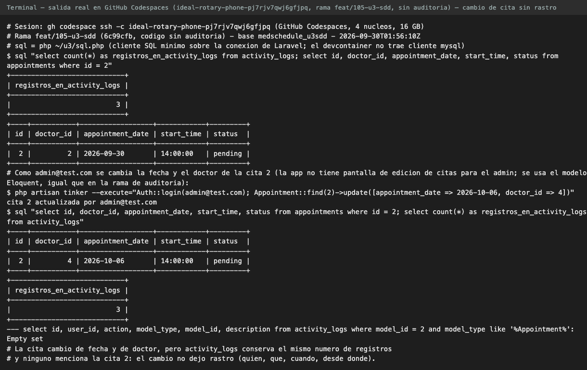
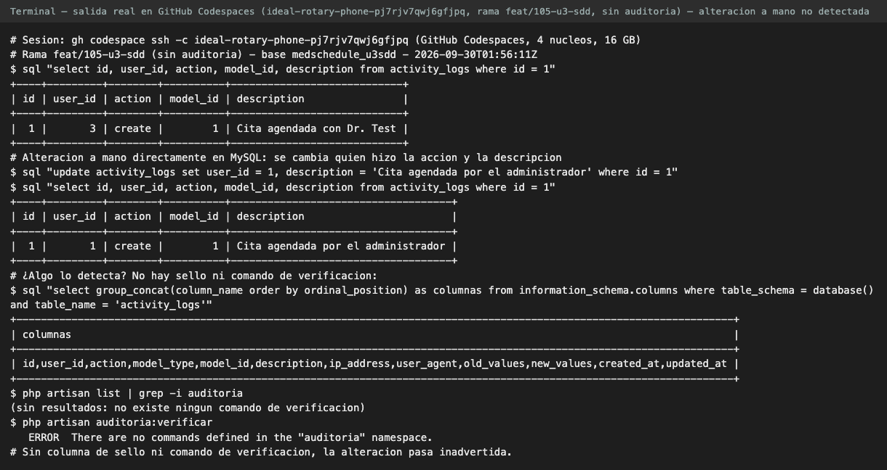
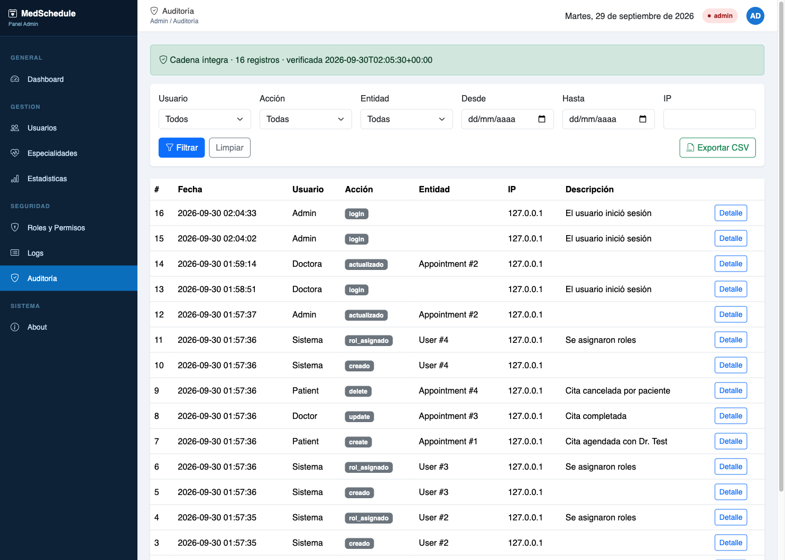
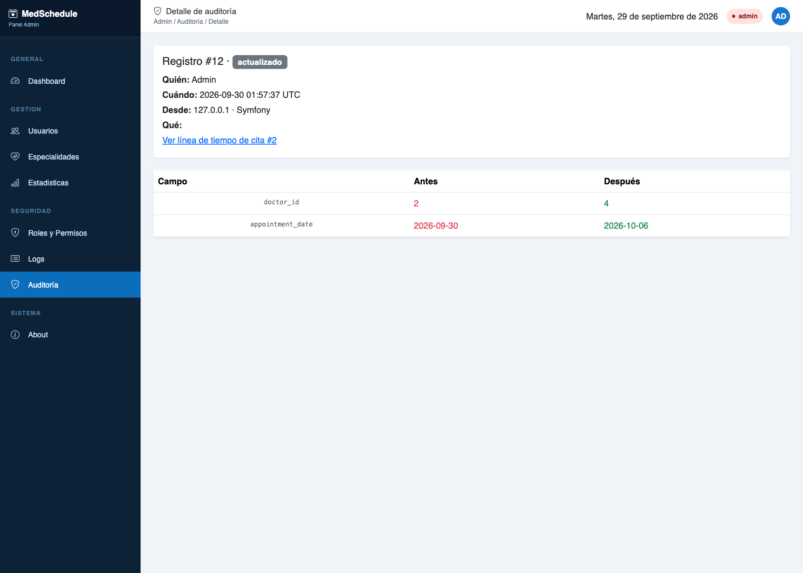
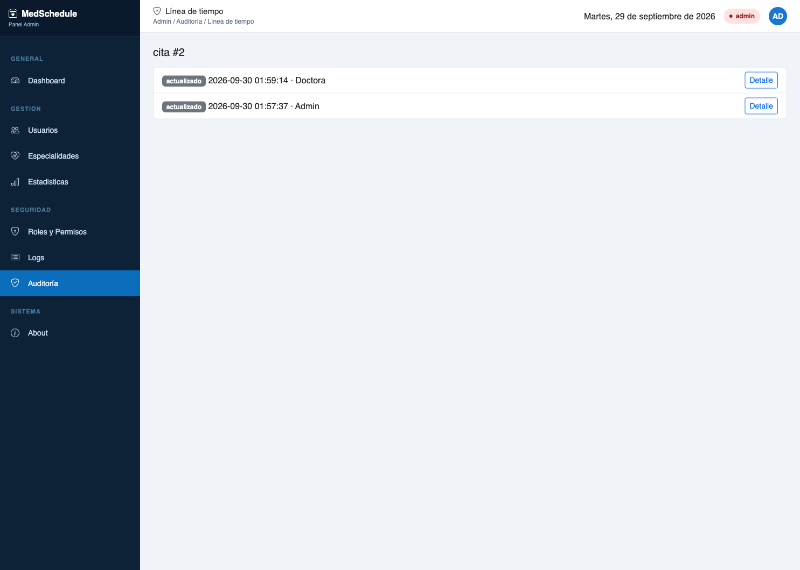
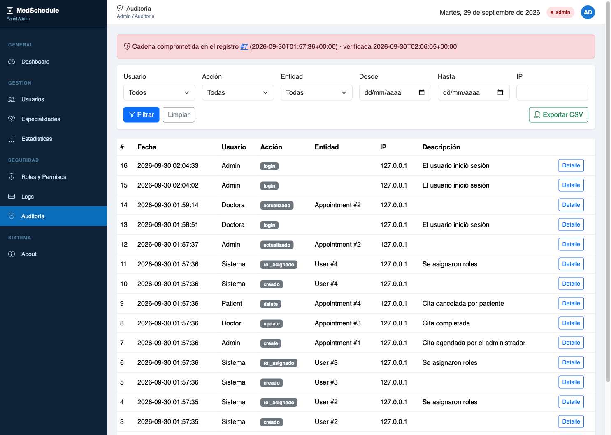

# 8. Módulo c: visor de auditoría

**Pull request:** [PR #113](https://github.com/JoseOrtega8/MedSchedule-/pull/113)

## 8.1 Qué resuelve

Antes de esta unidad, `activity_logs` registraba solo el inicio y el cierre de sesión y los
cambios del perfil del paciente. Un cambio de fecha o de doctor en una cita no dejaba rastro, y
cualquiera con acceso a la base de datos podía editar o borrar un registro sin que nadie lo
notara. Además, el registro del perfil del paciente guardaba PII médica en claro (apartado 8.3).

Este módulo convierte `activity_logs` en una auditoría de solo agregado, sellada y encadenada,
con captura automática y un visor exclusivo del administrador.

## 8.2 Qué se audita

| Origen | Eventos | Mecanismo |
|---|---|---|
| Citas, usuarios, especialidades, horarios, perfiles de doctor y de paciente | `creado`, `actualizado`, `eliminado`, con valores antes y después de los campos cambiados | Trait `App\Models\Concerns\Auditable` en los seis modelos |
| Sesión | `login` (ya existente en `AuthenticatedSessionController`), `logout`, `login_fallido`, `password_restablecida` | Listeners de `Logout`, `Failed` y `PasswordReset` |
| Roles y permisos | `rol_asignado`, `rol_retirado`, `permiso_asignado`, `permiso_retirado` | Eventos de `spatie/laravel-permission` (`events_enabled => true`) |
| Accesos denegados | `acceso_denegado` en las rutas de administración | Middleware `auditar.denegado` |
| El propio visor | `auditoria_exportada`, con los filtros usados | `AuditoriaController@exportar` |

Con esto los tipos de evento auditados pasan de los tres que existían a 28: 18 de las seis
entidades (tres operaciones cada una) y 10 de sesión, roles, permisos, accesos y exportación.

Reglas de captura:

- Solo se guardan los campos que cambiaron. Un cambio que solo toca `remember_token` o las
  marcas de tiempo no genera registro.
- Cada registro guarda quién (`user_id`), qué (`action`, entidad e id), cuándo, desde qué IP,
  con qué agente de usuario y, si la petición tenía traza, su `trace_id`. Este último solo se
  llena cuando la rama de trazabilidad está integrada; sin ella la columna queda vacía.
- Un intento de inicio de sesión fallido se registra con el correo enmascarado
  (`j***@dominio`), nunca completo.
- El cierre de sesión lo registra solo el listener: el controlador también lo registraba y
  duplicaba la fila, así que se quitó.

## 8.3 PII protegida

Los campos protegidos se auditan como `[protegido]`: el registro dice que cambiaron, nunca su
valor.

| Modelo | Campos protegidos |
|---|---|
| Todos | `password` |
| `PatientProfile` | `birth_date`, `blood_type`, `allergies`, `chronic_conditions`, `emergency_contact_name`, `emergency_contact_phone`, `curp` |
| `Appointment` | `reason` (motivo de la consulta) y `observaciones`: texto clínico libre |

**Hallazgo corregido.** El `ActivityLog::create` del método `update()` de
`PatientProfileController` guardaba en claro, en `old_values` y `new_values`, la fecha de
nacimiento, el tipo de sangre, las alergias, los padecimientos, los contactos de emergencia y la
CURP. El de `updatePhoto()` solo registraba la acción, sin valores. Ambos se eliminaron: el trait
registra esos mismos cambios con los valores protegidos. De paso,
`FullDataSeeder` dejó de insertar auditoría con `DB::table()` (sin sello) y pasó a usar el
modelo.

## 8.4 Cadena HMAC encadenada

Cada registro se sella al insertarse:

`hash = HMAC-SHA256(hash_anterior | json_canónico(fila), AUDIT_HMAC_KEY)`

| Pieza | Diseño |
|---|---|
| Contenido sellado | Acción, fecha (ISO 8601 en UTC), descripción, IP, entidad e id, valores antes y después, `trace_id`, agente de usuario y usuario |
| JSON canónico | Claves ordenadas (`ksort` con `SORT_STRING`, también dentro de los valores), sin espacios. MySQL reordena las claves de las columnas JSON; sin ordenar, un registro íntegro parecería alterado |
| Encadenamiento | `hash_anterior` es el sello del registro previo. Alterar o borrar una fila intermedia rompe la cadena desde ese punto |
| Concurrencia | La inserción ocurre en una transacción con `lockForUpdate` sobre el último registro, para que dos cambios simultáneos no bifurquen la cadena; se reintenta hasta 3 veces ante un interbloqueo |
| Solo agregado | El modelo Eloquent `ActivityLog` lanza `RegistroAuditoriaInmutable` ante cualquier intento de modificar o eliminar un registro a través del modelo. Una operación masiva (`ActivityLog::query()->update()` o `->delete()`) o SQL directo no se bloquea, pero la verificación de integridad la detecta |
| Llave | `AUDIT_HMAC_KEY` en `.env`. En producción, sin llave la aplicación no arranca. Fuera de producción se deriva de `APP_KEY` con una advertencia en el log, para no romper los entornos del equipo |

La migración `2026_09_23_000000` agrega `trace_id`, `hash_anterior` y `hash`, y **sella en la
misma migración todas las filas existentes**, en orden de id. Después de migrar no existe una
fila "histórica sin sello": toda fila con `hash` nulo cuenta como rota.

### Qué detecta y qué no

| Detecta | No detecta |
|---|---|
| Modificar cualquier campo sellado de una fila | Borrar las **últimas** filas de la tabla: la cadena queda íntegra hasta donde llega |
| Borrar una fila intermedia | A quien posee `AUDIT_HMAC_KEY`: puede recalcular toda la cadena de forma consistente. El sello protege contra quien no tiene la llave |
| Insertar una fila sin sello | Cambios en `id` o `updated_at`, que no forman parte del contenido sellado |
| Anular los sellos de forma masiva | El vaciado completo de la tabla: la verificación la reporta íntegra con 0 registros revisados |

Dos condiciones de operación completan los límites: rotar `AUDIT_HMAC_KEY` invalida la cadena
existente y obliga a volver a sellar el histórico con la llave nueva, y la migración que sella
debe correr en modo mantenimiento (`php artisan down`) para que nadie inserte auditoría a mitad
del sellado.

Esta última condición no la cumple hoy el despliegue automático: `scripts/despliegue.sh` ejecuta
`php artisan migrate --force` sin poner la aplicación en modo mantenimiento. Por eso el primer
despliegue que incluya la migración de integridad requiere un paso manual documentado: ejecutar
`php artisan down`, luego `php artisan migrate --force` y después `php artisan up`. Incorporar
el modo mantenimiento al script queda como mejora pendiente.

## 8.5 La auditoría sobrevive al usuario

La llave foránea original de `activity_logs.user_id` tenía `ON DELETE SET NULL`: al borrar un
usuario, MySQL ponía en nulo el `user_id` de sus registros, lo que cambiaba el contenido de
filas ya selladas y hacía que la verificación reportara una manipulación que nadie cometió. La
migración `2026_09_23_000001` quita la llave foránea y conserva el índice, que sigue sirviendo
a los filtros. Advertencia documentada en la propia migración: el rollback, que restaura la
llave, falla si ya existen registros de usuarios borrados.

## 8.6 Verificación de integridad

`php artisan auditoria:verificar` recorre la cadena completa por lotes de 500, informa los
registros revisados y termina con código 1 señalando el primer registro roto, o con código 0 si
la cadena está íntegra. Deja el resultado en caché para que el visor lo muestre sin recorrer la
tabla en cada visita.

`routes/console.php` lo programa a diario a las 03:00
(`Schedule::command('auditoria:verificar')->dailyAt('03:00')`). La programación de Laravel
necesita que el sistema ejecute `php artisan schedule:run` cada minuto (cron); ese cron no
está declarado en el repositorio y debe configurarse en el servidor donde se despliegue.

## 8.7 El visor `/admin/auditoria`

| Función | Detalle |
|---|---|
| Acceso | Grupo de rutas de administración con middleware en este orden: `auth`, `throttle:60,1`, `auditar.denegado`, `role:admin`. Un no administrador recibe 403 y el intento queda auditado; el límite de tasa va antes para que intentos repetidos reciban 429 sin llenar la auditoría |
| Filtros | Usuario, acción, entidad, rango de fechas e IP, validados con `FiltrarAuditoriaRequest` |
| Listado | Paginado en el servidor, 25 registros por página |
| Detalle | Diff lado a lado, campo por campo, con valores antes y después |
| Línea de tiempo | Historial de una entidad concreta. La URL usa alias (`cita`, `usuario`, `perfil_paciente`…), nunca nombres de clase, y el id está limitado a 18 dígitos para evitar un desbordamiento que respondía 500 |
| Integridad | Tres estados: gris ("Integridad aún no verificada") si nunca se ha ejecutado la verificación, verde ("Cadena íntegra") o rojo ("Cadena comprometida en el registro #n"), con el resultado de la última verificación |
| Enlace a traza | Si el registro tiene `trace_id`, enlace "Ver traza de la petición" a Grafana Explore sobre Tempo |
| Exportación CSV | En streaming; toda celda que empieza con `=`, `+`, `-`, `@`, tabulador o retorno de carro se antepone con `'` para que una hoja de cálculo no la interprete como fórmula; `fputcsv` sin escape invertido; un error a mitad de la exportación se registra en el log y no se expone en el archivo; la exportación queda auditada |

El indicador de integridad refleja la **última** corrida de `auditoria:verificar`, no el estado
en tiempo real.

## 8.8 Pruebas

El módulo agrega 40 métodos de prueba: 36 en `tests/Feature/Auditoria/` y 4 unitarios
(`CsvSeguroTest`, `EnmascararTest`). Entre ellos:

| Prueba | Qué verifica |
|---|---|
| `test_detecta_alteracion_manual_en_la_base` | Un `UPDATE` directo por SQL se detecta en el id exacto |
| `test_detecta_eliminacion_intermedia` | Borrar una fila intermedia rompe la cadena |
| `test_fila_sin_sello_rompe_la_cadena` y `test_anular_todos_los_hashes_rompe_la_cadena` | No hay forma de "perdonar" filas sin sello |
| `test_borrar_usuario_conserva_la_auditoria_y_la_cadena_integra` | Quitar la llave foránea cumple su propósito |
| `test_no_se_puede_modificar` y `test_no_se_puede_eliminar` | Solo agregado a través del modelo |
| `test_no_admin_recibe_403` (y sus variantes en detalle, línea de tiempo y exportación) | Exclusivo del administrador |
| `test_exportar_csv_escapa_formulas_y_queda_auditado` | CSV seguro y exportación auditada |
| `test_login_fallido_se_audita_con_correo_enmascarado` | El correo no se guarda completo |

Resultado registrado en `evidencia/pruebas-auditoria.txt` (rama `feat/108-auditoria`, commit
`251e6ee`, ejecutado en el Codespace): **43 pruebas aprobadas, 216 aserciones, 0 fallos, código
de salida 0**.

## 8.9 Antes y después

El "antes" se reprodujo en la rama `feat/105-u3-sdd`, que todavía no tiene este módulo, y el
"después" en la rama `feat/108-auditoria`, cada una con su propia base de datos de prueba
sembrada con los mismos datos. Se agregó a esas bases una segunda cuenta de doctor de prueba,
porque el sembrado trae un solo doctor y la prueba necesita cambiar el doctor de una cita.

La aplicación no tiene una pantalla para que el administrador edite la fecha o el doctor de una
cita: la única ruta que modifica citas es la del doctor, y solo cambia su estado. Por eso el
cambio se hizo en las dos ramas de forma idéntica, con `php artisan tinker`: se autenticó la
sesión como el administrador (`Auth::login`) y se actualizó la cita con Eloquent, el mismo camino
que usaría un controlador. Por esa razón el registro muestra la IP 127.0.0.1 y el agente
"Symfony", propios de una ejecución de consola.

### Antes: un cambio sin rastro y una alteración inadvertida

En `feat/105-u3-sdd`, como administrador, se cambió la cita 2 de fecha (2026-09-30 → 2026-10-06)
y de doctor (2 → 4). La tabla `activity_logs` siguió con sus 3 filas y ninguna habla de la cita 2.

Después se alteró a mano la fila 1 de `activity_logs` en MySQL (usuario 3 → 1 y descripción
cambiada). Nada lo detectó: la tabla no tiene columnas de sello y el comando
`auditoria:verificar` no existe en esa rama.

### Después: quién, qué, cuándo y desde dónde

En `feat/108-auditoria` se repitió el mismo cambio en la cita 2. Después, la cuenta de doctor
confirmó la cita con una petición HTTP real (`PATCH /appointments/2`), que genera un segundo
evento en la línea de tiempo.

### Después: la alteración se detecta

Con la cadena íntegra, la verificación termina en éxito (`evidencia/auditoria-verificar-integra.txt`):

| Salida de `php artisan auditoria:verificar` | Código de salida |
|---|---|
| `Registros revisados: 16` / `Cadena íntegra.` | 0 |

En la base de la rama de auditoría, ya migrada y sellada, se alteró a mano la fila equivalente a
la del "antes": la id 7, "Cita agendada con Dr. Test" (en esta base el id es otro porque la
migración y el sembrado registraron antes la creación de usuarios). Se cambió su usuario de 3 a 1
y su descripción a "Cita agendada por el administrador", y se repitió la verificación
(`evidencia/auditoria-verificar-rota.txt`):

| Salida de `php artisan auditoria:verificar` | Código de salida |
|---|---|
| `Registros revisados: 7` / `Cadena rota. Registro roto: 7 (2026-09-30T01:57:36+00:00)` | 1 |

La verificación se detiene en el primer eslabón roto y señala exactamente la fila alterada.

