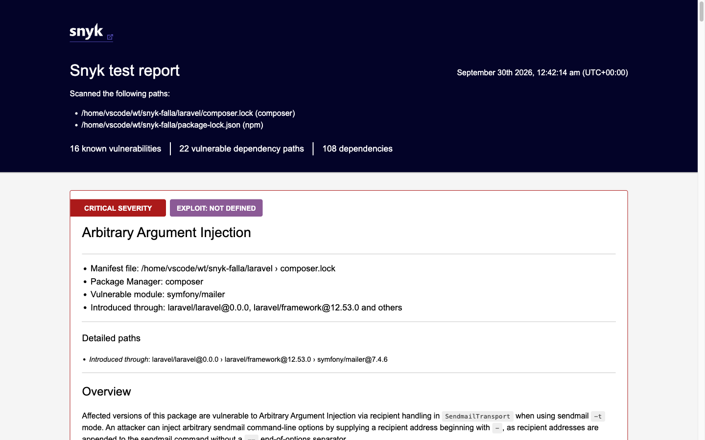
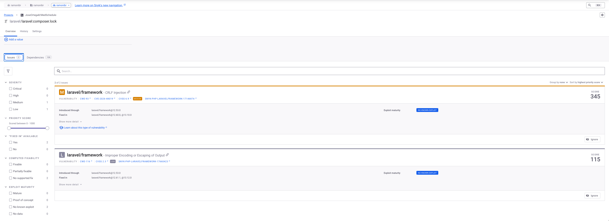

# 9. Módulo adicional: compuerta de vulnerabilidades en dependencias con Snyk

**Pull request:** [PR #114](https://github.com/JoseOrtega8/MedSchedule-/pull/114)

## 9.1 Qué resuelve

MedSchedule depende de paquetes de terceros declarados en `composer.lock` (PHP) y
`package-lock.json` (JavaScript). Antes de este módulo ninguno de los dos se analizaba en ningún
punto del pipeline: una dependencia con una vulnerabilidad conocida llegaba a producción y solo
se sabía por un aviso externo. SonarQube analiza el código propio, no el de las dependencias.

Este módulo no forma parte de los tres módulos del alcance. Se agrega como historia de usuario
propia (US5) en la especificación, en su propia rama (`feat/109-snyk`), sin modificar los otros
módulos: agrega el job nuevo de `release.yml`, el archivo `.snyk` y dos scripts en
`package.json` (`seguridad:snyk` y `test:scripts`).

## 9.2 Qué analiza

`scripts/snyk-escanear.sh` ejecuta:

`npx --yes snyk@1.1307.4 test --all-projects --severity-threshold=high --json-file-output=<salida>`

| Parámetro | Por qué |
|---|---|
| `snyk@1.1307.4` vía `npx --yes` | CLI fijado por versión, sin instalación global ni entrada en `package.json` |
| `--all-projects` | Detecta y analiza a la vez `composer.lock` y `package-lock.json` |
| `--severity-threshold=high` | Solo las vulnerabilidades altas y críticas cuentan para la compuerta |
| `--json-file-output` | Deja el detalle en `docs/entrega-u3/evidencia/snyk-resultado.json`, o en la ruta de `SNYK_SALIDA` |

Con `--monitor` el script corre además `snyk monitor --all-projects`, que sube una instantánea
al dashboard de Snyk. Solo lo hace si el análisis terminó en 0 o 1, y su fallo no cambia el
resultado de la compuerta.

## 9.3 La compuerta y sus códigos de salida

El script traduce los códigos del CLI de Snyk a tres resultados:

| Situación | Código de Snyk | Código del script | Efecto en la liberación |
|---|---|---|---|
| Sin vulnerabilidades altas o críticas | 0 | 0 | Continúa |
| Vulnerabilidades altas o críticas | 1 | 1 | Se detiene |
| Error de ejecución o de autenticación | 2 | 2 | Se detiene |
| Ningún proyecto soportado | 3 | 2 | Se detiene |
| Código no documentado | otro | 2 | Se detiene |
| Sin `SNYK_TOKEN` en la sesión | — (no se ejecuta) | 1 | Fuera de GitHub Actions (por ejemplo, en el Codespace sin el secreto), falla con un mensaje en stderr |

El token se lee únicamente de la variable de entorno `SNYK_TOKEN`; el script nunca lo imprime ni
lo escribe en un archivo.

El script tiene pruebas en bash puro, `tests/scripts/snyk-escanear.test.sh`, que ponen un
`npx` falso al frente del `PATH` y comprueban cada código de salida, los argumentos exactos del
CLI, la condición de `--monitor` y que un token falso reconocible no aparezca en la salida. Se
ejecutan con `npm run test:scripts`; el script contiene 21 comprobaciones. Resultado:
`Resumen: 21/21 pruebas OK`, código de salida 0 (`evidencia/snyk-pruebas-script.txt`, commit
`f1e3512`). Estas pruebas no necesitan token ni contactan a Snyk.

## 9.4 Integración en `release.yml`

El job `seguridad` ("Dependencias (Snyk)") corre después de `integracion`, en paralelo con
`calidad`:

| Paso | Qué hace |
|---|---|
| Verificar token | Si el secreto `SNYK_TOKEN` existe expone `hay=true`; si no, `hay=false` y emite un `::notice::` visible en la corrida |
| Analizar dependencias | Solo si `hay == 'true'`: `bash scripts/snyk-escanear.sh` |
| Publicar evidencia | Siempre: sube `snyk-resultado.json` como artefacto por 30 días, si existe |

El job de pruebas exige `needs.seguridad.result == 'success'`. Sin token el job termina en
éxito con el aviso, así que la falta de configuración no bloquea el pipeline; con token, una
vulnerabilidad alta o crítica lo detiene antes de las pruebas y del despliegue.

## 9.5 Política de excepciones `.snyk`

El archivo `.snyk` en la raíz (`version: v1.25.0`, `ignore: {}`) es la única forma de exentar un
hallazgo de la compuerta. Cada excepción debe llevar `reason` (por qué no se corrige ahora) y
`expires` (fecha ISO 8601). Al cumplirse esa fecha, Snyk vuelve a contar el hallazgo como
bloqueante aunque siga en la lista: una excepción no puede quedar olvidada. Hoy la política no
tiene excepciones.

## 9.6 Antes y después

No hizo falta agregar una dependencia vulnerable a propósito: el `composer.lock` del proyecto ya
tenía vulnerabilidades conocidas. Las corridas se hicieron el 2026-09-29 con el CLI fijado
(`snyk@1.1307.4`); el token se pasó por variable de entorno y no aparece en ninguna salida.

### Antes: las vulnerabilidades pasaban sin aviso

En la rama `feat/105-u3-sdd` (commit `2eb69e7`), que no tiene la compuerta, `release.yml` no
contiene ningún paso de seguridad: `grep -n "seguridad\|snyk" .github/workflows/release.yml` no
encuentra nada. Sobre ese mismo código, Snyk con el umbral de la compuerta (alta o crítica)
encontró en `composer.lock` **16 vulnerabilidades en 22 rutas: 1 crítica y 15 altas**
(`evidencia/snyk-00-antes.txt`). `package-lock.json` salió limpio. Nada en el pipeline lo
impedía.

| Paquete (versión) | Severidad | Vulnerabilidades |
|---|---|---|
| `symfony/mailer` 7.4.6 | Crítica | 1: inyección de argumentos arbitrarios |
| `league/commonmark` 2.8.0 | Alta | 7: complejidad algorítmica y consumo excesivo de recursos |
| `guzzlehttp/guzzle` 7.10.0 | Alta | 3: manejo de información sensible |
| `phpseclib/phpseclib` 3.0.49 | Alta | 3: ataques de temporización y deserialización |
| `symfony/http-kernel` 7.4.6 | Alta | 1: autorización incorrecta |
| `symfony/routing` 7.4.6 | Alta | 1: expresión regular incorrecta |

Un análisis del mismo código sin umbral dio 1 crítica, 15 altas, 19 medias y 3 bajas en
`composer.lock`, y ninguna en `package-lock.json` (`evidencia/snyk-severidades.txt`).

### Después, primero: la compuerta falla

En la rama `feat/109-snyk` (commit `f1e3512`), ejecutado en el Codespace, `scripts/snyk-escanear.sh` encontró las mismas
16 vulnerabilidades (1 crítica y 15 altas), imprimió "Se encontraron vulnerabilidades de
severidad alta o critica" y terminó con **código 1** (`evidencia/snyk-puerta-falla.txt`). En el
pipeline, ese código detiene el job `seguridad` y, con él, las pruebas y el despliegue.

### Corrección

Se actualizaron en `composer.lock` los paquetes señalados, sin cambiar `composer.json`
(commit `dcc2648`, `fix(deps): actualizar dependencias con vulnerabilidades altas reportadas por Snyk`):

| Paquete | De | A |
|---|---|---|
| `symfony/mailer` | 7.4.6 | 7.4.19 |
| `symfony/http-kernel` | 7.4.6 | 7.4.20 |
| `symfony/routing` | 7.4.6 | 7.4.20 |
| `league/commonmark` | 2.8.0 | 2.10.3 |
| `guzzlehttp/guzzle` | 7.10.0 | 7.15.5 |
| `phpseclib/phpseclib` | 3.0.49 | 3.0.57 |

Con ellos subieron sus dependencias directas (otros componentes de Symfony, sus polyfills,
`guzzlehttp/psr7`, `guzzlehttp/promises`, `nette/schema`, `nette/utils` y `doctrine/lexer`). Una
actualización sin restricciones llevaba `symfony/event-dispatcher` a la versión 8, que exige
PHP 8.4; el proyecto y el CI usan PHP 8.2. Para conservar la compatibilidad, la actualización se
repitió fijando temporalmente `symfony/event-dispatcher` en `^7.4` (queda en 7.4.17), sin tocar
`composer.json`. Después de actualizar, la suite completa mostró exactamente los mismos fallos
previos del issue #86, sin fallos nuevos.

### Después: la compuerta pasa

Sobre el commit corregido, el mismo script terminó con "Tested 7 projects, no vulnerable paths
were found", "Sin vulnerabilidades altas o criticas" y **código 0**
(`evidencia/snyk-puerta-pasa.txt`). En la corrida sin umbral quedaron 0 críticas, 0 altas,
1 media y 1 baja, las dos en `laravel/framework` 12.53.0; no bloquean
(`evidencia/snyk-severidades.txt`). El envío de la instantánea al dashboard de Snyk
con `--monitor` terminó con código 0 (`evidencia/snyk-monitor.txt`).

## 9.7 Límites

- Sin `SNYK_TOKEN` no hay análisis: queda el aviso en la corrida, no una compuerta fallida.
- El análisis se autentica con una cuenta gratuita de Snyk; no hay cuenta de equipo. Cualquier
  integrante con cuenta puede configurar el secreto `SNYK_TOKEN` en el repositorio.
- El umbral es alta o crítica: `--severity-threshold=high` deja fuera del reporte y de la
  compuerta las vulnerabilidades de severidad media y baja.
- Las fuentes de vulnerabilidades no siempre coinciden en la severidad. `composer audit`
  clasifica como **alta** la inyección CRLF en la regla de correo por defecto de
  `laravel/framework` anterior a 12.60.0, que Snyk clasifica como media y por eso no bloquea.
  Se corrige subiendo `laravel/framework` dentro de `^12.0`; queda recomendado como mejora
  aparte, fuera de este módulo, que solo corrige lo que Snyk marca como alto o crítico.
