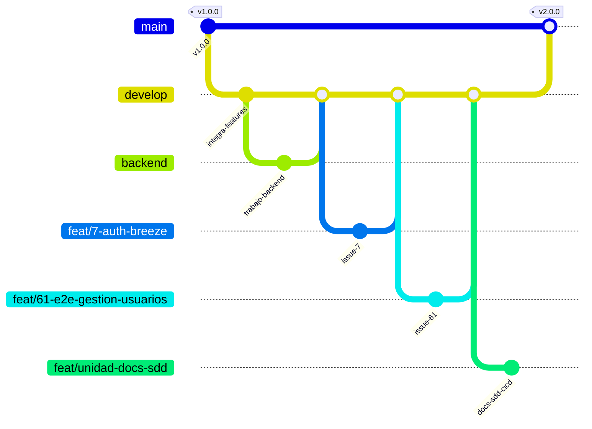
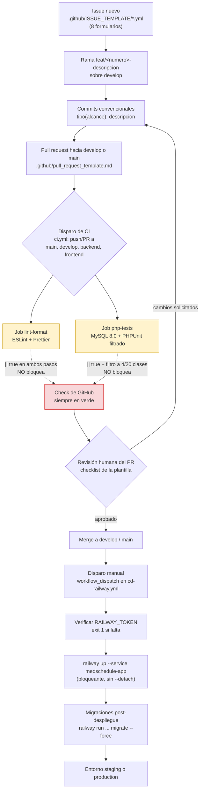

# 04 — Flujo de trabajo para el control de versiones (CI/CD)

Este documento cubre el punto 4 de la rúbrica: el flujo de trabajo de control de versiones (ramas,
convenciones de commit y de issues/PR) y la integración/entrega continua (GitHub Actions) del
repositorio `MedSchedule-`. Todo lo descrito aquí se verificó contra el estado real del repositorio
en la rama `feat/unidad-docs-sdd`, con `git branch -a`, `git tag` y `grep -n` contra los archivos de
workflow. El documento se sostiene solo: no es necesario abrir el repositorio para entender el
pipeline, sus huecos y el workflow de despliegue agregado en esta unidad.

## 1. Modelo de ramas real

El repositorio no sigue un único modelo de libro de texto (no es GitFlow puro ni trunk-based puro),
sino una convención propia observable en el listado real de ramas.

Ramas locales y remotas verificadas con `git branch -a` en esta máquina:

- **`main`** — rama por defecto del repositorio (`remotes/origin/HEAD -> origin/main`). Recibe
  `push` directo y `pull_request` según `.github/workflows/ci.yml:4-7`.
- **`develop`** — rama de integración. También dispara CI en `push` y `pull_request`
  (`.github/workflows/ci.yml:5,7`).
- **`backend`** y **`frontend`** — ramas de equipo (integración parcial por área). Disparan CI en
  `push` (`.github/workflows/ci.yml:5`) pero no están en la lista de `pull_request`
  (`.github/workflows/ci.yml:7`): un PR contra `backend` o `frontend` no ejecuta el pipeline.
- **`feat/<numero>-<descripcion>`** — una rama por issue, con el número del issue como prefijo.
  Verificadas: `feat/7-auth-breeze`, `feat/11-forgot-password-view-queue`, `feat/12-dashboard`,
  `feat/13-about`, `feat/14-frontend-view-queue`, `feat/18-security-hardening`,
  `feat/21-rbac-admin-ui`, `feat/26-doctor-agenda-ui`, `feat/31-patient-profile-controller`,
  `feat/36-specialties-crud-ui`, `feat/37-doctor-schedules-ui`, `feat/40-doctor-profile-ui`,
  `feat/42-admin-activity-logs-ui`, `feat/53-performance-indexes`,
  `feat/54-google-calendar-queue`, `feat/56-security-endpoints`,
  `feat/60-logs-paginacion-defensiva`, `feat/61-e2e-gestion-usuarios`, `feat/64-limpieza-repo`, y
  `feat/unidad-docs-sdd` (la rama de esta entrega, que no numera issue porque documenta la unidad
  completa en vez de una funcionalidad puntual). Solo en remoto existen además
  `feat/5-migraciones-bd`, `feat/19-google-calendar` y `feat/55-dashboard-cache-service`, ya
  fusionadas o pendientes de limpieza local.
- **`test/22-unit-tests-auth`** — variante del mismo esquema numerado, con prefijo `test/` en vez de
  `feat/`, para trabajo dedicado a pruebas de un issue concreto.
- **`backup/pantallas-actual`** — rama de respaldo puntual, fuera del esquema numerado.
- **`tmp/integration-check`** — rama temporal de verificación de integración.

Ninguna de estas ramas —`backend`, `frontend`, `feat/*`, `test/*`, `backup/*`, `tmp/*`— pasa por
`pull_request` en el pipeline salvo que el PR apunte a `main` o `develop`; son ramas de trabajo, y la
compuerta de CI solo se activa cuando el cambio se propone contra una rama de integración.

Tags verificados con `git tag`: `v1.0.0` y `v2.0.0`. No hay evidencia en el repositorio de que los
tags disparen ningún workflow (`.github/workflows/ci.yml` no declara un disparador `on: push: tags`),
por lo que el versionado con tags es hoy manual y desacoplado de CI/CD.



El diagrama simplifica: no reproduce las ~20 ramas `feat/*` reales ni `frontend`, `test/22-...`,
`backup/pantallas-actual` ni `tmp/integration-check` (harían el gráfico ilegible), pero sí refleja el
patrón verificado — ramas de equipo (`backend`) y ramas por issue (`feat/<n>-...`) que fusionan hacia
`develop`, y `develop` que fusiona hacia `main` en los puntos marcados con tag.

## 2. Convenciones de commits, issues y pull requests

### 2.1 Commits

Formato de commit convencional: `tipo(alcance): descripción`. Tipos usados en este proyecto (y en
esta misma entrega, según `global-constraints.md`): `feat`, `fix`, `docs`, `chore`, `refactor`,
`test`, `style`, `ci`, `perf`. Sin líneas de atribución (`Co-Authored-By` u otras) en el mensaje.

### 2.2 Plantillas de issue

`.github/ISSUE_TEMPLATE/` contiene **ocho** formularios (verificado con `ls`, no siete):

| Archivo | `name:` del formulario | `title:` |
|---|---|---|
| `01-FEATURE-FORM.yml` | Solicitud de Funcionalidad | `[feat]: ` |
| `10-CHORE-FORM.yml` | Tarea Menor | `[Chore]: ` |
| `20-BUG-REPORT.yml` | Reporte de Error | `[Bug]: ` |
| `30-CI-FORM.yml` | Cambios en la Integración Continua (CI/CD) | `[CI]: ` |
| `40-DOCS-FORM.yml` | Cambio en Documentación | `[Docs]: ` |
| `50-PERF-FORM.yml` | Mejora de Rendimiento | `[Perf]: ` |
| `60-REFACTOR-FORM.yml` | Reestructuración del Código | `[Refactor]: ` |
| `70-TEST-FORM.yml` | Agregar o Actualizar Pruebas | `[Test]: ` |

El prefijo numérico de cada archivo (`01`, `10`, `20`...) ordena el selector de issues en GitHub; no
tiene relación con el número de issue de las ramas `feat/<numero>-...`. El formulario `30-CI-FORM.yml`
es, en particular, el canal formal para proponer cambios al propio pipeline — por ejemplo, el fix de
`ci.yml` que se propone en la sección 5 de este documento debería abrirse como un issue `[CI]:`.

### 2.3 Plantilla de pull request

Existen dos rutas para la misma plantilla: `.github/pull_request_template.md` y
`.github/PULL_REQUEST_TEMPLATE/01-pull_request_template.md` (contenido idéntico, 1874 bytes cada
una). GitHub usa `pull_request_template.md` en la raíz de `.github/` como plantilla por defecto al
abrir un PR; la copia dentro de `PULL_REQUEST_TEMPLATE/` sigue la convención que permite tener
múltiples plantillas seleccionables por query string (`?template=`), aunque aquí solo hay una.

La plantilla exige, en este orden: un resumen del cambio, el tipo de cambio marcado con checkbox
(`fix`, `feat`, `refactor`, `test`, `ci`, `perf`, `docs`, u "otro"), la lista de archivos afectados,
instrucciones para probarlo localmente, un checklist de verificación (haber probado localmente,
seguir la convención de commits, haber actualizado pruebas y documentación, "no hay errores en
CI/CD") y notas adicionales con referencias cruzadas a issues/PRs relacionados.

El punto "no hay errores en CI/CD" del checklist es, hoy, una autodeclaración del autor del PR: como
se detalla en la sección 3, el pipeline actual no puede contradecirlo automáticamente, porque sus
pasos de calidad terminan en `|| true` y nunca reportan fallo.

## 3. El pipeline actual: `.github/workflows/ci.yml`, job por job

Este archivo es preexistente y **no se modifica en esta entrega** (restricción vinculante de
`global-constraints.md`). Se describe y se critica a continuación, verificado línea por línea con
`grep -n`.

### 3.1 Disparadores (líneas 3-7)

```yaml
on:
    push:
        branches: [main, develop, backend, frontend]
    pull_request:
        branches: [main, develop]
```

Se ejecuta en cada `push` a `main`, `develop`, `backend` o `frontend`, y en cada `pull_request` cuyo
destino sea `main` o `develop`. Un PR hacia `backend` o `frontend` no dispara el pipeline: solo lo
hace un `push` directo a esas dos ramas.

### 3.2 Job `lint-format` (líneas 10-29)

Corre en `ubuntu-latest`. Pasos:

1. `actions/checkout@v4` (línea 15) — descarga el código del commit disparador.
2. `actions/setup-node@v4` con `node-version: '20'` (líneas 18-20) — instala Node 20 (LTS), la misma
   versión documentada en `docs/entrega/01-configuracion-herramientas.md`.
3. `npm ci` (línea 23) — instala dependencias de Node de forma reproducible desde `package-lock.json`.
4. `npx eslint resources/js --ext .js --max-warnings=50 || true` (**línea 26**) — analiza el JS de
   `resources/js` con ESLint, tolerando hasta 50 advertencias antes de considerarlas error. El
   `|| true` al final hace que el paso termine siempre en éxito (código de salida 0),
   **sin importar cuántos errores reales de lint existan**.
5. `npx prettier --check "resources/**/*.{js,css}" || true` (**línea 29**) — verifica formato de
   JS/CSS bajo `resources/`. El mismo `|| true` aplica: el paso nunca falla el job aunque el formato
   esté roto.

### 3.3 Job `php-tests` (líneas 31-92)

Corre en `ubuntu-latest`, con un servicio adicional:

```yaml
services:
    mysql:
        image: mysql:8.0
        env:
            MYSQL_ROOT_PASSWORD: password
            MYSQL_DATABASE: medschedule_test
        ports:
            - 3306:3306
        options: --health-cmd="mysqladmin ping" --health-interval=10s --health-timeout=5s --health-retries=3
```

Levanta un contenedor MySQL 8.0 con la base `medschedule_test`, expuesto en el puerto 3306 del
runner, con verificación de salud (`mysqladmin ping`) para que los pasos siguientes no arranquen
contra un motor todavía no listo. La contraseña `password` es una credencial efímera del contenedor
de CI (vive y muere con el job), no un secreto de producción — no representa una filtración.

Pasos:

1. `actions/checkout@v4` (línea 46) — descarga el código.
2. `shivammathur/setup-php@v2` con `php-version: '8.2'` y extensiones `mbstring, pdo, pdo_mysql`
   (líneas 49-52) — instala PHP 8.2 con lo necesario para Laravel y para hablar con MySQL.
3. `actions/setup-node@v4` con `node-version: '20'` (líneas 55-57) — Node 20, necesario para
   compilar assets con Vite antes de correr las pruebas de feature (varias vistas Blade dependen del
   manifiesto de Vite).
4. `npm ci` (línea 60) — dependencias de Node.
5. `npm run build` (línea 63) — compila los assets con Vite y genera el manifiesto que consumen las
   vistas Blade vía `@vite(...)`.
6. `composer install --no-interaction --prefer-dist` (línea 66) — dependencias PHP.
7. `cp .env.example .env` (línea 69) — crea el `.env` del runner a partir de la plantilla versionada;
   no hay secretos aquí, es un archivo de ejemplo público.
8. `php artisan key:generate` (línea 72) — genera `APP_KEY` para el `.env` recién copiado.
9. `php artisan migrate --force` (línea 82) — corre las migraciones contra el servicio MySQL, con las
   variables `DB_*` inyectadas por `env:` (líneas 75-81) apuntando a `127.0.0.1:3306`,
   `medschedule_test`, usuario `root`, contraseña `password` (la misma credencial efímera del
   servicio, no un secreto real).
10. `php artisan test --filter="AuthTest|ActivityLogControllerTest|ExampleTest|EnsureAdminRoleTest" || true`
    (**línea 92**) — ejecuta **solo** las cuatro clases de prueba nombradas en el filtro, de las
    **veinte** clases de prueba que existen en el repositorio. El `|| true` final hace que este paso
    —el único que ejecuta lógica de negocio— nunca falle el job, sin importar cuántas aserciones
    fallen dentro de esas cuatro clases.

### 3.4 Lo que el pipeline no hace

**El pipeline no ejecuta Playwright en absoluto.** No hay ningún paso que invoque
`npx playwright test` ni el script `test:e2e` de `package.json`; las pruebas end-to-end existen en el
repositorio pero no corren nunca en GitHub Actions, solo si alguien las dispara manualmente en su
máquina.

## 4. Hallazgo central: por qué este pipeline nunca reporta fallo

Este es el hallazgo más importante del documento, porque explica por qué el check verde de GitHub
Actions en un PR **no es evidencia de que el código funcione**.

- **Los tres `|| true`** (líneas 26, 29 y 92) convierten cualquier código de salida distinto de cero
  del comando que los precede en un código de salida 0. En Bash, `comando || true` significa
  "si `comando` falla, ejecuta `true` en su lugar", y el código de salida del paso es el de `true`
  (siempre 0). El resultado práctico: ESLint puede reportar cientos de errores, Prettier puede
  encontrar todo el código mal formateado, y PHPUnit puede fallar sus cuatro clases filtradas por
  completo — el job termina en verde en los tres casos, porque el paso nunca propaga el fallo al
  runner.
- **El filtro de la línea 92** (`--filter="AuthTest|ActivityLogControllerTest|ExampleTest|EnsureAdminRoleTest"`)
  reduce la ejecución a 4 de las 20 clases de prueba del repositorio. Las 16 restantes —incluidas
  `AdminRbacAccessTest`, `AppointmentControllerTest`, `DoctorProfileControllerTest`,
  `ScheduleControllerTest`, `SpecialtyControllerTest` (con 2 fallos verificados cada una),
  `DashboardControllerTest` (3 fallos) y `GoogleCalendarControllerTest` (2 fallos) — **nunca se
  ejecutan en CI**, sin importar si están rotas o no. `docs/entrega/02-plan-de-pruebas.md` (sección
  6) documenta la taxonomía completa de esos 15 fallos verificados al correr la suite completa fuera
  del pipeline: 10 son tests obsoletos que nunca autentican (no usan `actingAs()` ni
  `RefreshDatabase`, y las rutas que golpean ya están protegidas por
  `Route::middleware(['auth','role:admin'|'role:doctor'])` de Spatie, `routes/web.php:46,103,121`),
  3 son drift real entre `/dashboard` y lo que el test espera, y 2 apuntan a un defecto de
  integración con `GoogleCalendarService`. Ninguno de los 15 se corrige en esta entrega (regla: no
  arreglar nada existente); quedan documentados como trabajo de la unidad siguiente.
- **Playwright ausente por completo** significa que ningún flujo de navegador real —incluyendo el
  dashboard del paciente— se verifica en CI. Esto tiene una consecuencia concreta ya identificada:
  `resources/views/patient/dashboard.blade.php` (línea 18) referencia
  `resources/js/patient-dashboard.js` vía `@vite(...)`, pero ese archivo no está en el arreglo
  `input` de `vite.config.js` (que sí lista los otros doce entrypoints). Con `npm run dev` esto pasa
  desapercibido porque el servidor de desarrollo de Vite sirve cualquier ruta; con `npm run build`
  —el comando que el propio `ci.yml:63` ejecuta— el archivo queda fuera del manifiesto, y al
  renderizar esa vista en producción Laravel lanza "Unable to locate file in Vite manifest". El
  dashboard del paciente está roto en producción hoy, y nada en el pipeline lo detecta: no hay
  prueba E2E que cargue esa vista, y aunque la hubiera, Playwright no corre en CI.

**Combinando los tres hallazgos:** el pipeline actual no tiene ninguna compuerta de calidad real. El
check verde en un PR certifica únicamente que el código compiló y que `npm ci` / `composer install`
terminaron sin error — no que el lint pase, no que el formato esté correcto, no que las pruebas de
negocio pasen, y no que la aplicación funcione en un navegador real.

### 4.1 Fix propuesto para la unidad siguiente (no aplicado en esta entrega)

Por orden de impacto, sin tocar `ci.yml` en esta entrega (restricción vinculante):

1. Quitar los tres `|| true` (líneas 26, 29, 92) para que el job falle cuando el paso correspondiente
   falle.
2. Ampliar el filtro de la línea 92 a la suite completa (quitar `--filter=...`), una vez corregidos
   los 15 fallos documentados en `docs/entrega/02-plan-de-pruebas.md` — corregir primero, ampliar el
   filtro después, para no romper el pipeline con un `git push` intermedio.
3. Añadir un paso (o job) que ejecute Playwright (`npx playwright test` / `npm run test:e2e`) contra
   la app servida, cubriendo al menos los flujos de `specs/001-pruebas-e2e/`.
4. Añadir `resources/js/patient-dashboard.js` al arreglo `input` de `vite.config.js`, y cubrir esa
   vista con una prueba E2E que la cargue, para que un futuro regreso del mismo defecto sí falle el
   build.

## 5. El workflow de despliegue agregado en esta entrega: `.github/workflows/cd-railway.yml`

Este archivo se creó en la Tarea 8 de esta misma unidad (no preexistía). A diferencia de `ci.yml`,
sí es material de esta entrega y puede describirse como andamiaje construido, no solo observado.

### 5.1 Por qué el disparo es manual

El único disparador es `workflow_dispatch` con un input `entorno` (líneas 6-16):

```yaml
on:
    workflow_dispatch:
        inputs:
            entorno:
                description: 'Entorno destino del despliegue'
                required: true
                default: 'staging'
                type: choice
                options:
                    - staging
                    - production
```

No hay disparador `push` ni `pull_request`: el workflow no se ejecuta solo. Alguien con permisos
debe entrar a la pestaña Actions de GitHub y lanzarlo a mano, eligiendo `staging` o `production`. Es
una decisión deliberada, no una limitación: en esta unidad se entrega el **andamiaje** de despliegue
continuo (el workflow, la verificación del secreto, el orden correcto de los pasos), no un
**despliegue automático** en producción. Automatizar el disparo (por ejemplo, al hacer merge a
`main`) requiere que antes existan condiciones que hoy no se cumplen: un proyecto de Railway
provisionado, el secreto `RAILWAY_TOKEN` configurado en el repositorio, y — sobre todo — que `ci.yml`
deje de terminar en `|| true`, porque no tiene sentido desplegar automáticamente algo cuyo pipeline
de integración continua no puede fallar aunque el código esté roto (sección 4). Mientras esa
precondición no se resuelva, el disparo manual es la opción responsable: cada despliegue queda
sujeto a una decisión humana explícita.

### 5.2 `concurrency` (líneas 18-20)

```yaml
concurrency:
    group: cd-railway-${{ github.event.inputs.entorno }}
    cancel-in-progress: false
```

El grupo de concurrencia se agrupa por entorno (`cd-railway-staging` / `cd-railway-production`), así
que dos ejecuciones simultáneas hacia el **mismo** entorno se serializan (la segunda espera a que
termine la primera) en vez de correr en paralelo y pisarse; `cancel-in-progress: false` evita que un
segundo disparo cancele un despliegue ya en curso a medio terminar. Un despliegue a `staging` y uno a
`production` sí pueden coexistir, porque pertenecen a grupos distintos.

### 5.3 Pasos del job `desplegar`

1. `actions/checkout@v4` (línea 30) — descarga el código a desplegar.
2. **Verificación del secreto** (líneas 32-40): expone `RAILWAY_TOKEN` como variable de entorno del
   paso vía `secrets.RAILWAY_TOKEN`, y si viene vacía (`-z "$RAILWAY_TOKEN"`) imprime un error con la
   anotación `::error::` de GitHub Actions y termina con `exit 1`, fallando el job explícitamente
   antes de intentar nada. El paso deja constancia de que el secreto está presente sin imprimir su
   valor ("Secreto presente. No se imprime su valor.") — el repositorio es público y el token nunca
   debe aparecer en un log.
3. `actions/setup-node@v4` con `node-version: '20'` (líneas 42-45) — Node necesario para instalar el
   CLI de Railway, que se distribuye como paquete npm.
4. `npm install -g @railway/cli` (línea 48) — instala el CLI de Railway globalmente en el runner.
5. **Despliegue** (líneas 50-56): `railway up --service medschedule-app`, deliberadamente **sin**
   `--detach`. Sin ese flag, el comando bloquea la ejecución del paso hasta que Railway termina de
   construir y arrancar el servicio; con `--detach` el comando retornaría de inmediato y el paso
   siguiente (migraciones) podría ejecutarse contra un servicio todavía en transición, a mitad de
   arranque. La elección prioriza correctitud del orden sobre velocidad del workflow.
6. **Migraciones** (líneas 58-61): `railway run --service medschedule-app php artisan migrate --force`,
   ejecutado ya contra el entorno desplegado, después de que el paso anterior confirma que terminó.

### 5.4 Manejo de `RAILWAY_TOKEN` como secreto

`RAILWAY_TOKEN` se referencia únicamente como `${{ secrets.RAILWAY_TOKEN }}` (líneas 34, 52, 60): un
secreto de GitHub Actions configurado por fuera del código, en la configuración del repositorio
(Settings → Secrets and variables → Actions) o del `environment` correspondiente. El archivo nunca
contiene el valor del token, solo su nombre — coherente con que el repositorio es público. El job
declara `environment: ${{ github.event.inputs.entorno }}` (línea 26), lo que además permite, si se
configuran "environments" de GitHub para `staging` y `production` con secretos propios, que cada
entorno use su propio `RAILWAY_TOKEN` sin que el workflow tenga que saber cuál es cuál.

### 5.5 Redundancia detectada con `nixpacks.toml`

`nixpacks.toml` (`[start] cmd`) ya ejecuta `php artisan migrate --force` como parte del comando de
arranque del contenedor, antes de levantar `frankenphp`. El paso 6 de este workflow ejecuta el mismo
comando otra vez, después del despliegue. En un despliegue real las migraciones correrían dos veces:
no es destructivo (las migraciones de Laravel son idempotentes por su tabla de control
`migrations`), pero es redundante y deja ambiguo cuál de los dos lugares debería ser el responsable.
Este documento no decide cuál eliminar — queda como decisión pendiente para la unidad siguiente,
junto con los otros dos defectos de `nixpacks.toml` ya documentados en
`docs/entrega/01-configuracion-herramientas.md` (sección 2.6): el `Caddyfile` referenciado que no
existe, y que `frankenphp`/`laravel/octane` no están declarados en `composer.json`. Los tres
defectos, sumados al del manifiesto de Vite (sección 4), son cuatro problemas que impedirían un
despliegue exitoso hoy si `cd-railway.yml` se ejecutara contra un proyecto de Railway real.

## 6. Recorrido completo: del issue al despliegue, con sus compuertas de calidad



Lectura del diagrama: las únicas compuertas de calidad **automáticas** hoy son la existencia misma
de los jobs (si `npm ci`, `composer install`, `npm run build` o las migraciones fallan por un error
de infraestructura, el job sí falla, porque esos pasos no tienen `|| true`); todo lo que evalúa
*calidad del código* (lint, formato, pruebas) está neutralizado por `|| true` y por el filtro
reducido, y no puede bloquear un merge. La compuerta real que existe hoy es **humana**: la revisión
del pull request contra el checklist de `.github/pull_request_template.md`. El paso de despliegue
(`cd-railway.yml`) sí tiene una compuerta automática propia y efectiva —la verificación de
`RAILWAY_TOKEN` con `exit 1`— pero ocurre después de todo lo anterior, y solo protege contra la
ausencia del secreto, no contra la calidad del código que se está desplegando.

## 7. Verificación

Toda cita de línea de este documento contra `.github/workflows/ci.yml` se verificó con:

```bash
cd /Applications/MAMP/htdocs/MedSchedule-
grep -n 'true' .github/workflows/ci.yml
grep -n 'filter' .github/workflows/ci.yml
```

Salida obtenida (coincide con las líneas 26, 29 y 92 citadas en la sección 3):

```
26:              run: npx eslint resources/js --ext .js --max-warnings=50 || true
29:              run: npx prettier --check "resources/**/*.{js,css}" || true
92:              run: php artisan test --filter="AuthTest|ActivityLogControllerTest|ExampleTest|EnsureAdminRoleTest" || true
```

El modelo de ramas (sección 1) se verificó con `git branch -a` y `git tag` en esta máquina, sobre la
rama `feat/unidad-docs-sdd`. Las plantillas de issue y PR (sección 2) se verificaron con `ls -la
.github/ISSUE_TEMPLATE/` (ocho archivos) y `ls -la .github/pull_request_template.md
.github/PULL_REQUEST_TEMPLATE/` (dos rutas, contenido idéntico). El contenido de
`.github/workflows/cd-railway.yml` (sección 5) se verificó con `cat -n` completo del archivo. Ninguno
de los archivos fuera de `docs/entrega/04-flujo-cicd.md` se modificó para producir este documento.
