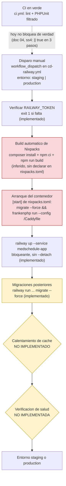

# 05 — Estrategia de despliegue

Punto 5 de la rúbrica: "estrategia de despliegue mediante pipelines CI/CD". Este documento describe
los entornos reales de `MedSchedule-`, la elección de Railway como destino de despliegue, el diseño
del pipeline con sus etapas y compuertas, el manejo de secretos, el procedimiento de migraciones, la
estrategia de reversión y el rol de Terraform como capa declarativa sin aplicar. Cierra con la
sección más valiosa del documento: cuatro defectos de despliegue verificados hoy en el repositorio,
que impedirían un despliegue exitoso, y que **no se corrigen en esta entrega** (regla vinculante de
`global-constraints.md`) porque su fix es trabajo de la unidad siguiente.

## 0. Método de verificación

Todo dato de este documento se obtuvo abriendo el archivo citado en esta máquina (rama
`feat/unidad-docs-sdd`) o ejecutando el comando de verificación indicado, siguiendo el mismo método
que `01-configuracion-herramientas.md`, `02-plan-de-pruebas.md` y `04-flujo-cicd.md`. En particular,
los cuatro defectos de despliegue de la sección 8 se verificaron así:

```bash
cd /Applications/MAMP/htdocs/MedSchedule-
sed -n '1,25p' resources/views/patient/dashboard.blade.php   # confirma la línea 18
cat -n vite.config.js                                        # confirma las 17 entradas de "input"
cat -n nixpacks.toml                                          # confirma el "cmd" de arranque completo
find . -maxdepth 2 -iname "Caddyfile"                         # sin resultados: no existe
grep -inE 'frankenphp|laravel/octane' composer.json           # sin resultados: no declarado
cat -n .github/workflows/cd-railway.yml                        # confirma el paso de migración posterior
```

Ningún archivo bajo `app/`, `routes/`, `config/`, `database/`, `tests/`, `resources/` ni
`.github/` se modificó para producir este documento; `nixpacks.toml` y `vite.config.js` permanecen
intactos. Este documento no contradice a `docs/sdd/sdd-proposal.md` (hallazgo 4, la discrepancia de
tres declaraciones sobre el motor de base de datos) ni a `docs/entrega/01-configuracion-
herramientas.md` §2.6 (los tres defectos ya detectados de `nixpacks.toml`) ni a
`docs/entrega/04-flujo-cicd.md` §5 (la descripción de `cd-railway.yml`): los reproduce y los
completa con la perspectiva de despliegue, sin repetirlos íntegros.

## 1. Entornos

| Entorno | Propósito | Base de datos | Quién despliega | Cómo se accede |
|---|---|---|---|---|
| Local | Desarrollo del autor en esta máquina | SQLite, `database/database.sqlite` (`.env.example:` `DB_CONNECTION=sqlite`) | El propio desarrollador, con `php artisan serve` | `http://127.0.0.1:8000`, solo desde esta máquina |
| Pruebas locales | Ejecutar `php artisan test` contra un motor real antes de subir cambios | MySQL de MAMP en el puerto `8889`, base `medschedule_test` (forzada por `phpunit.xml:26-27`) | El propio desarrollador, invocando PHPUnit con `DB_HOST`/`DB_PORT` explícitos | No es un entorno servido: solo la conexión de base de datos usada por la suite |
| Integración continua | Verificar cada `push`/`pull_request` a `main`/`develop`/`backend`/`frontend` de forma aislada y reproducible | Servicio MySQL 8.0 efímero, base `medschedule_test` (`.github/workflows/ci.yml:34-42`) | GitHub Actions, automáticamente; nadie dispara este entorno a mano | Solo accesible desde dentro del runner durante la ejecución del workflow; no queda expuesto después |
| Staging | Validar un cambio en infraestructura real de Railway antes de producción | MySQL gestionado por Railway (servicio propio, aún no provisionado) | Una persona autorizada, disparando `workflow_dispatch` en `cd-railway.yml` con `entorno: staging` | URL pública que Railway asigna al servicio `medschedule-app` en el proyecto de staging (dominio no fijado todavía en esta unidad, porque el proyecto de Railway no existe aún — ver sección 3) |
| Producción | Servir la aplicación a usuarios reales | MySQL gestionado por Railway (servicio propio, aún no provisionado) | La misma persona autorizada, disparando `workflow_dispatch` con `entorno: production` | URL pública que Railway asigna al servicio `medschedule-app` en el proyecto de producción |

La fila de integración continua y la de pruebas locales usan el mismo nombre de base
(`medschedule_test`) en motores distintos (MySQL de MAMP en `8889` contra el servicio efímero de
GitHub Actions en `3306`), y ninguna de las dos coincide con el `DB_CONNECTION=sqlite` de
desarrollo local ni, cuando existan, con el MySQL gestionado de Railway. Esta discrepancia de tres
declaraciones activas sobre el motor de base de datos ya está documentada como hallazgo verificado
en `docs/sdd/sdd-proposal.md` (hallazgo 4) y en `docs/entrega/01-configuracion-herramientas.md`
(fila 4 del inventario); este documento no la repite, solo añade el quinto dato real: Railway con
MySQL gestionado es el motor previsto para staging y producción, el único de los cinco que hoy no
tiene ni host ni credenciales, porque el proyecto de Railway todavía no se ha creado.

## 2. Por qué Railway

### 2.1 El argumento técnico decisivo: `nixpacks.toml` ya existe

El repositorio ya trae `nixpacks.toml` en su raíz (`docs/entrega/01-configuracion-herramientas.md`
§2.6 reproduce su contenido íntegro). Nixpacks es exactamente el formato de configuración que el
constructor nativo de Railway consume para detectar los lenguajes del proyecto (PHP vía
`composer.json`, Node vía `package.json`) e inferir las fases de instalación y build —
`composer install`, `npm ci`, `npm run build` — sin que el repositorio necesite declarar un
`Dockerfile` propio ni ningún otro artefacto de build adicional. El archivo `nixpacks.toml` presente
en el repositorio solo sobreescribe la fase `[start]` (el comando de arranque del contenedor); el
resto de las fases las infiere Nixpacks automáticamente a partir de los manifiestos de dependencias
ya existentes. Elegir cualquier otra plataforma habría exigido escribir esa configuración de build
desde cero; con Railway, ya está resuelta.

### 2.2 IONOS ya no está disponible

El autor ya no tiene la infraestructura de IONOS que usaba antes de esta unidad: un hosting
compartido con despliegue manual por SFTP/SSH. La documentación operativa de ese despliegue —un
checklist de pasos y un documento de estructura de base de datos— existió en algún momento en el
árbol de trabajo de esta máquina, pero **no forma parte de este repositorio ni de ningún commit
alcanzable de su historial**, y no se referencia aquí por ruta porque un lector del repositorio
público no la encontraría: esos dos documentos contenían credenciales en claro de esa
infraestructura y se conservan, por decisión del autor, únicamente en local, fuera del control de
versiones. La sección 8.5 detalla ese hallazgo de seguridad. Railway es el destino oficial decidido
por el autor para reemplazar la infraestructura desaparecida.

### 2.3 Comparación con Render y con un VPS propio

| Criterio | Railway | Render | VPS propio |
|---|---|---|---|
| Consume el `nixpacks.toml` ya presente en el repositorio | Sí, de forma nativa: es el propio formato de build de Railway | No: Render tiene su propio sistema de detección de build (buildpacks o Docker); reutilizar `nixpacks.toml` tal cual no está garantizado y no se verificó en esta entrega | No aplica: un VPS no tiene constructor propio, cada paso (instalar PHP, Node, un servidor web, MySQL) se configura a mano |
| Base de datos gestionada | Sí, MySQL como servicio del propio proyecto de Railway | Sí, ofrece bases de datos gestionadas (Postgres nativo; MySQL con matices que no se verificaron en esta entrega) | No: el equipo tendría que instalar, actualizar y respaldar MySQL manualmente, la misma carga operativa que hizo que IONOS dejara de ser sostenible |
| Disparo desde el repositorio de GitHub | Sí, ya implementado en esta unidad (`cd-railway.yml`, `workflow_dispatch` + CLI de Railway) | Sí, Render soporta despliegue automático desde GitHub de forma nativa, sin necesidad de un workflow propio | No: requeriría un paso adicional de `rsync`/`scp`/SSH orquestado desde el pipeline, similar al SFTP manual que usaba IONOS |
| Costo exacto vigente | No se verificó en esta entrega el detalle de precios ni límites del plan gratuito/de pago actuales de Railway; se deja como incertidumbre explícita en vez de citar una cifra no comprobada | Igual: no se verificó el detalle vigente de precios de Render | Costo de un VPS típico es más predecible por sí solo, pero no incluye el tiempo de operación (parches de seguridad, actualizaciones, monitoreo) que sí absorbe una plataforma gestionada |
| Esfuerzo de migración desde el estado actual del repositorio | Ninguno adicional de build: solo falta crear el proyecto y resolver los defectos de la sección 8 | Reescribir la configuración de build específica de Render, sin reutilizar directamente `nixpacks.toml` | Reescribir todo el aprovisionamiento desde cero (servidor web, PHP-FPM o equivalente, MySQL, certificados TLS), la misma carga que ya demostró no ser sostenible con IONOS |

**Conclusión**: Railway es la elección correcta no por una comparación de precios (que este
documento no puede verificar hoy con datos confiables), sino porque el repositorio ya está
construido para consumirlo sin trabajo adicional de configuración de build, tiene base de datos
gestionada, y el pipeline de disparo desde GitHub ya existe (`cd-railway.yml`). Render sería viable
en teoría pero exigiría reescribir la capa de build; un VPS propio reproduciría exactamente la carga
operativa que dejó de ser sostenible con IONOS.

## 3. Diseño del pipeline: etapas y compuertas

El pipeline de despliegue de esta unidad combina lo ya implementado en
`.github/workflows/cd-railway.yml` (descrito en detalle en `docs/entrega/04-flujo-cicd.md` §5) con
dos etapas que el diseño requiere pero que **hoy no existen en el archivo**: calentamiento de caché
y verificación de salud. Se marcan explícitamente como ausentes, no se inventan como si ya
estuvieran implementadas.



Lectura del diagrama, etapa por etapa:

1. **CI en verde** — compuerta de entrada deseable, pero `docs/entrega/04-flujo-cicd.md` §4 ya
   documenta que hoy no puede fallar de verdad (tres `|| true` y un filtro reducido a 5 de 20
   clases). El pipeline de despliegue no verifica por sí mismo que CI haya pasado: es una compuerta
   humana (quien dispara `workflow_dispatch` decide si CI se veía bien), no una compuerta técnica.
2. **Verificar `RAILWAY_TOKEN`** — la única compuerta automática que existe hoy en
   `cd-railway.yml`, y funciona: `exit 1` si el secreto falta (líneas 32-40, ver sección 4).
3. **Build automático de Nixpacks** — aquí es donde el defecto del manifiesto de Vite (sección 8.1)
   se materializa: `npm run build` corre sin errores, pero el manifiesto queda incompleto.
4. **Arranque del contenedor** (`[start]` de `nixpacks.toml`) — aquí se materializan los otros tres
   defectos: el `Caddyfile` inexistente (6.2), el binario de FrankenPHP no garantizado (6.3), y la
   primera de las dos ejecuciones de `migrate --force` (6.4).
5. **`railway up`** y **migraciones posteriores** — ya implementados en `cd-railway.yml`, con el
   orden correcto (sin `--detag` para no correr migraciones contra un servicio a medio arrancar,
   `docs/entrega/04-flujo-cicd.md` §5.3), pero la migración posterior es la segunda ejecución del
   mismo comando que ya corrió en la etapa anterior.
6. **Calentamiento de caché y verificación de salud** — ninguna de las dos existe en
   `cd-railway.yml` hoy. Se proponen para la unidad siguiente: un paso `railway run --service
   medschedule-app php artisan config:cache && php artisan route:cache && php artisan view:cache`
   después de las migraciones, y un paso final que haga una petición HTTP a la URL desplegada
   (por ejemplo a una ruta de salud simple) y falle el job si la respuesta no es `200`, en vez de dar
   por exitoso el despliegue solo porque `railway up` no reportó error de infraestructura.

### 3.1 Por qué estas compuertas no bastan hoy

Ninguna etapa del diagrama detectaría hoy los cuatro defectos de la sección 8: el build de Vite
"tiene éxito" (genera un manifiesto, solo que incompleto), `railway up` no puede fallar por un
`Caddyfile` faltante porque ese fallo ocurre *dentro* del contenedor ya desplegado, y no hay
verificación de salud que lo detecte después. Es exactamente el argumento central de este documento:
un pipeline con compuertas nominales pero sin verificación real de resultado no es distinto, en la
práctica, del `|| true` que ya neutraliza a `ci.yml` (`docs/entrega/04-flujo-cicd.md` §4).

## 4. Manejo de secretos

- **`RAILWAY_TOKEN`** vive exclusivamente como secreto de GitHub Actions
  (`${{ secrets.RAILWAY_TOKEN }}`, `cd-railway.yml` líneas 34, 52, 60), configurado por fuera del
  código en la configuración del repositorio o del `environment` correspondiente
  (`staging`/`production`, línea 26). El archivo lo referencia únicamente por su nombre; su valor
  nunca aparece en el repositorio, en ningún log de este documento, ni en ningún reporte de esta
  entrega. El paso de verificación (líneas 32-40) confirma que el secreto existe sin imprimirlo
  ("Secreto presente. No se imprime su valor.") y falla explícitamente con `exit 1` si falta.
- **Variables de aplicación** (`APP_KEY`, credenciales de la base de datos gestionada de Railway,
  credenciales de Google Calendar, etc.) se configuran como variables de entorno del propio servicio
  de Railway (`medschedule-app`), no como secretos de GitHub ni como archivos en el repositorio.
  Railway las inyecta al contenedor en tiempo de ejecución; el pipeline de despliegue no las toca ni
  las necesita conocer, porque no las declara en ningún paso de `cd-railway.yml`.
- **El `.env` jamás se commitea.** `.gitignore:7-8` excluye `.env*` salvo `.env.example` (la
  plantilla sin valores reales). Este documento no reproduce, y en ningún paso de su verificación se
  imprimió, el contenido de ningún `.env` real de esta máquina.
- **El repositorio es público.** Esa es la razón por la que `RAILWAY_TOKEN` se referencia solo por
  su nombre en este documento y en el propio workflow, la misma razón por la que la documentación
  heredada de la infraestructura de IONOS —que sí contiene credenciales reales en claro— no se versiona
  bajo ninguna forma en este repositorio (hallazgo de seguridad detallado en la sección 8.5), y por la
  que `terraform/variables.tf:1-7` marca `railway_token` como `sensitive = true` sin valor por
  defecto, inyectado únicamente por la variable de entorno `TF_VAR_railway_token`
  (`terraform/providers.tf:14-15`, comentario explícito: "El token JAMAS se escribe aqui").

## 5. Procedimiento de migraciones

El procedimiento previsto es `php artisan migrate --force` (el flag `--force` es necesario porque
Laravel bloquea `migrate` en `APP_ENV=production` sin él). Hoy ese comando se ejecuta en **dos**
lugares distintos del mismo despliegue — el defecto 4 de la sección 8.4 — y este documento no
decide aquí cuál de los dos debe quedar como responsable único; esa decisión, junto con el resto de
los defectos, es trabajo de la unidad siguiente. Lo que sí establece este documento es el criterio
para tomar esa decisión cuando se aborde:

- Si las migraciones quedan solo en `[start]` de `nixpacks.toml`, corren en **cada** arranque del
  contenedor (no solo en cada despliegue nuevo), lo cual es más frecuente de lo necesario pero
  garantiza que un contenedor nunca arranque con un esquema desactualizado.
- Si quedan solo en `cd-railway.yml` (paso posterior a `railway up`), corren exactamente una vez por
  despliegue disparado, en el momento explícito y auditable del workflow, pero un reinicio del
  contenedor sin un despliegue nuevo de por medio no las volvería a intentar.
- No es destructivo dejarlas duplicadas mientras tanto: las migraciones de Laravel son idempotentes
  por su tabla de control `migrations`, así que ejecutar `migrate --force` dos veces seguidas no
  reaplica una migración ya registrada.

## 6. Estrategia de reversión

La reversión prevista se apoya en el historial de despliegues de Railway: cada `railway up`
disparado por `cd-railway.yml` queda registrado como un despliegue distinto en el proyecto, y
Railway conserva ese historial para poder reactivar una versión anterior sin reconstruir desde cero.
No se verificó en esta entrega, por no existir todavía un proyecto de Railway real contra el cual
probarlo, el detalle exacto de esa interfaz (el flujo de "redeploy" de un despliegue anterior desde
el panel de Railway, o el subcomando equivalente del CLI); se documenta la estrategia general —
Railway conserva un historial de despliegues reactivable — sin afirmar pasos de interfaz no
confirmados.

Una ruta alternativa, más auditable porque no depende de la interfaz de Railway, es re-disparar
`workflow_dispatch` sobre un commit o tag anterior conocido como bueno (por ejemplo `v2.0.0`,
verificado con `git tag` en `docs/entrega/04-flujo-cicd.md` §1): como `cd-railway.yml` construye
siempre desde el código descargado por `actions/checkout@v4` en el momento del disparo, apuntar el
disparo a una referencia de git anterior reproduce ese despliegue anterior de forma explícita y
versionada, en vez de depender de un botón fuera del repositorio.

**Límite de esta estrategia, sin corregir en esta entrega**: ninguna de las dos rutas revierte el
esquema de la base de datos. El pipeline solo ejecuta `migrate --force` hacia adelante; no hay ningún
paso que ejecute `migrate:rollback` como parte de una reversión. Si un despliegue revertido depende
de una migración que el despliegue fallido ya aplicó y que no es compatible con el código anterior,
la reversión de código por sí sola no basta. Esto no es uno de los cuatro defectos verificados de la
sección 8 —es una limitación de diseño reconocida, no un defecto de código—, pero queda anotado aquí
porque es información necesaria para que la unidad siguiente decida si migraciones reversibles
(`down()` bien implementado en cada migración) son parte de su alcance.

## 7. Terraform como capa declarativa

`terraform/` contiene el esqueleto de infraestructura como código para el proyecto de Railway de
esta unidad, ya inventariado en `docs/entrega/01-configuracion-herramientas.md` §2.11. Este
documento añade el detalle de qué declara y por qué no se aplica todavía:

- **`terraform/providers.tf`** fija `required_version >= 1.6.0` y el proveedor comunitario
  `terraform-community-providers/railway ~> 0.4` (no es un proveedor oficial de HashiCorp). El token
  se inyecta por `var.railway_token`, nunca escrito en el archivo.
- **`terraform/variables.tf`** declara `railway_token` (`sensitive = true`, sin valor por defecto,
  inyectado vía `TF_VAR_railway_token`), `nombre_proyecto` (`default = "medschedule"`) y
  `nombre_entorno` (`default = "production"`, con `validation` que solo acepta `production` o
  `staging`).
- **`terraform/main.tf`** deja **comentados a propósito** dos recursos: `railway_project.medschedule`
  y `railway_service.app` (el servicio de aplicación construido con el `nixpacks.toml` del
  repositorio). Solo queda activo un `output "nota_estado"` informativo que recuerda que el esqueleto
  no está aplicado. El comentario de cabecera del archivo es explícito: aplicarlos sin revisar
  "provisiona infraestructura de pago".
- **`terraform/terraform.tfvars.example`** es la plantilla de valores; `.gitignore:44-49` excluye
  `*.tfstate`, `*.tfvars` (salvo el `.example`) y `.terraform/` del repositorio, para que ni el
  estado ni las variables reales con el token lleguen a este repositorio público.

**Por qué está sin aplicar**: `terraform version` no está instalado en esta máquina (verificado en
`01-configuracion-herramientas.md` §4), y aplicar los recursos comentados de `main.tf` crearía un
proyecto real de Railway con costo asociado, algo que esta unidad —de documentación y andamiaje, no
de aprovisionamiento— no está autorizada a hacer sin decisión explícita del autor.

**Camino para aplicarlo en la unidad siguiente**, en orden:

1. Instalar Terraform (`brew install terraform` en macOS, según `terraform/README.md`).
2. `cd terraform && terraform init`, para descargar el proveedor de Railway declarado en
   `providers.tf`.
3. Descomentar `railway_project.medschedule` y `railway_service.app` en `main.tf` solo cuando el
   equipo decida crear el proyecto real.
4. `terraform plan -var="railway_token=$TF_VAR_railway_token"` y revisar el plan antes de aplicar
   nada — el propio `terraform/README.md` insiste en este paso como crítico.
5. `terraform apply`, solo tras la revisión anterior, para crear el proyecto y el servicio de
   Railway; a partir de ahí, `RAILWAY_TOKEN` (sección 4) y el destino de `cd-railway.yml` referencian
   un proyecto real en vez de uno todavía inexistente.

## 8. Defectos verificados: cuatro de despliegue y un incidente de seguridad ya resuelto

Esta es la sección de mayor valor del documento: demuestra por qué el pipeline necesita compuertas
reales, ya que hoy ninguna de las etapas descritas en la sección 3 detectaría ninguno de los cuatro
defectos de despliegue siguientes (8.1 a 8.4), y el paso de pruebas de `ci.yml` termina en `|| true`
(`docs/entrega/04-flujo-cicd.md` §3-4). Ninguno de esos cuatro se corrige en esta entrega — se
documentan con su fix propuesto para la unidad siguiente, siguiendo la misma regla que ya aplicaron
los documentos 01 a 04. La sección 8.5 documenta un quinto defecto, de naturaleza distinta —no
bloquea un despliegue, expone credenciales— detectado y corregido dentro de esta misma tarea.

### 8.1 Defecto 1 — el dashboard del paciente no entra al manifiesto de Vite

**Gravedad: alta.** `resources/views/patient/dashboard.blade.php:18` invoca
`@vite([..., 'resources/js/patient-dashboard.js'])` dentro de un bloque que empieza en la línea 14.
`vite.config.js` declara un arreglo `input` de exactamente 17 entradas (7 hojas CSS en las líneas
8-14, 10 módulos JS en las líneas 15-24; verificado contando el arreglo completo) y
`resources/js/patient-dashboard.js` no es una de ellas. Con `npm run dev` el servidor de desarrollo
de Vite sirve cualquier ruta solicitada y el problema pasa desapercibido; con `npm run build` —el
comando que corre tanto `ci.yml:63` como la fase de build automática de Nixpacks en Railway (sección
3)— el archivo queda fuera del manifiesto versionado, y al renderizar la vista Laravel lanza "Unable
to locate file in Vite manifest". **El dashboard del paciente queda roto en producción.**

Fix propuesto, sin aplicar: añadir `'resources/js/patient-dashboard.js'` al arreglo `input` de
`vite.config.js`, y cubrir esa vista con una prueba E2E que la cargue (ya identificado como CP-049 a
CP-054 en `docs/entrega/03-casos-de-prueba.md` §4.3, propuestos y sin implementar).

### 8.2 Defecto 2 — el `Caddyfile` que arranca el contenedor no existe

**Gravedad: crítica.** El `[start]` de `nixpacks.toml` (línea 2) invoca
`frankenphp run --config /Caddyfile`, pero no existe ningún archivo `Caddyfile` en el repositorio,
verificado con `find . -maxdepth 2 -iname "Caddyfile"` sin resultados. Sin ese archivo de
configuración, el proceso de arranque de FrankenPHP falla y el contenedor nunca llega a servir la
aplicación: un despliegue con este `nixpacks.toml` tal como está hoy no serviría ninguna petición,
sin importar que el build de assets haya terminado sin error.

Fix propuesto, sin aplicar: agregar un `Caddyfile` mínimo al repositorio, o retirar la bandera
`--config /Caddyfile` del comando de arranque para que FrankenPHP use su configuración por defecto.

### 8.3 Defecto 3 — FrankenPHP no está declarado como dependencia

**Gravedad: alta, raíz común con el defecto 2.** `composer.json` no menciona `frankenphp` ni
`laravel/octane` en ninguna sección (`require` ni `require-dev`), verificado con
`grep -inE 'frankenphp|laravel/octane' composer.json`, sin resultados. El comando de arranque de
`nixpacks.toml` asume un binario de FrankenPHP disponible en el contenedor, pero nada en el
repositorio garantiza que el constructor de Nixpacks lo instale: sin una dependencia declarada que
lo traiga, la disponibilidad de ese binario depende de un comportamiento de Nixpacks no verificado en
esta entrega, no de una decisión explícita del proyecto.

Fix propuesto, sin aplicar: declarar `laravel/octane` con el driver de FrankenPHP (o el paquete de
FrankenPHP correspondiente) en `composer.json`, para que el binario que el `[start]` de
`nixpacks.toml` asume quede garantizado por una dependencia versionada del propio proyecto.

### 8.4 Defecto 4 — las migraciones correrían dos veces

**Gravedad: baja (no destructiva, pero ambigua).** El `[start]` de `nixpacks.toml` (línea 2) ya
ejecuta `php artisan migrate --force` antes de arrancar FrankenPHP, cada vez que el contenedor
arranca. El paso "Ejecutar migraciones en el entorno desplegado" de `.github/workflows/cd-railway.yml`
(líneas 58-61) ejecuta el mismo comando otra vez, después de que `railway up` confirma que el
servicio terminó de desplegarse. En un despliegue real contra un proyecto de Railway existente, las
migraciones se ejecutarían dos veces. No es destructivo porque las migraciones de Laravel son
idempotentes por su tabla de control `migrations` (una migración ya registrada no se reaplica), pero
es redundante y deja sin resolver cuál de los dos lugares debería ser el responsable único — el
criterio para decidirlo está en la sección 5 de este documento.

Fix propuesto, sin aplicar: elegir un solo lugar responsable de `migrate --force` (ver sección 5) y
retirar la ejecución del otro.

### 8.5 Defecto 5 — documentación operativa de IONOS con credenciales en claro en el árbol de trabajo

**Gravedad: alta; incidente de seguridad ya resuelto, no un defecto de código.** Durante la
preparación de esta misma tarea, dos documentos heredados de la infraestructura de IONOS ya
desaparecida —un checklist de despliegue y un documento de estructura de base de datos— existían sin
trackear en el árbol de trabajo de esta máquina. Al revisarlos se confirmó que contenían, en texto
claro, el host y puerto de la base de datos, una contraseña, y el host, puerto y usuario del acceso
SFTP de esa infraestructura (ninguno de esos valores se reproduce en este documento). El repositorio
de `MedSchedule-` es público: cualquiera de esos valores, si llega a un commit, queda expuesto de
forma permanente en el historial de git en cuanto ese commit se publica — corregirlo en un commit
posterior no borra el anterior.

Un primer intento dentro de esta misma tarea sí llegó a commitear ambos archivos de forma local
(commit `6787c1b`), sin que nadie los hubiera revisado antes de decidir commitearlos. Ese commit
nunca se subió a ningún remoto: esta rama no tiene upstream configurado ni existe en `origin`. El
coordinador de la entrega detectó el problema al revisar el reporte de esta misma tarea, deshizo el
commit con `git reset --soft` antes de cualquier `push`, retiró los dos archivos del área de
preparación, y confirmó que no aparecen en ningún commit alcanzable del historial del repositorio.
Consultado expresamente, el autor decidió que ambos documentos **quedan fuera del repositorio de
forma permanente**: no se redactan para retirarles las credenciales ni se versionan de ninguna otra
forma; se conservan únicamente en la máquina local, fuera del control de versiones. La contraseña
expuesta no se reutiliza en ningún otro sistema, por lo que no fue necesario rotarla.

Fix aplicado —a diferencia de los defectos 8.1 a 8.4, este sí se corrigió dentro de esta tarea,
porque es un incidente de seguridad activo en un repositorio público, no una deuda técnica
documentable—: se añadieron reglas nuevas a `.gitignore` que excluyen ambos archivos por su ruta
exacta, para que no puedan volver a commitearse por accidente. No se cita aquí el número de línea de
esas reglas porque el archivo `.gitignore` seguirá creciendo en unidades futuras.

### 8.6 Por qué ninguna compuerta actual detecta los defectos de código

Los cuatro defectos de despliegue (8.1 a 8.4) comparten una característica: **ninguno rompe un paso
que hoy tenga una verificación real.** `npm run build` termina con éxito aunque el manifiesto quede
incompleto (el comando no sabe que una vista Blade referencia un entrypoint ausente); `railway up`
no puede fallar por un `Caddyfile` inexistente porque ese fallo ocurriría dentro del contenedor ya en
ejecución, no en el propio comando de despliegue; y no hay ninguna prueba E2E ni verificación de
salud (sección 3) que cargue la vista rota o compruebe que el proceso de arranque sobrevivió. Es la
misma lección que `docs/entrega/04-flujo-cicd.md` §4 documenta para `ci.yml`: un pipeline en verde no
certifica que la aplicación funcione, certifica únicamente que los comandos ejecutados no devolvieron
un código de salida distinto de cero — y ninguno de estos cuatro defectos produce ese código de
salida en el lugar donde el pipeline actual mira.

El defecto 5 (sección 8.5) refuerza el mismo argumento desde otro ángulo: tampoco existe hoy ninguna
compuerta automática —ni en `ci.yml` ni en `cd-railway.yml`— que escanee un commit en busca de
credenciales antes de aceptarlo. Lo que detuvo ese incidente fue una revisión humana del reporte de
la tarea, no un paso del pipeline. Es la misma conclusión que el resto de este documento: sin
compuertas reales, la responsabilidad de detectar un problema recae por completo en quien revisa a
mano.

## 9. La documentación de IONOS: obsoleta y fuera del repositorio

Antes de esta unidad existían, en esta máquina, dos documentos operativos de la infraestructura de
IONOS ya desaparecida: un checklist de pasos de despliegue manual por SFTP/SSH, y un documento que
describía la estructura de base de datos pensada para ese hosting. Ambos quedan obsoletos porque esa
infraestructura ya no existe y Railway es el destino vigente (sección 2.2).

Ninguno de los dos se versiona en este repositorio, ni se referencia aquí por ruta, y esta sección no
invita a abrirlos: como detalla el hallazgo de seguridad de la sección 8.5, contenían credenciales en
claro de esa infraestructura (host y contraseña de base de datos, host, puerto y usuario de SFTP), y
este repositorio es público. Se conservan, por decisión explícita del autor, únicamente en la máquina
local, fuera del control de versiones y sin redactar sus valores sensibles para hacerlos
versionables — la decisión fue no conservarlos versionados en ninguna forma, ni siquiera editados.
`.gitignore` incluye reglas dedicadas que excluyen ambos archivos por su ruta exacta, para que no
puedan volver a commitearse por accidente (sección 8.5).

Esto no deja a la entrega sin registro histórico de cómo se desplegaba antes de Railway: la sección
2.2 de este mismo documento y la sección 8.5 resumen, sin reproducir ningún valor sensible, qué
describían esos documentos y por qué dejaron de ser el procedimiento operativo vigente.

## 10. Conclusión

Railway es el destino de despliegue correcto para el estado actual del repositorio porque ya trae la
configuración de build (`nixpacks.toml`) que Railway consume de forma nativa, sin exigir reescribir
esa capa como sí ocurriría con Render o con un VPS propio — la misma carga operativa que dejó de ser
sostenible con IONOS. El pipeline de esta unidad (`cd-railway.yml`) ya resuelve el manejo seguro del
secreto `RAILWAY_TOKEN` y el orden correcto entre el despliegue y las migraciones, pero dos etapas
que el diseño requiere —calentamiento de caché y verificación de salud— todavía no existen, y esa
ausencia es exactamente lo que permite que los cuatro defectos verificados en la sección 8 lleguen
sin detectarse hasta un despliegue real: un manifiesto de Vite incompleto que rompe el dashboard del
paciente, un `Caddyfile` inexistente que impediría que el contenedor sirviera una sola petición,
FrankenPHP sin declarar como dependencia, y migraciones duplicadas sin ser destructivas. Ninguno se
corrige aquí por regla explícita de esta entrega; todos quedan documentados con su fix propuesto,
listos para que la unidad siguiente los resuelva con criterio antes de intentar el primer despliegue
real contra un proyecto de Railway. El quinto defecto (sección 8.5) es distinto en naturaleza pero
igual de instructivo: documentación heredada con credenciales en claro estuvo, brevemente, a un
`push` de distancia de quedar expuesta en el historial de este repositorio público, y lo que lo
evitó fue una revisión humana, no una compuerta del pipeline. Ese incidente ya se corrigió —los
archivos quedan fuera del control de versiones y `.gitignore` los excluye explícitamente—, pero
refuerza el mismo diagnóstico del resto del documento: mientras el pipeline no tenga compuertas
automáticas reales, la calidad y la seguridad de cada cambio dependen de que alguien lo revise a
mano antes de que sea tarde.
