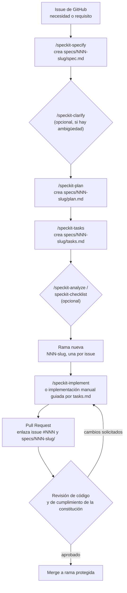

# Guía de Spec-Driven Development para MedSchedule

Esta guía documenta qué es Spec-Driven Development (SDD), qué beneficios trae con su forma de
medirlos sobre este proyecto en concreto, la instalación de Spec Kit ya realizada en la rama
`feat/unidad-docs-sdd`, el flujo de trabajo con seguimiento que el equipo debe seguir a partir de
ahora, y la evolución piloto (dos especificaciones ya redactadas) que sirve de ejemplo de
referencia. El diagnóstico completo del estado actual de MedSchedule —modelo de datos, inventario
de controladores, comparación Kiro/Spec Kit y los ocho hallazgos sobre qué falta para un SDD
formal— vive en el documento hermano `docs/sdd/sdd-proposal.md`; aquí no se repite ni se
contradice, solo se cita por número de sección cuando hace falta.

## 1. Qué es Spec-Driven Development

Spec-Driven Development es una forma de trabajar en la que la especificación del comportamiento
esperado —qué debe hacer el sistema y cómo se sabrá que quedó bien hecho— se escribe y se aprueba
**antes** de escribir el código que la implementa, en vez de reconstruirla después a partir del
código ya existente. La especificación no es un documento de intención informal: sigue una
plantilla fija (historias de usuario priorizadas, escenarios de aceptación en formato
Given/When/Then, requisitos funcionales numerados y verificables, criterios de éxito medibles) y
es el artefacto contra el que se revisa el plan técnico, las tareas de implementación y,
finalmente, el propio código.

**De dónde viene.** SDD es la evolución práctica de una idea que ya existía en Extreme Programming
y en Behavior-Driven Development (BDD): que la ambigüedad de un requisito es más barata de resolver
en una conversación sobre un documento que en una revisión de código ya escrito. Spec Kit
(`github/spec-kit`), la herramienta adoptada en esta entrega, formaliza esa idea como un flujo de
comandos de agente de IA (`/speckit-specify`, `/speckit-plan`, `/speckit-tasks`,
`/speckit-implement`) que producen y encadenan esos artefactos dentro del propio repositorio, en
vez de dejarlos en una herramienta externa de gestión de producto.

**Por qué importa para MedSchedule en concreto.** El diagnóstico de `sdd-proposal.md` §5, hallazgo
1, ya estableció que MedSchedule no tiene ningún artefacto de especificación previo al código: los
requisitos históricos viven en issues de GitHub, y las únicas especificaciones del repositorio se
escribieron en esta misma entrega, para funcionalidad que todavía no existe. Esto no es un defecto
aislado: es la causa que el mismo diagnóstico señala como origen común de los hallazgos 2 a 8 (CI
que no puede fallar, cobertura de pruebas parcial y desalineada, tres configuraciones de base de
datos sin una fuente de verdad, ausencia de criterios de aceptación verificables). SDD no corrige
esos hallazgos —esa corrección es trabajo de la unidad siguiente— pero es el proceso que evita que
la próxima funcionalidad nueva los repita.

**Contraste con el flujo actual del equipo.** Hoy el flujo real, verificado en el código, es
código → (a veces) documentación posterior → issue de seguimiento si algo falla en producción. Con
SDD el orden se invierte: issue/necesidad → `spec.md` (qué construir y cómo se sabrá que está bien
construido) → `plan.md` (cómo construirlo con el stack de MedSchedule) → `tasks.md` (en qué orden,
con qué archivos concretos) → código → pruebas que verifican los criterios ya escritos en la spec,
no criterios inventados después de ver el código funcionando.

**Relación con TDD.** SDD y TDD no compiten: operan en dos niveles distintos de la misma pregunta.
La especificación (`spec.md`) define **qué** hay que construir y **cuándo** se puede considerar
terminado, en el nivel de negocio (una historia de usuario, un criterio de aceptación). El test
(unitario o de feature) define **cuándo está construido** en el nivel de código: convierte cada
criterio de aceptación de la spec en una aserción ejecutable. La skill `generar-casos-prueba`
(sección 6.2) es exactamente la bisagra entre ambos niveles: toma una spec ya aprobada y deriva de
ella la matriz de casos de prueba y los esqueletos de test, para que TDD se practique sobre
criterios que ya fueron acordados como negocio, no sobre una interpretación individual del
desarrollador.

## 2. Beneficios y cómo medirlos en este proyecto

Cada beneficio se enuncia con una forma de medición concreta sobre MedSchedule, con la cifra de
partida real cuando existe. Ninguna de estas cifras se corrige en esta entrega: son la línea base
contra la que se compara el progreso de la unidad siguiente.

| Beneficio | Cifra de partida (hoy) | Cómo se mide a partir de ahora |
|---|---|---|
| Reducción del retrabajo por tests que nunca ejercitan la ruta real | 10 de las 15 pruebas que fallan hoy (grupo A de `sdd-proposal.md` §5.2: `AdminRbacAccessTest`, `AppointmentControllerTest`, `DoctorProfileControllerTest`, `ScheduleControllerTest`, `SpecialtyControllerTest`) fallan porque nunca usan `actingAs()`; dos de esos archivos usan explícitamente el patrón `withSession(['mock_current_user' => ...])` (verificado: `grep -rl "mock_current_user" tests/` devuelve `tests/Unit/EnsureAdminRoleTest.php` y `tests/Feature/AdminRbacAccessTest.php`). La skill `generar-casos-prueba` (sección 6.2) prohíbe explícitamente ese patrón. | Ejecutar `grep -rl "mock_current_user" tests/` después de cada módulo nuevo generado con SDD: la meta es que ese comando no agregue coincidencias nuevas a las dos ya heredadas. Cada aparición nueva es retrabajo evitable que ya se había prevenido por escrito. |
| Trazabilidad de requisito a prueba | Hoy 0%: ningún requisito histórico de MedSchedule tiene un identificador (`FR-00X`) que un test pueda citar; es el hallazgo 8 de `sdd-proposal.md` §5. En las dos specs piloto de esta entrega hay 25 requisitos funcionales numerados (`FR-001`–`FR-014` en `specs/001-pruebas-e2e/spec.md`, `FR-001`–`FR-011` en `specs/002-tours-guiados/spec.md`) y sus `tasks.md` ya citan `cumple FR-XXX` en 15 y 18 tareas respectivamente (verificado con `grep -c "cumple FR" specs/*/tasks.md`). | Para cada spec nueva, calcular `(requisitos con al menos un TC-00X o "cumple FR-XXX" asociado) / (total de requisitos)`. Meta: 100%, igual que en las dos specs piloto. Un requisito sin tarea o caso de prueba que lo cite es una spec incompleta, detectable antes de escribir código. |
| Incorporación más rápida de integrantes nuevos | Hoy, para entender un módulo, un integrante nuevo debe leer código disperso: 13 controladores en `app/Http/Controllers/` (dos de ellos, `AdminDashboardController` y `DoctorDashboardController`, código muerto sin ruta que los invoque — `sdd-proposal.md` §4.1), 8 modelos y las rutas de `routes/web.php`, sin un documento único que explique el requisito de negocio. | Para el próximo módulo construido con SDD, contar cuántos archivos fuente necesitó leer un integrante nuevo antes de su primer commit relacionado con la tarea, comparado con leer un único `spec.md` primero. Instrumentación mínima: registrar en el propio PR ("archivos leídos antes de codear") como parte de la plantilla de PR, y comparar entre features con y sin spec previa. |
| Criterios de aceptación verificables en vez de interpretables | Hoy 0 issues históricos documentan un criterio de éxito comprobable por prueba automática (hallazgo 8, `sdd-proposal.md` §5); la única fuente de "qué se espera" es el comportamiento observado del código ya escrito. Las dos specs piloto ya declaran 10 criterios de éxito medibles en total (`SC-001`–`SC-005` en cada una, verificado con `grep -c "^\- \*\*SC-" specs/*/spec.md`), todos con un porcentaje o una cifra de tiempo, no una descripción cualitativa. | Antes de aprobar cualquier `spec.md` nuevo, verificar que cada `SC-00X` incluye una cifra o un porcentaje verificable (no “mejora la experiencia” ni “es más rápido”). Meta: 100% de los criterios de éxito de specs nuevas cumplen ese formato, igual que las 10 ya escritas en el piloto. |

## 3. Instalación realizada

### 3.1 Comandos ejecutados

Spec Kit se instaló en dos pasos, ambos ya ejecutados sobre esta rama:

```bash
uv tool install specify-cli --from git+https://github.com/github/spec-kit.git
specify init --here --force --non-interactive --integration claude
```

La versión instalada es `1.0.6.dev0`. La salida completa de la segunda invocación quedó guardada
como evidencia en `docs/entrega/evidencia/specify-init.txt`; confirma la integración seleccionada
(`claude`), el tipo de script (`sh`) y la lista de comandos instalados.

**Advertencia sobre el separador de los comandos.** Los comandos de agente que instala Spec Kit se
invocan con **guion**, no con punto: `/speckit-constitution`, `/speckit-specify`, `/speckit-plan`,
`/speckit-tasks`, `/speckit-implement`, `/speckit-clarify`, `/speckit-analyze`,
`/speckit-checklist`, `/speckit-converge`, `/speckit-taskstoissues`. El separador está declarado de
forma explícita en `.specify/integration.json`, campo `integration_settings.claude.invoke_separator`,
con el valor `"-"`. Escribirlos con punto (`/speckit.specify`) es el error más frecuente al empezar
a usar la herramienta y no funciona en esta versión.

### 3.2 Estructura real de `.specify/`

```
.specify/
├── integration.json                       # version 1.0.6.dev0, integration: claude, invoke_separator: "-"
├── init-options.json
├── .gitignore
├── integrations/
│   ├── claude.manifest.json
│   └── speckit.manifest.json
├── memory/
│   ├── constitution.md                    # constitución del proyecto, ver 3.4
│   └── .constitution-template.json
├── scripts/bash/
│   ├── check-prerequisites.sh
│   ├── common.sh
│   ├── create-new-feature.sh
│   ├── resolve-template.sh
│   ├── setup-plan.sh
│   └── setup-tasks.sh
├── templates/
│   ├── spec-template.md
│   ├── plan-template.md
│   ├── tasks-template.md
│   ├── checklist-template.md
│   └── constitution-template.md
└── workflows/
    ├── speckit/workflow.yml
    └── workflow-registry.json
```

No existe una carpeta `.claude/commands/` en esta versión de Spec Kit: cada comando de agente está
definido como una skill de Claude Code, en `.claude/skills/speckit-<nombre>/SKILL.md`. Las diez
carpetas presentes hoy bajo `.claude/skills/` con ese prefijo son:
`speckit-constitution`, `speckit-specify`, `speckit-plan`, `speckit-tasks`, `speckit-implement`,
`speckit-clarify`, `speckit-analyze`, `speckit-checklist`, `speckit-converge` y
`speckit-taskstoissues`.

### 3.3 Comandos de agente disponibles

| Comando | Uso en el flujo | Obligatorio u opcional |
|---|---|---|
| `/speckit-constitution` | Establece o enmienda los principios del proyecto en `.specify/memory/constitution.md`. | Se ejecuta una vez por proyecto (o al enmendar un principio); ya ejecutado en esta entrega. |
| `/speckit-specify` | Crea `specs/<NNN>-<slug>/spec.md` a partir de una descripción en lenguaje natural, usando `.specify/templates/spec-template.md`. | Obligatorio antes de planear cualquier funcionalidad nueva. |
| `/speckit-plan` | Genera `plan.md` a partir de una spec ya aprobada. | Obligatorio antes de generar tareas. |
| `/speckit-tasks` | Genera `tasks.md` a partir del plan, agrupado por historia de usuario. | Obligatorio antes de implementar. |
| `/speckit-implement` | Ejecuta la implementación guiada por `tasks.md`. | Usado en la fase de construcción (unidad siguiente para las specs piloto). |
| `/speckit-clarify` | Preguntas estructuradas para de-riesgar zonas ambiguas de una spec. | Opcional, antes de `/speckit-plan` si la spec tiene ambigüedades reales. |
| `/speckit-analyze` | Reporte de consistencia cruzada entre spec, plan y tareas. | Opcional, después de `/speckit-tasks` y antes de `/speckit-implement`. |
| `/speckit-checklist` | Genera checklists de calidad para validar completitud y claridad de requisitos. | Opcional, después de `/speckit-plan`. |
| `/speckit-converge` | Evalúa el estado real del código y agrega como tareas el trabajo pendiente detectado. | Opcional, útil para reconciliar código legado con specs nuevas. |
| `/speckit-taskstoissues` | Convierte las tareas de `tasks.md` en issues de GitHub. | Opcional, para equipos que gestionan trabajo en el tablero de issues. |

### 3.4 Constitución del proyecto

La constitución vive en `.specify/memory/constitution.md`, versión **1.0.0**, ratificada el
**2026-09-09**, con siete principios. Se reproducen aquí tal cual están redactados, sin resumir ni
reordenar:

> **I. Estilo de código** — Comentarios en español; nombres de variables y funciones en
> snake_case.
>
> **II. Manejo de errores** — Manejo de errores explícito con try/catch; nunca silenciar
> excepciones.
>
> **III. Gestión de secretos** — Ningún secreto en el código; todo en .env, que jamás se commitea.
>
> **IV. Validación de entrada** — Validar y sanitizar todo input antes de procesarlo.
>
> **V. Exposición de errores al cliente** — Los errores internos no se exponen al cliente.
>
> **VI. Spec-Driven Development** — Toda funcionalidad nueva entra por spec antes que por código.
>
> **VII. Convenciones de control de versiones** — Commits convencionales; una rama por issue.

La constitución también fija, en su sección "Restricciones Adicionales", que el repositorio es
público (ningún archivo puede contener claves, tokens, contraseñas ni cadenas de conexión) y las
versiones fijadas `driver.js@1.8.0` y `@playwright/test@^1.62.1`. La sección "Governance" declara
que la constitución prevalece sobre cualquier otra práctica de desarrollo del proyecto y que toda
enmienda futura debe versionarse por semver (MAJOR/MINOR/PATCH) con justificación explícita.

## 4. Flujo de trabajo con seguimiento

El ciclo de trabajo, desde que existe una necesidad hasta que el código queda mergeado, es el
siguiente. La trazabilidad se sostiene en tres identificadores que viajan juntos: el número de
issue, el slug de la spec (`NNN-nombre`) y el nombre de la rama, que deben coincidir.



**Cómo se enlaza cada spec con su issue y su PR.** El número `NNN` del directorio `specs/NNN-slug/`
es el mismo que el número del issue que originó la necesidad (por ejemplo, un issue "Ampliar
cobertura E2E" se convierte en `specs/001-pruebas-e2e/`). La rama de trabajo toma el mismo slug
(`001-pruebas-e2e`), y la descripción del Pull Request referencia tanto el issue (`Closes #NNN`)
como la ruta de la spec (`specs/001-pruebas-e2e/spec.md`). Con esto, cualquier persona que audite
el historial puede ir del PR mergeado hacia atrás: al `tasks.md` que ejecutó, al `plan.md` que lo
diseñó y al `spec.md` que fijó el criterio de aceptación original, sin depender de memoria ni de
conversación externa al repositorio.

## 5. Evolución piloto

El profesor pidió una evolución piloto sobre dos funcionalidades reales de MedSchedule. Ambas ya
tienen su `spec.md`, `plan.md` y `tasks.md` completos bajo `specs/`; el código que las implementa
se construye en la unidad siguiente — aquí solo se presenta el estado ya alcanzado (la
especificación y su plan de tareas), no una implementación.

### 5.1 `specs/001-pruebas-e2e` — Ampliación de cobertura de pruebas E2E por rol

**Requisito de origen** (`Input` de `spec.md`): ampliar la cobertura E2E de MedSchedule más allá
del único flujo existente (`sdd-proposal.md` §5, hallazgo 5: `playwright.config.js` fija `testDir`
en `./tests/playwright_gestion_usuarios`, un solo archivo de prueba), cubriendo autenticación y
control de acceso por rol, agenda del doctor, agendado/cancelación de cita del paciente y CRUD de
especialidades, de forma que el pipeline de CI falle cuando estas pruebas fallen.

**Historias de usuario y prioridad**: US1 Autenticación y control de acceso por rol (P1, MVP);
US2 Agenda del doctor (P2); US3 Agendado y cancelación de cita del paciente (P3); US4 CRUD de
especialidades del administrador (P4).

**Criterios de aceptación** (ejemplo de cada historia, en formato Given/When/Then, ver el archivo
completo para el resto): un usuario `admin` que inicia sesión correctamente es redirigido a su
panel; un usuario `patient` que intenta acceder a una ruta de `admin` recibe 403; un doctor ve
únicamente sus propias citas en su agenda; un paciente que agenda un horario ya ocupado recibe un
rechazo sin crear una segunda cita; un administrador no puede crear una especialidad con nombre
duplicado.

**Criterios de éxito medibles**: la cobertura E2E pasa de 1 a 5 flujos (`SC-001`); el 100% de las
ejecuciones de CI sobre una solicitud de cambios corre las pruebas de los cuatro flujos nuevos
(`SC-002`); el 100% de las ejecuciones con al menos un fallo terminan en estado fallido, sin el
`|| true` que hoy oculta ese resultado (`SC-003`, directamente ligado al hallazgo 2 de
`sdd-proposal.md` §5); el 100% de las ejecuciones dejan capturas de pantalla como artefacto
descargable (`SC-004`); ninguna de las 5 pruebas depende de datos dejados por otra (`SC-005`).

**Tareas generadas** (`tasks.md`, 24 tareas en 7 fases): Fase 1 Setup (seeders y datos base
reutilizables), Fase 2 Foundational —crítica: instalar navegadores de Playwright, ejecutar
`npx playwright test` en el mismo job con el patrón de captura de PID de esta entrega, **eliminar
el `|| true`** del paso de pruebas E2E y publicar el reporte HTML como artefacto—, Fases 3 a 6 una
por cada historia de usuario (US1 a US4, con tareas marcadas `[P]` cuando son paralelizables), y
Fase 7 de consolidación (verificar aislamiento de datos entre pruebas y que un fallo forzado
efectivamente pone el job en rojo). El plan aclara explícitamente que este ajuste al pipeline es
"trabajo de implementación posterior a esta especificación": no se modificó `.github/workflows/ci.yml`
al escribir la spec ni el plan, conforme a la restricción global de esta entrega.

### 5.2 `specs/002-tours-guiados` — Tours guiados interactivos por rol

**Requisito de origen**: incorporar tours guiados con `driver.js@1.8.0` para que cada rol reciba
una guía de primera vez en su panel (administrador: gestión de usuarios y especialidades; doctor:
agenda y perfil; paciente: cómo agendar una cita), que se muestre una sola vez por usuario, pueda
relanzarse desde un botón de ayuda, sea accesible por teclado y no bloquee la aplicación si el
elemento destino no existe.

**Historias de usuario y prioridad**: US1 Tour de administrador (P1, MVP); US2 Tour de doctor (P2);
US3 Tour de paciente (P3); US4 Relanzar el tour desde un botón de ayuda (P4, depende de que exista
al menos un tour de rol).

**Criterios de aceptación** (ejemplo de cada historia): un administrador que nunca vio el tour lo
recibe automáticamente al entrar a su panel y recorre gestión de usuarios y especialidades; ese
mismo tour no vuelve a arrancar solo en un segundo ingreso; un elemento destino ausente en un paso
intermedio se omite sin error visible; un usuario que cambia de rol ve el tour del rol nuevo como
no visto.

**Criterios de éxito medibles**: 100% de los usuarios que ingresan por primera vez ven arrancar el
tour de su rol sin acción adicional (`SC-001`); 100% de los accesos posteriores no disparan el
arranque automático salvo por el botón de ayuda (`SC-002`); el botón de ayuda relanza el tour en
menos de 1 segundo (`SC-003`); el tour es resiliente ante elementos destino ausentes en el 100% de
los casos probados (`SC-004`); el 100% de los pasos son completables solo con teclado (`SC-005`).

**Tareas generadas** (`tasks.md`, 26 tareas en 7 fases): Fase 1 Setup (dependencia `driver.js`
fijada en `1.8.0`, carpetas `resources/js/tours/` y `tests/playwright_tours_guiados/`), Fase 2
Foundational —crítica: mecanismo compartido de persistencia de "tour visto" por usuario y rol,
comprobación de existencia del elemento destino antes de cada paso, botón de ayuda reutilizable y
navegación completa por teclado—, Fases 3 a 5 una por tour de rol (US1 a US3, cada una con su
propio archivo JS, sus atributos de anclaje sobre las vistas existentes sin alterar lógica de
negocio, y su prueba E2E), Fase 6 para el botón de ayuda y la resiliencia (US4), y Fase 7 de
consolidación (revisión de textos en español, ausencia de overlays residuales, comportamiento ante
cambio de rol). Las tareas T009 y T013 dejan explícito que los atributos de anclaje se agregan a
las vistas ya existentes (`resources/views/admin/rbac.blade.php`,
`resources/views/admin/especialidades.blade.php`, `resources/views/doctor/agenda.blade.php`,
`resources/views/doctor/perfil.blade.php`) "sin alterar su lógica de negocio" —texto literal de
ambas tareas—. T017 va más allá sobre `resources/views/patient/dashboard.blade.php`: exige hacerlo
"sin crear una vista nueva ni alterar la lógica de negocio ni los endpoints JSON de
`AppointmentController`", coherente con que esta entrega no corrige ni toca código de producto.

## 6. Skills de IA que apoyan el flujo

Además de los comandos `/speckit-*` de la sección 3.3, el equipo escribió dos skills propias para
Claude Code en esta entrega, ambas en `.claude/skills/`, pensadas específicamente para el dominio
de MedSchedule.

### 6.1 `generar-spec-modulo`

Definida en `.claude/skills/generar-spec-modulo/SKILL.md`. Genera el contenido de una especificación
funcional en el formato exacto de `.specify/templates/spec-template.md` para un módulo o requisito
nuevo, a partir de una investigación previa del dominio de MedSchedule: lee
`.specify/memory/constitution.md` como autoridad de estilo, revisa las migraciones y modelos
existentes bajo `database/migrations/` y `app/Models/` para identificar qué tablas y relaciones
toca el módulo, y revisa `routes/web.php` para entender el patrón de autorización vigente
(`role:admin`/`role:doctor`/`role:patient` de Spatie), señalando explícitamente que una spec nueva
nunca debe asumir el middleware legado `EnsureAdminRole` como mecanismo definitivo.

**Cuándo se invoca**: antes de escribir código para un módulo o requisito nuevo, como paso previo a
`/speckit-specify` —no lo reemplaza, hace la investigación de dominio para que el contenido de la
spec sea concreto, no genérico—. **Cómo encaja en el ciclo**: su salida es el texto que se pega en
el `spec.md` que crea `/speckit-specify`, o que actualiza uno ya creado, antes de pasar a
`/speckit-plan`. Entre los errores que evita explícitamente: specs con detalles de implementación
(nombres de clases, rutas, SQL) que deberían vivir en el plan, y requisitos de rol escritos con
mayúscula (`Admin`, `Doctor`) — el mismo bug histórico de comparación de roles que motiva la
User Story 1 de `specs/001-pruebas-e2e/spec.md`.

### 6.2 `generar-casos-prueba`

Definida en `.claude/skills/generar-casos-prueba/SKILL.md`. A partir de una spec ya aprobada, deriva
una matriz de casos de prueba (`id`, `modulo`, `precondiciones`, `pasos`, `datos`,
`resultado_esperado`, `tipo`, `prioridad`) y emite los esqueletos de test correspondientes —PHPUnit
de feature, PHPUnit unitario o Playwright E2E—, siguiendo como referencia de estilo
`tests/Feature/ActivityLogControllerTest.php` (para PHPUnit con Spatie) y
`tests/playwright_gestion_usuarios/gestion-usuarios.spec.js` (para E2E).

**Cuándo se invoca**: después de que un `spec.md` está aprobado y antes de implementar, como
contraparte de `/speckit-tasks` (que genera las tareas de implementación): esta skill genera las
tareas de prueba alineadas a las mismas historias de usuario. **Cómo encaja en el ciclo**: es la
bisagra entre spec y TDD descrita en la sección 1 — traduce cada `Acceptance Scenario` y cada
`FR-00X` de la spec en un caso de prueba trazable.

**Por qué es la skill más directamente ligada al diagnóstico de este proyecto**: su paso 3 prohíbe
de forma explícita el patrón `withSession(['mock_current_user' => [...]])` en favor de
`actingAs($usuario)` con rol asignado vía Spatie, y lo señala textualmente como "la causa raíz de
10 de los 15 fallos actuales del suite" — el mismo grupo A de fallos verificado de forma
independiente en `sdd-proposal.md` §5.2. Es, en la práctica, la skill que convierte en regla escrita
para el agente el hallazgo más costoso del diagnóstico, de modo que ningún módulo nuevo construido
con este flujo pueda reintroducirlo.

## 7. Cómo seguir esta guía

Para quien construya la siguiente funcionalidad de MedSchedule sobre este andamiaje: partir de un
issue, invocar `/speckit-specify` (apoyado en `generar-spec-modulo` si el módulo toca datos o
autorización existentes), completar `/speckit-plan` y `/speckit-tasks`, generar la matriz de
pruebas con `generar-casos-prueba` antes de escribir el primer archivo de implementación, abrir una
rama con el mismo `NNN-slug` que la carpeta de la spec, e incluir esa ruta en la descripción del
Pull Request junto con el issue que cierra. El diagnóstico completo de por qué este proceso hace
falta en MedSchedule —con evidencia línea por línea— está en `docs/sdd/sdd-proposal.md`.
