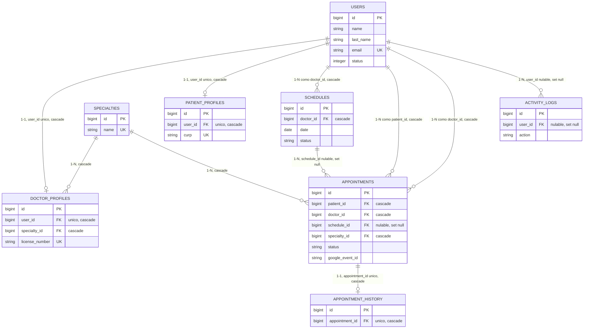

# Propuesta de Spec-Driven Development para MedSchedule

Diagnóstico del sistema MedSchedule obtenido por ingeniería inversa directa sobre el código de la
rama `feat/unidad-docs-sdd`, y propuesta de adopción de Spec-Driven Development (SDD) apoyada en
Spec Kit. Todas las afirmaciones de este documento citan el archivo y, cuando aplica, la línea
exacta donde se verificaron. Ningún hallazgo aquí descrito se corrige en esta entrega: se documenta
con su fix propuesto para que la unidad siguiente lo implemente.

## 1. Alcance y método

El diagnóstico se construyó leyendo, en este orden, las quince migraciones de
`database/migrations/`, los ocho modelos Eloquent de `app/Models/`, los trece archivos de
`app/Http/Controllers/` (incluida la subcarpeta `Auth/` con nueve controladores propios del scaffold
de autenticación de Laravel), los dos middleware, los dos servicios, el único job en cola, las 191
líneas combinadas de `routes/web.php` y `routes/auth.php`, y la salida real de la suite de pruebas
(`vendor/bin/phpunit`). No se ejecutó ningún comando que imprimiera el contenido de `.env` ni de
ningún archivo con credenciales.

## 2. Modelo de datos reconstruido desde las migraciones

Las quince migraciones crean o modifican diecinueve tablas (con `Schema::create`; las tres migraciones
que solo alteran tablas existentes —`2026_03_01_061322`, `2026_08_15_043158` y `2026_08_19_031109`— no
suman tablas nuevas). Se agrupan aquí por origen para que cada
fila sea trazable a su archivo.

### 2.1 Núcleo de autenticación y framework — `0001_01_01_000000_create_users_table.php`

| Tabla | Columna | Tipo | Nulable | Restricciones |
|---|---|---|---|---|
| `users` | `id` | bigint PK | no | autoincremental |
| | `name` | string(100) | no | |
| | `last_name` | string(100) | no | |
| | `email` | string(150) | no | `unique` |
| | `email_verified_at` | timestamp | sí | |
| | `password` | string | no | |
| | `phone` | string(20) | sí | |
| | `status` | integer | no | default `1` (1=activo, 0=inactivo) |
| | `remember_token` | string | sí | |
| | `created_at`/`updated_at` | timestamp | sí | |
| `password_reset_tokens` | `email` | string PK | no | |
| | `token` | string | no | |
| | `created_at` | timestamp | sí | |
| `sessions` | `id` | string PK | no | |
| | `user_id` | foreignId | sí | índice, sin `constrained()` (no declara FK real) |
| | `ip_address` | string(45) | sí | |
| | `user_agent` | text | sí | |
| | `payload` | longText | no | |
| | `last_activity` | integer | no | índice |

### 2.2 Caché — `2026_02_24_039999_create_cache_table.php`

| Tabla | Columna | Tipo | Nulable | Restricciones |
|---|---|---|---|---|
| `cache` | `key` | string PK | no | |
| | `value` | mediumText | no | |
| | `expiration` | integer | no | índice |
| `cache_locks` | `key` | string PK | no | |
| | `owner` | string | no | |
| | `expiration` | integer | no | índice |

### 2.3 Catálogo — `2026_02_24_040000_create_specialties_table.php`

| Tabla | Columna | Tipo | Nulable | Restricciones |
|---|---|---|---|---|
| `specialties` | `id` | bigint PK | no | |
| | `name` | string(150) | no | `unique` |
| | `description` | text | sí | |
| | `status` | integer | no | default `1` |
| | timestamps | timestamp | sí | |

### 2.4 Perfiles — `2026_02_24_044713` y `2026_02_24_044754`, más `2026_08_19_031109`

| Tabla | Columna | Tipo | Nulable | Restricciones |
|---|---|---|---|---|
| `doctor_profiles` | `id` | bigint PK | no | |
| | `user_id` | foreignId | no | `unique`, FK → `users.id`, **`onDelete('cascade')`** |
| | `specialty_id` | foreignId | no | FK → `specialties.id`, **`onDelete('cascade')`** |
| | `license_number` | string(50) | sí | `unique` |
| | `bio` | text | sí | |
| | `consultation_duration` | tinyInteger | no | default `30` |
| | timestamps | timestamp | sí | |
| `patient_profiles` | `id` | bigint PK | no | |
| | `user_id` | foreignId | no | `unique`, FK → `users.id`, **`onDelete('cascade')`** |
| | `birth_date` | date | sí | |
| | `blood_type` | enum(8 valores) | sí | `A+,A-,B+,B-,AB+,AB-,O+,O-` |
| | `allergies` | text | sí | |
| | `chronic_conditions` | text | sí | |
| | `emergency_contact_name` | string(150) | sí | |
| | `emergency_contact_phone` | string(20) | sí | |
| | `curp` | string(18) | sí | `unique` |
| | `photo_path` | string | sí | añadida en `2026_08_19_031109_add_photo_path_to_patient_profiles_table.php` |
| | timestamps | timestamp | sí | |

### 2.5 Agenda y citas — `2026_02_24_044945`, `2026_02_24_045026`, `2026_02_24_045200`

| Tabla | Columna | Tipo | Nulable | Restricciones |
|---|---|---|---|---|
| `schedules` | `id` | bigint PK | no | |
| | `doctor_id` | foreignId | no | FK → `users.id`, **`onDelete('cascade')`** |
| | `date` | date | no | |
| | `start_time` | time | no | |
| | `end_time` | time | no | |
| | `status` | enum(`available`,`blocked`) | no | default `available` |
| | timestamps | timestamp | sí | |
| | — | — | — | índice compuesto `(doctor_id, date, status)`; `unique` compuesto `uq_doctor_slot (doctor_id, date, start_time)` añadido en `2026_08_15_043158_add_performance_indexes.php` |
| `appointments` | `id` | bigint PK | no | |
| | `patient_id` | foreignId | no | FK → `users.id`, **`onDelete('cascade')`** |
| | `doctor_id` | foreignId | no | FK → `users.id`, **`onDelete('cascade')`** |
| | `schedule_id` | foreignId | **sí** | FK → `schedules.id`, **`onDelete('set null')`** |
| | `specialty_id` | foreignId | no | FK → `specialties.id`, **`onDelete('cascade')`** |
| | `appointment_date` | date | no | |
| | `start_time` / `end_time` | time | no | |
| | `status` | enum(`pending`,`confirmed`,`completed`,`cancelled`) | no | default `pending` |
| | `reason` | text | sí | |
| | `google_event_id` | string(255) | sí | |
| | `observaciones` | text | sí | comentada en el código como "nuevo campo" |
| | timestamps | timestamp | sí | |
| | — | — | — | índices individuales en `patient_id`, `status`, `specialty_id`; compuesto `(doctor_id, appointment_date)`; en `2026_08_15_043158` se agregan además `idx_doctor_date (doctor_id, appointment_date)` — duplicado funcional del índice ya existente — e `idx_patient_status (patient_id, status)` |
| `appointment_history` | `id` | bigint PK | no | |
| | `appointment_id` | foreignId | no | `unique`, FK → `appointments.id`, **`onDelete('cascade')`** |
| | `diagnosis` / `treatment` / `prescription` / `follow_up_notes` | text | sí | |
| | `next_appointment_suggested` | date | sí | |
| | timestamps | timestamp | sí | |

### 2.6 Auditoría — `2026_02_24_045227` y `2026_03_01_061322`

| Tabla | Columna | Tipo | Nulable | Restricciones |
|---|---|---|---|---|
| `activity_logs` | `id` | bigint PK | no | |
| | `user_id` | foreignId | **sí** | FK → `users.id`, **`onDelete('set null')`** |
| | `action` | string(100) | no | índice |
| | `model_type` | string(100) | sí | |
| | `model_id` | unsignedBigInteger | sí | |
| | `description` | text | sí | |
| | `ip_address` | string(45) | sí | |
| | `user_agent` | string(255) | sí | |
| | `old_values` / `new_values` | json | sí | |
| | `created_at` | timestamp | no | `useCurrent()`, índice |
| | `updated_at` | timestamp | no | añadida en `2026_03_01_061322`, `useCurrent()` |
| | — | — | — | en `2026_08_15_043158` se agregan `idx_action_created (action, created_at)` e `idx_model (model_type, model_id)` |

### 2.7 Autorización — `2026_02_25_030516_create_permission_tables.php` (paquete `spatie/laravel-permission`)

Cinco tablas generadas por la migración estándar del paquete, sin modificaciones locales: `permissions`
(`id`, `name`, `guard_name`, `unique(name, guard_name)`), `roles` (misma forma), `model_has_permissions`
y `model_has_roles` (tablas pivote polimórficas sobre `model_type` + `model_id`, con FK en cascada hacia
`permissions.id` / `roles.id`), y `role_has_permissions` (pivote directo entre las dos anteriores, ambas
FK en cascada). El proyecto no usa "teams" (`config('permission.teams')` no está activado), por lo que
las columnas de equipo no se materializan.

### 2.8 Colas — `2026_08_19_045433_create_jobs_table.php` y `..._create_failed_jobs_table.php`

Tablas estándar de Laravel para el driver `database` de colas: `jobs` (`id`, `queue` indexado, `payload`,
`attempts`, `reserved_at`, `available_at`, `created_at`) y `failed_jobs` (`id`, `uuid` único, `connection`,
`queue`, `payload`, `exception`, `failed_at`).

## 3. Diagrama entidad-relación

Diagrama construido exclusivamente a partir de las claves foráneas declaradas en las migraciones
citadas arriba (sección 2). No incluye las tablas de framework (`sessions`, `cache`, `cache_locks`,
`jobs`, `failed_jobs`, `password_reset_tokens`) ni las de Spatie, por no aportar valor de dominio al
diagrama; sí se documentaron en la sección 2.7 por integridad del inventario.

Nota de fidelidad: `users` participa dos veces en `appointments` (como `patient_id` y como
`doctor_id`), ambas con `onDelete('cascade')` — verificado en
`database/migrations/2026_02_24_045026_create_appointments_table.php:16-17`. El modelo `User`
(`app/Models/User.php:37-54`) no declara los métodos `patientAppointments()` / `doctorAppointments()`
correspondientes a estas dos relaciones inversas; solo expone `doctorProfile()`, `patientProfile()` y
`activityLogs()`. El modelo `User` también declara `specialty()` (`app/Models/User.php:51-54`) como
`belongsTo(Specialty::class, 'specialty_id')`, pero la tabla `users` no tiene columna `specialty_id`
(verificado en la migración de la sección 2.1): es una relación muerta que fallaría en cuanto se
invocara.

## 4. Inventario de la capa de aplicación

### 4.1 Controladores

`app/Http/Controllers/` contiene trece archivos en su raíz: doce controladores concretos más la clase
base abstracta `Controller.php`. La subcarpeta `Auth/` añade nueve controladores propios del scaffold
de autenticación de Laravel (no generados por este equipo), expuestos por `routes/auth.php`.

| Controlador | Responsabilidad | Rutas que lo exponen |
|---|---|---|
| `AdminDashboardController` | Clase vacía (`//` como único cuerpo, `app/Http/Controllers/AdminDashboardController.php:9`). No está referenciada en ninguna ruta. | ninguna |
| `DoctorDashboardController` | Igual que la anterior: clase vacía sin referencias en rutas (`app/Http/Controllers/DoctorDashboardController.php:9`). | ninguna |
| `DashboardController` | Enruta por rol hacia la vista o el JSON del dashboard correspondiente; expone los datos cacheados vía `DashboardStatsService`. | `web.php:47,48,49,50,51,104,105,122,123` |
| `ActivityLogController` | Listado, detalle y filtrado de `activity_logs` para el panel de administración. | `web.php:52-55` |
| `AppointmentController` | Agenda del doctor (JSON), alta/cancelación/actualización de citas, disponibilidad de horario. | `web.php:41,107,108,127,128` |
| `DoctorProfileController` | Lectura/actualización del perfil de doctor y su foto. | `web.php:115-117` |
| `PatientProfileController` | Lectura/actualización del perfil de paciente y su foto; lectura del perfil por parte del doctor. | `web.php:118,124-126` |
| `ScheduleController` | CRUD de horarios del doctor (en arreglo/JSON, no persistido vía Eloquent en `store`/`update`/`destroy`, ver `app/Http/Controllers/ScheduleController.php:147-220`). | `web.php:110-113` |
| `SpecialtyController` | CRUD de especialidades para el administrador. | `web.php:57-60` |
| `GoogleCalendarController` | Sincroniza (`sync`) y desincroniza (`unsync`) una cita con Google Calendar. | `web.php:38-39` |
| `ProfileController` | Edición y borrado del perfil de usuario autenticado (Breeze estándar). | `web.php:34-36` |
| `Controller.php` | Clase base abstracta, sin lógica propia. | — |
| `Auth/AuthenticatedSessionController` | Login y logout. | `auth.php:20-24,58-59` |
| `Auth/RegisteredUserController` | Alta de usuario nuevo. | `auth.php:15-18` |
| `Auth/PasswordResetLinkController` | Solicitud de enlace de recuperación. | `auth.php:26-30` |
| `Auth/NewPasswordController` | Formulario y confirmación de nueva contraseña. | `auth.php:32-36` |
| `Auth/PasswordController` | Cambio de contraseña estando autenticado. | `auth.php:56` |
| `Auth/ConfirmablePasswordController` | Confirmación de contraseña antes de acciones sensibles. | `auth.php:51-54` |
| `Auth/EmailVerificationPromptController` | Pantalla de "verifica tu correo". | `auth.php:40-41` |
| `Auth/EmailVerificationNotificationController` | Reenvío del correo de verificación. | `auth.php:47-49` |
| `Auth/VerifyEmailController` | Confirmación del enlace de verificación firmado. | `auth.php:43-45` |

`AdminDashboardController` y `DoctorDashboardController` son código muerto: existen como archivos pero
ninguna ruta los invoca; toda la lógica de dashboard vive en `DashboardController`.

### 4.2 Modelos

| Modelo | Tabla | Relaciones declaradas |
|---|---|---|
| `User` | `users` | `doctorProfile()` hasOne, `patientProfile()` hasOne, `activityLogs()` hasMany, `specialty()` belongsTo (relación muerta, ver sección 3) |
| `DoctorProfile` | `doctor_profiles` | `user()` belongsTo, `specialty()` belongsTo |
| `PatientProfile` | `patient_profiles` | `user()` belongsTo |
| `Specialty` | `specialties` | `doctors()` hasMany (hacia `DoctorProfile`) |
| `Schedule` | `schedules` | `doctor()` belongsTo (`User`), `appointment()` hasOne |
| `Appointment` | `appointments` | `patient()`/`doctor()` belongsTo (`User`), `schedule()` belongsTo, `specialty()` belongsTo, `history()` hasOne, `patientProfile()` belongsTo vía `patient_id` |
| `AppointmentHistory` | `appointment_history` | `appointment()` belongsTo |
| `ActivityLog` | `activity_logs` | `user()` belongsTo; castea `old_values`/`new_values` a `array` |

### 4.3 Middleware, servicios y colas

| Componente | Tipo | Responsabilidad | Observación |
|---|---|---|---|
| `EnsureAdminRole` | Middleware | Control de acceso admin. | `app/Http/Middleware/EnsureAdminRole.php:13-14` lo marca en un comentario propio como "TEMPORARY MOCK ACCESS CONTROL": simula un usuario admin en sesión si no existe (`mock_current_user`). No está registrado como alias de middleware en ninguna ruta de `web.php`/`auth.php`; las rutas reales usan `role:admin` de Spatie. Solo lo referencia hoy `AdminRbacAccessTest`. |
| `SecurityHeaders` | Middleware | Añade cabeceras de seguridad (`X-Frame-Options`, CSP, etc.) a toda respuesta. | Ajusta la política CSP según `app()->environment('local')` para permitir el servidor de Vite en desarrollo. |
| `DashboardStatsService` | Servicio | Calcula y cachea (120s/300s) las estadísticas y gráficas del dashboard de administrador. | Usada por `DashboardController::adminData/getUsersChart/getAppointmentsChart`. |
| `GoogleCalendarService` | Servicio | Encapsula el cliente `Google\Client` (cuenta de servicio) para crear, borrar y listar eventos de calendario. | Si `setAuthConfig` falla, deja `$client = null` y todos los métodos devuelven `null`/vacío en vez de lanzar excepción. |
| `SyncAppointmentToCalendar` | Job (`ShouldQueue`) | Crea el evento de calendario de forma asíncrona tras confirmar una cita; 3 reintentos, 10s de backoff. | Solo actúa si la cita sigue `confirmed`; si `createEvent()` devuelve `null` relanza `RuntimeException` para activar el reintento. |

## 5. Diagnóstico: qué falta para un SDD formal

Los ocho hallazgos siguientes se documentan con su evidencia; ninguno se corrige en esta entrega.

1. **No existe ningún artefacto de especificación previo al código.** Los requisitos históricos
   viven en issues de GitHub, no en documentos de especificación versionados. Las únicas
   especificaciones que existen en el repositorio (`specs/001-pruebas-e2e/spec.md` y
   `specs/002-tours-guiados/spec.md`) se redactaron *después* del código, como parte de esta misma
   entrega (Tarea 5), y explícitamente para funcionalidad que todavía no se implementa — no como
   práctica retroactiva sobre el sistema existente.

2. **Los pasos de lint y de tests del CI no pueden fallar el build.** En
   `.github/workflows/ci.yml:26` (`npx eslint ... || true`), línea 29 (`npx prettier --check ... || true`)
   y línea 92 (`php artisan test --filter=... || true`), el sufijo `|| true` fuerza que el paso
   termine en éxito sin importar el resultado real del comando.

3. **El paso de tests del CI ejecuta solo cinco de las veinte clases de prueba reales.**
   `.github/workflows/ci.yml:92` usa `--filter="AuthTest|ActivityLogControllerTest|ExampleTest|EnsureAdminRoleTest"`.
   El filtro nombra cuatro patrones, pero casa por subcadena y `ExampleTest` coincide con dos
   archivos distintos (`tests/Unit/ExampleTest.php` y `tests/Feature/ExampleTest.php`, las pruebas
   de ejemplo de fábrica de Laravel, que no prueban nada del dominio), así que en realidad se
   ejecutan cinco clases. El repositorio tiene 20 clases de prueba (17 en `tests/Feature/`,
   incluidas las 6 de `tests/Feature/Auth/`, y 3 en `tests/Unit/`) — se corrige aquí el número de la
   estimación previa ("veintidós"), que no resistió el conteo directo
   (`find tests -name "*.php" -exec grep -l "^class " {} \;` devuelve 20 archivos con clase). Las 15
   clases restantes, incluidas las que sí se ejecutan hoy con fallos reales
   (`AppointmentControllerTest`, `DashboardControllerTest`, `GoogleCalendarControllerTest`, etc.), no
   corren nunca en el pipeline.

4. **Tres afirmaciones distintas sobre el motor de base de datos.** `phpunit.xml` fuerza
   `DB_CONNECTION=mysql` con base `medschedule_test` para pruebas; `config/database.php:19` usa
   `env('DB_CONNECTION', 'sqlite')` como valor por defecto y `.env.example:23` fija
   `DB_CONNECTION=sqlite` para desarrollo local; `README.md` (líneas 5, 53, 67 y 126) declara MySQL 8.0
   como el motor del proyecto. Tres configuraciones activas y coherentes entre sí en su propio
   contexto, pero sin una única fuente de verdad documentada.

5. **Cobertura E2E de un solo flujo.** `playwright.config.js:6` fija `testDir` en
   `./tests/playwright_gestion_usuarios`, y ese directorio contiene un único archivo de prueba
   (`gestion-usuarios.spec.js`). Los flujos de autenticación por rol, agenda del doctor, agendado del
   paciente y CRUD de especialidades no tienen cobertura E2E, solo Feature (PHPUnit) parcial.

6. **`docs/IONOS_Deploy_Checklist.md` describe una infraestructura que ya no existe.** El documento
   asume despliegue manual por FTP/SSH a un hosting IONOS con una carpeta raíz `MedSchedule/public`;
   el pipeline vigente (`.github/workflows/cd-railway.yml`) despliega a Railway. El checklist de IONOS
   queda como documentación histórica no actualizada, no como procedimiento operativo real.

7. **La regla `/docs/*` de `.gitignore` impedía versionar documentación en subcarpetas.** Antes del
   commit `2b0dd57` (`docs(feat): desbloquear rutas entregables en .gitignore`, ver
   `git log --oneline -- .gitignore`), la regla `/docs/*` (con la excepción puntual `!/docs/*.md` para
   archivos sueltos) bloqueaba cualquier subcarpeta nueva bajo `docs/`, entre ellas la que este mismo
   documento ocupa (`docs/sdd/`). Hoy el `.gitignore` declara explícitamente `!/docs/entrega/` y
   `!/docs/sdd/` para revertir ese bloqueo.

8. **No hay criterios de aceptación verificables ligados a cada requisito.** Ni los issues históricos
   ni el código documentan condiciones de éxito comprobables por prueba automática; la única fuente de
   "qué se espera" de una funcionalidad son las pruebas ya escritas (cuando existen) o el
   comportamiento observado del código en producción — lo cual invierte el orden que un SDD exige
   (criterio primero, implementación después).

### 5.1 Hallazgo adicional de severidad alta: build de producción roto en el dashboard del paciente

`resources/views/patient/dashboard.blade.php:18` invoca `@vite(['resources/js/patient-dashboard.js'])`,
pero `resources/js/patient-dashboard.js` no aparece en el arreglo `input` de `vite.config.js` (que sí
lista los otros diecisiete entrypoints: 10 módulos JS —`app.js`, `about.js`, `topbar-date.js`,
`dashboard.js`, `agenda.js`, `especialidades.js`, `horarios.js`, `doctor-profile.js`,
`admin-logs.js`, `admin-rbac.js`— y 7 hojas de estilo —`app.css`, `agenda.css`,
`especialidades.css`, `horarios.css`, `doctor-profile.css`, `admin-logs.css`, `admin-rbac.css`—).
Con `npm run dev` el servidor de Vite sirve cualquier ruta y el problema no se manifiesta;
con `npm run build` (el que ejecuta `ci.yml:63`) el archivo queda fuera del manifiesto y Laravel lanza
`Unable to locate file in Vite manifest` al renderizar la vista. El dashboard del paciente queda roto
en cualquier entorno que sirva assets compilados. Nada lo detecta hoy porque el paso de tests del CI
termina en `|| true` (hallazgo 2) y no existe una prueba E2E que cargue esa vista (hallazgo 5). Fix
propuesto para la unidad siguiente: añadir `'resources/js/patient-dashboard.js'` al arreglo `input` de
`vite.config.js` y cubrir la vista con una prueba E2E.

### 5.2 Taxonomía verificada de los quince fallos de PHPUnit

El repositorio tiene 79 métodos de prueba en total (verificado con
`grep -rE "public function test_" tests --include="*.php" | wc -l`), repartidos en las 20 clases de
la sección 3. Sobre esa base, la corrida de referencia de la revisión de la Tarea 2 registra 64
pruebas que pasan y 15 que fallan. Al intentar reproducir esa corrida en esta máquina,
`php artisan test` no pudo replicar ese resultado exacto: `phpunit.xml` fuerza `DB_CONNECTION=mysql`
contra una base `medschedule_test` en el puerto por defecto (3306), mientras que el MySQL de MAMP en
este entorno escucha en el puerto 8889 — la corrida local termina en fallos masivos de conexión, no
en los 15 fallos reales. Esto es, en sí mismo, una manifestación directa del hallazgo 4 (tres
configuraciones de base de datos distintas y no reconciliadas) y no invalida la taxonomía siguiente,
que se verificó leyendo directamente el código de cada test y de la ruta o controlador que ejercita,
sin depender de ejecutar la suite: es una mezcla de tres problemas distintos, no de una base de
pruebas vacía sin roles sembrados:

| Grupo | Cantidad | Archivos | Causa raíz verificada |
|---|---|---|---|
| A — tests obsoletos que nunca autentican | 10 | `AdminRbacAccessTest` (2), `AppointmentControllerTest` (2), `DoctorProfileControllerTest` (2), `ScheduleControllerTest` (2), `SpecialtyControllerTest` (2) | No usan `actingAs()` ni `RefreshDatabase`. `AdminRbacAccessTest` inyecta `withSession(['mock_current_user' => ...])`, el mecanismo del middleware legado `EnsureAdminRole` (sección 4.3). Las rutas reales que golpean ya están protegidas por `Route::middleware(['auth', 'role:admin'\|'role:doctor'])` de Spatie (`routes/web.php:46,103`), no por ese middleware. Sembrar roles no arreglaría estos tests: nunca inician sesión real. |
| B — drift entre código y test | 3 | `DashboardControllerTest` | Autentica correctamente (`RefreshDatabase` + `setupRoles()` + `assignRole()`). La ruta `/dashboard` (`routes/web.php:19-31`) siempre devuelve una redirección 302 según el rol — incluso para admin y patient, que el test espera en `200 OK` (`test_admin_dashboard_returns_ok`, `test_patient_dashboard_returns_ok`) — y redirige primero al doctor hacia `doctor.dashboard` (`routes/web.php:25`) en vez de hacerlo directo a `doctor.agenda`, como espera `test_doctor_dashboard_redirects_to_agenda` (`tests/Feature/DashboardControllerTest.php:41-46`). Es divergencia real entre el comportamiento del código y la expectativa del test, no un test mal escrito. |
| C — defectos funcionales probables | 2 | `GoogleCalendarControllerTest` | Autentica bien, usa `RefreshDatabase` y Mockery. En `test_sync_confirmed_appointment_creates_event` el mock de `GoogleCalendarService::createEvent` se define para devolver `'fake-event-id-123'`, pero la respuesta observada trae `google_event_id` en `null` — el `sync()` real de `GoogleCalendarController` despacha el job de forma asíncrona (`SyncAppointmentToCalendar::dispatch`, `app/Http/Controllers/GoogleCalendarController.php:34`) y responde de inmediato sin esperar el resultado, mientras el test asume una respuesta síncrona con el evento ya creado. En `test_unsync_clears_google_event_id`, `deleteEvent` se invoca 0 veces en vez de 1 sobre el mock inyectado. Apunta a una resolución de dependencia distinta de la mockeada o a que el flujo probado no llega a invocar el servicio como el test asume. |

Hallazgo adicional de cobertura, sin fallo asociado: `tests/Feature/Auth/RegistrationTest.php` existe
pero está vacío (`class RegistrationTest extends TestCase {}`, sin métodos, verificado leyendo el
archivo completo). PHPUnit no lo reporta como fallo porque no tiene pruebas que ejecutar; es un stub
preexistente sin cobertura real sobre el registro de usuarios.

## 6. Comparación: Kiro contra Spec Kit

| Criterio | Kiro (AWS) | Spec Kit (GitHub, ya instalado en esta rama) |
|---|---|---|
| Costo y licencia | Producto de AWS con capas gratuita y de pago; no se verificó en esta entrega el detalle vigente de precios ni límites de uso — se deja como **incertidumbre explícita** en vez de citar una cifra no comprobada. | Código abierto (repositorio público `github/spec-kit`), sin costo de licencia. Instalado vía `uv tool install specify-cli --from git+https://github.com/github/spec-kit.git` (Tarea 3), versión `1.0.6.dev0`. |
| Dependencia de un IDE concreto | Es un IDE agéntico propio (fork de Code OSS): el flujo de specs vive dentro de Kiro como aplicación. Migrar de editor implica migrar de herramienta de trabajo completa. | Es un CLI (`specify`) que coloca plantillas y scripts dentro del propio repositorio (`.specify/`) e integra comandos como skills del agente (`.claude/skills/speckit-*/SKILL.md`, verificado en la Tarea 3). No sustituye el editor: el equipo sigue usando el que ya tiene. |
| Agentes soportados | No se verificó en esta entrega si Kiro admite agentes de terceros más allá de su propio asistente integrado; se deja como incertidumbre en vez de afirmar una lista de agentes soportados sin comprobarla. | Multi-agente por diseño: la CLI acepta `--integration claude` (usado en esta instalación) y documenta soporte para otros agentes de código; los artefactos (`.specify/templates/`, `.specify/memory/constitution.md`) son texto plano, independiente del agente que los consuma. |
| Integración con el flujo de git existente | Al ser un IDE, el flujo de git pasa por su propia interfaz; no se verificó si permite operar igual que la CLI de git que ya usa el equipo (`gh`, hooks, `git worktree`). | Total: `.specify/` es una carpeta más del repositorio, los commits de sus artefactos son commits normales (verificado: commit `e9eb433` de la Tarea 3 los incluyó junto al resto del historial), y el flujo `/speckit-specify` → `/speckit-plan` → `/speckit-tasks` no reemplaza ningún paso de `git`/`gh` ya en uso. |
| Curva de aprendizaje para el equipo | Requiere aprender un IDE nuevo completo (atajos, paneles, flujo de specs propio) además de la metodología SDD en sí. | El equipo ya usa Claude Code como agente de trabajo; Spec Kit se aprende como un puñado de comandos nuevos (`/speckit-*`) sobre la misma herramienta, sin curva de editor. |
| Madurez del proyecto | Producto de AWS lanzado y mantenido activamente, pero de historia más corta como categoría de producto que Spec Kit; no se verificó aquí su cadencia de versiones ni estabilidad de API — incertidumbre reconocida. | Repositorio público con historial de commits verificable, versión instalada `1.0.6.dev0` (aún pre-1.0 en su propio versionado, ver Tarea 3), en desarrollo activo. Es "menos maduro" en número de versión, pero su superficie (plantillas Markdown + scripts bash) es lo bastante simple como para que la inmadurez del proyecto no bloquee su adopción. |

**Recomendación: Spec Kit.** Es de código abierto (sin costo ni dependencia de licencia comercial),
agnóstico del agente (funciona con el flujo de Claude Code que el equipo ya usa, y en principio con
cualquier otro agente de código), y se instala dentro del propio repositorio sin forzar un cambio de
editor ni de herramienta de trabajo — condición que Kiro, al ser un IDE completo, no cumple. Donde no
hay evidencia verificada sobre Kiro (costo exacto vigente, lista de agentes soportados, madurez de API)
se deja anotado como incertidumbre en vez de afirmarse.

## 7. Propuesta de implementación de SDD

| Fase | Entregable | Criterio de salida |
|---|---|---|
| 1. Adopción de la constitución | `.specify/memory/constitution.md` con los siete principios del proyecto (ya redactado en la Tarea 3: estilo de código, manejo de errores, gestión de secretos, validación de entrada, no exposición de errores internos, SDD obligatorio para funcionalidad nueva, convenciones de control de versiones). | La constitución existe, está versionada en el repositorio y el equipo la referencia en la descripción de cada PR nuevo. |
| 2. Especificación de los módulos pendientes | Una spec por módulo bajo `specs/<NNN>-<slug>/spec.md`, siguiendo `.specify/templates/spec-template.md`, para la funcionalidad que aún no se construye — empezando por las dos ya redactadas como piloto (`specs/001-pruebas-e2e`, `specs/002-tours-guiados`). | Cada spec tiene historias de usuario priorizadas, escenarios de aceptación en formato Given/When/Then y una sección de supuestos explícitos, revisada por al menos otra persona del equipo antes de pasar a plan. |
| 3. Plan y tareas por spec | `plan.md` y `tasks.md` generados con `/speckit-plan` y `/speckit-tasks` para cada spec aprobada, con las tareas agrupadas por historia de usuario y marcadas como independientes cuando sea posible. | El plan referencia archivos y componentes reales del código (no genéricos), y cada tarea del `tasks.md` tiene un criterio de aceptación verificable heredado de la spec. |
| 4. Implementación guiada por spec con verificación | Código y pruebas construidos contra las tareas de la fase 3, con `/speckit-implement` o implementación manual equivalente, cerrando cada tarea solo cuando su criterio de aceptación pasa en la suite de pruebas real (sin el filtro reducido ni el `|| true` de `ci.yml`, cuya corrección queda fuera de esta entrega y es trabajo de la unidad siguiente). | El PR de la funcionalidad enlaza su spec y su issue de origen; la suite de pruebas que cubre esa funcionalidad pasa en verde de forma reproducible antes de mergear. |

## 8. Conclusión

MedSchedule tiene un modelo de datos consistente y una capa de aplicación funcional, pero construida
sin ningún artefacto de especificación previo: los ocho hallazgos de la sección 5, más el defecto de
build del dashboard del paciente (sección 5.1) y la taxonomía real de los quince fallos de prueba
(sección 5.2), son síntomas de ese mismo origen — el código antecede siempre a la definición de qué
debía construirse y de cómo se sabría que estaba bien construido. La propuesta de la sección 7 no
pretende reescribir el sistema existente; usa Spec Kit, ya instalado y funcionando dentro del propio
repositorio (Tarea 3), para que la funcionalidad que falta por construir sí nazca de una especificación
con criterios de aceptación verificables, sin exigirle al equipo cambiar de editor ni de flujo de
trabajo.
